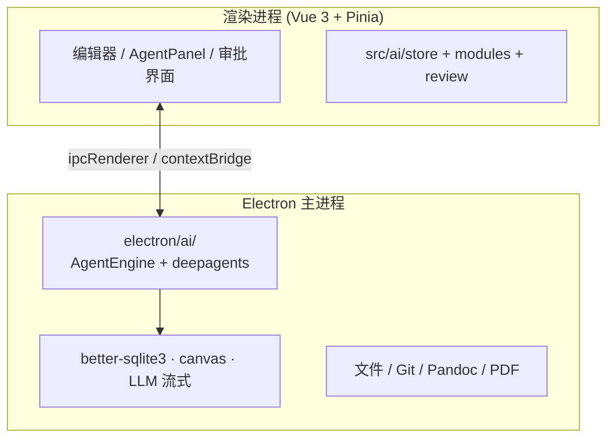
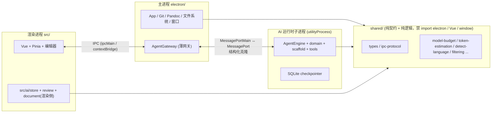

# Agent 进程隔离与分层重构方案

> 目标：将 iWriter 的 AI 运行时从 Electron 主进程拆分为独立子进程（`utilityProcess`），让 agent 的**渲染层**与**执行层**边界清晰，对齐 deepagents 的进程隔离设计理念，并补齐 AI 运行时的测试覆盖。
>
> 本文为方案设计文档，尚未进入实现。**暂不涉及「未保存内容」这套机制（`SnapshotBroker` / `EditorStateBroker` / `untitled:` 虚拟 ID）的调整**——该机制保持现状，作为已知遗留项单独记录，见文末「暂缓项」。
>
> 版本依据：deepagents `^1.10.2` + `@langchain/core ^1.1.35`；Electron `^43.2.0`。

---

## 一、背景与动机

### 1.1 现状一句话

iWriter 的 AI 运行时目前**直接跑在 Electron 主进程**（`electron/ai/`），在宿主进程内调用 `createDeepAgent()`，通过 Electron IPC 与渲染进程通信。它既不是 deepagents-code 的「TUI 客户端 + `langgraph dev` 子进程」，也不是「ACP stdio server」，而是第三种形态：**在宿主进程内直接调用 SDK**。

### 1.2 与 deepagents 设计理念的对照

deepagents 的分层是：

```txt
create_cli_agent        ← deepagents-code 的 CLI 适配层（装配）
       │ 调用
create_deep_agent       ← deepagents SDK 的 harness
       │ 调用
create_agent            ← LangChain 的 agent 抽象
       │ 调用
LangGraph 运行时         ← 编译成图、执行、checkpoint、streaming
```

deepagents-code 把 agent 隔离到独立进程的核心动机是**进程隔离**：

- TUI 模式：`langgraph dev` 子进程持有图，客户端 `RemoteAgent` 通过 HTTP+SSE 访问。
- ACP 模式：`AgentServerACP` 以 stdio server 形态独立运行，客户端通过协议对话。

两条路的共同点：**「装配并运行 agent」是一件事，「渲染并展示结果」是另一件事，二者用一条明确的协议边界隔开**。iWriter 目前把两件事都塞进了主进程，这正是要修正的偏差。

### 1.3 要解决的四个问题

| # | 问题 | 现状 | 影响 |
| --- | --- | --- | --- |
| P1 | 无进程隔离 | AI 运行时 + `better-sqlite3` + `canvas` + LLM 长流式请求全在主进程 | native addon 崩溃或流式阻塞会拖垮整个 App |
| P2 | `AgentEngine` god-class | 装配 + 缓存 + 流式 + resume + HITL + 内存 + 回退模型 + 标题生成，~1500+ 行 | 职责混杂，难以单测与迁移 |
| P3 | 主进程反向依赖渲染层 | `electron/` import `../src/` 的**运行时**代码（非仅类型） | 边界隐性，两份代码被编译进两个 runtime |
| P4 | 测试薄弱 | `node:test` + esbuild 打包 data-URI import，无统一 `test` script，CI 不跑测试 | AI 运行时回归风险高 |

---

## 二、现状分析

### 2.1 进程模型



安全基线（已确认）：renderer 窗口 `nodeIntegration: false` + `contextIsolation: true`，是正确的。但 AI 运行时没有这个隔离——它跑在主进程，与文件系统、原生 addon 同级。

### 2.2 `AgentEngine` 的职责清单（god-class 证据）

| 职责 | 现状位置 |
| --- | --- |
| 装配 agent（`createDeepAgent` 调用点） | `AgentEngine._buildAgent`（约 1501 行） |
| agent 实例缓存（10+ 字段 `cacheKey`） | `AgentEngine.agentCache` |
| 流式运行 / resume | `AgentEngine` run/resume 方法 |
| HITL 决策 / 中毒批次防护 | `AgentEngine` |
| 回退模型通知 | `AgentEngine._notifyModelFallbackOnce` |
| 记忆路径 / 摘要框架 | `AgentEngine._buildMemoryPaths` 等 |
| 线程标题生成 | 从 `src/ai/thread/title` import |
| provider/model/domain/mode 解析 | `runtime/ThreadRuntimeResolver.ts` |

### 2.3 反向依赖（P3 的具体证据）

`electron/` 大量 import 自 `../src/`，**其中相当一部分是运行时代码而非类型**：

```typescript
// electron/App.ts —— 主进程 import 渲染树的运行时
import Timer from '../src/utils/Timer'
import { UpdaterManager } from '../src/updater/UpdaterManager'
import { ... } from '../src/services/workspace/filtering'
import { ... } from '../src/utils/fileContentHash'

// electron/PandocService.ts
import { getPandocExportFormat, ... } from '../src/import-export/pandocFormats'

// electron/ai/AgentEngine.ts —— 主进程 import 渲染树的纯函数
import { resolveEffectiveModelBudget } from '../../src/ai/model/model-budget'
import { estimateTextTokens } from '../../src/ai/model/token-estimation'
import { generateThreadTitle } from '../../src/ai/thread/title'
import { detectInputLanguage } from '../../src/ai/message/detectInputLanguage'
```

这暴露出 `src/` 并非「渲染进程专属」，而是「共享 + 渲染」混装的一锅。后果：

1. 同一份代码被编译进两个 runtime（Vite 打给 renderer，`tsc -p tsconfig.electron.json` 编进 main）。
2. 边界隐性——没人能一眼判断「哪些 `src/` 代码主进程能用、哪些只能在 renderer 跑」。
3. 阻碍 utilityProcess 迁移——拆子进程前必须先搞清楚「什么能进 Node 子进程」。

### 2.4 协议定义重复

存在两处协议定义源：

- `electron/ai/ipc/protocol.ts`（主进程侧）
- `src/types/ai-ipc.ts`（共享侧，被 `preload.ts` 引用）

二者描述同一套消息（`SendMessageRequest` / `StreamChunkEvent` / `RunInterruptedEvent` 等），应收敛为一处。

### 2.5 测试现状

- 测试文件位于 `tests/`，命名 `.test.mjs`（Node 内置 `node:test`）与少量 `.test.ts`。
- 无统一 `npm test` script，`package.json` 无 `test` 条目。
- CI（`.github/workflows/` 仅 `docs-pages.yml`、`release.yml`）**不跑测试**。
- 测试模式为临时方案：用 esbuild 把单个被测 TS 文件 bundle 后经 data-URI import：

```javascript
import { describe, it } from 'node:test'
import { build } from 'esbuild'
// 每个测试文件各自 bundle 被测模块，再 data: URI 动态 import
```

这套方案的问题：每个测试文件重复造 bundle 轮子、无统一断言/覆盖率入口、无 CI 门禁，导致 AI 运行时（`scaffold/` 的纯函数、middleware、`ThreadRuntimeResolver`）覆盖严重不足。

---

## 三、目标架构



关键设计决策：

1. **`shared/` 是唯一的三方共享层**，规则：不 import `electron`、不 import Vue/Pinia、不碰 `window`/`localStorage`/`document`。
2. **渲染层 = `src/` + `shared/` 类型**，负责 UI、编辑器、审批交互。
3. **执行层 = `electron/ai/` 子进程 + `shared/` 逻辑**，负责 agent 装配、运行、checkpoint。
4. **主进程只留一个薄网关 `AgentGateway`**，负责消息转发、窗口生命周期绑定、把渲染层请求路由到子进程。

---

## 四、分阶段路线

> 阶段顺序按「先清理边界、再拆 god-class、最后做进程迁移」编排。每个阶段独立可交付、可回滚，业务语义零变化。

### Phase 1 — 抽取 `shared/` 契约层，修依赖方向

**目标**：把「跨进程契约 + 纯逻辑」从 `src/` 中剥离，使主进程、渲染进程、未来的子进程三方都能安全 import。

**新增目录**：

```txt
shared/
├── types/                          # FileChange / GitActionResult / menu / pandoc / libreoffice ...
├── ai/
│   ├── types.ts                    # AiProviderConfig / ThreadMessage / AiSettings ...
│   ├── ipc-protocol.ts             # SendMessageRequest / StreamChunkEvent ...（合并掉两处）
│   ├── model-budget.ts             # 纯函数
│   ├── token-estimation.ts
│   ├── detect-input-language.ts
│   └── thread-title.ts
├── utils/
│   ├── timer.ts
│   └── file-content-hash.ts
├── workspace/
│   └── filtering.ts
└── import-export/
    └── pandoc-formats.ts
```

**依赖方向规则（lint 强制）**：

- `electron/**` 只 import `shared/**` 与自身，**不再 import `src/**` 的运行时**。
- `src/**` 只 import `shared/**` 与自身。
- `shared/**` 不 import 任何一方（零依赖，或仅依赖 `shared` 内部）。

**落地步骤**：

1. 建立 `shared/`，配 tsconfig path alias（如 `@shared/*`）。
2. 逐文件迁移，先移**类型**（零风险），再移**纯函数**（有测试保护）。
3. `AgentEngine.ts` 里的 `../../src/ai/...` 全部改为 `@shared/ai/...`。
4. 判定 `UpdaterManager`、`Timer` 归属：主进程专用运行时归 `electron/`；纯工具类归 `shared/utils/`。
5. 加 ESLint `no-restricted-imports` 规则，禁止 `electron/` 再 import `src/`，防止回潮。

**验收**：`electron/` 中不再存在 `from '../src/` 或 `from '../../src/`（除类型外，且类型也迁到 shared）；`npm run type-check` 通过。

### Phase 2 — 协议去重 + 传输层抽象

**目标**：把 IPC 协议收敛为一处，并引入可替换的 transport 接口，为 Phase 4 的 MessagePort 迁移铺路。

**步骤**：

1. 合并 `electron/ai/ipc/protocol.ts` 与 `src/types/ai-ipc.ts` → `shared/ai/ipc-protocol.ts`（唯一契约）。
2. 收敛 `electron/ai/ipc/` 下的 `StreamEventAdapter` / `RendererEventBridge` / `MessageAdapter` 为一个 `AgentTransport` 接口：

```typescript
interface AgentTransport {
  sendRun(req: SendMessageRequest): Promise<void>
  sendResume(req: ResumeRunRequest): Promise<void>
  onStream(cb: (e: StreamChunkEvent) => void): Unsubscribe
  onInterrupt(cb: (e: RunInterruptedEvent) => void): Unsubscribe
  onDone(cb: (e: RunDoneEvent) => void): Unsubscribe
  onError(cb: (e: RunErrorEvent) => void): Unsubscribe
  // ...
}
```

3. 提供第一个实现 `IpcTransport`（底层仍是 `ipcMain`/`ipcRenderer`），Phase 4 再实现 `MessagePortTransport`。

**验收**：协议定义只有 `shared/ai/ipc-protocol.ts` 一处；`preload.ts` 只 import 一处。

### Phase 3 — 拆分 `AgentEngine` god-class

**目标**：把「装配」「运行」「配置」「缓存」「传输」解耦，参照 deepagents-code 的模块边界（`create_cli_agent` 装配 / `server_graph` 运行 / `ServerConfig` 配置）。

**拆分目标**：

```txt
electron/ai/
├── builder/AgentBuilder.ts       # 纯装配：入参 → createDeepAgent()（对应 create_cli_agent）
├── runtime/AgentRunner.ts        # 流式运行 + resume 生命周期（对应 server_graph / main）
├── config/RuntimeConfig.ts       # 冻结配置对象（对应 ServerConfig，可序列化 + 作为 cacheKey）
├── cache/AgentCache.ts           # 独立缓存与失效策略
├── transport/                    # AgentTransport 接口 + IpcTransport
└── (保留) domain/ scaffold/ tools/ checkpoint/
```

**要点**：

- `RuntimeConfig` 做成冻结对象，**它自身就是 `agentCache` 的 key**（`hash(config)`），替代现在手工拼 10+ 字段字符串 key。这样配置对象也天然可序列化传给子进程。
- `AgentBuilder.build(config)` 返回 `createDeepAgent()` 结果，纯函数化，可直接单测。
- `AgentRunner` 只依赖 `AgentBuilder` 产物 + transport，不含任何 Electron UI 依赖，为 Phase 4 迁移做好准备。

**验收**：`AgentEngine` 退化为薄编排或删除，原职责全部落到上述模块；纯函数模块有单测。

### Phase 4 — 迁移到 `utilityProcess`

**目标**：把 `electron/ai/` 运行时整体搬进独立 Node 子进程，主进程只留 `AgentGateway` 转发。

**进程与通信**：

```typescript
// 主进程 —— 启动子进程并建立 MessagePort 通道
import { utilityProcess, MessageChannelMain } from 'electron'

const child = utilityProcess.fork(
  path.join(__dirname, 'ai-runtime.js'),
  [],
  { serviceName: 'ai-runtime' }
)
const { port1, port2 } = new MessageChannelMain()
child.postMessage({ type: 'init', config }, [port1])  // port1 转移给子进程
port2.on('message', (e) => { /* 收子进程回传 */ })
port2.postMessage({ type: 'run', threadId })          // 发给子进程
```

```typescript
// 子进程 ai-runtime.js
process.parentPort.on('message', (e) => {
  if (e.ports.length) { /* 拿到转移来的 port1 */ }
})
```

**要点**：

- 消息经**结构化克隆**，天然序列化，天然跨进程——正好逼着协议做对。
- 现有 `shared/ai/ipc-protocol.ts` 直接复用，`IpcTransport` 换成 `MessagePortTransport`。
- **checkpointer（`better-sqlite3`）随运行时一起进子进程**，减少主进程的原生 addon 暴露面；主进程通过消息间接读写线程列表（Phase 2 的 transport 接口已包含此类调用）。

**安全设计**（见第五节）。

**验收**：`utilityProcess` 内跑通完整 run/resume/stream/HITL 流程；主进程不再 import `deepagents`、`better-sqlite3` 相关模块。

### Phase 5 — 补齐测试

**目标**：为 AI 运行时建立统一、可持续的测试入口，覆盖纯函数与 middleware。

**现状痛点**：`node:test` + esbuild 逐文件 data-URI import，无 `npm test`，CI 不跑。

**方案**：

1. **统一测试入口**：新增 `"test": "node --test tests/"` script，把散落的 `.test.mjs` 纳入统一命令（`.test.ts` 通过 esbuild 预处理或改用原生 TS 支持）。
2. **优先覆盖纯函数层**（迁移后已在 `shared/`，可无副作用测试）：
   - `shared/ai/model-budget`、`token-estimation`、`detect-input-language`
   - `scaffold/approval/FilesystemApprovalPolicy`、`WritingSessionRegistry`
   - `scaffold/middleware/` 5 个中间件（`OrphanToolCallStripper` / `HumanRespondMessage` / `TaskToolCompat` / `RateLimitRetry` / `instrumented-fallback`）
   - `runtime/ThreadRuntimeResolver`
3. **为 `AgentBuilder` / `RuntimeConfig` 加构造测试**（Phase 3 产物），验证「配置 → 图」装配正确、缓存 key 稳定。
4. **接 CI**：在现有 workflow 增加一个 `test` job（或新建 `ci.yml`），跑 `npm run test` 作为门禁。
5. **约定**：仿 deepagents 仓库「warnings 即错误」「新功能必须带单测」的约束，在 `AGENTS.md` 补充 AI 运行时测试要求。

**验收**：`npm test` 一条命令可跑全部测试；CI 有 test job；新增 middleware/纯函数均有单测。

---

## 五、通信与安全设计

### 5.1 信任模型

- `utilityProcess` 是**可信 Node 子进程**，与主进程同信任级，**不是** renderer 那种 Chromium 沙箱（`nodeIntegration:false` 那套不适用于它）。
- 因此安全不靠「沙箱」，而靠**消息校验 + 工具白名单**。

### 5.2 安全事项清单

| 事项 | 性质 | 处理 |
| --- | --- | --- |
| 消息边界即信任边界 | 新增，需注意 | 子进程对入站消息做 schema 校验（复用 `shared/ai/ipc-protocol.ts`），拒绝未知字段/越权路径 |
| LLM 控制执行（shell/file 工具） | 既有 | 迁移不新增，但隔离后获得更好的收容边界；后续可叠加 OS 级沙箱（macOS seatbelt / 类似 deepagents-code `--sandbox`） |
| 密钥跨进程传递 | 新增，轻微 | `AiConfigStore` 的 API key 通过 `init` 消息传一次，**禁止打日志**；或子进程自己读存储 |
| 误以为 utilityProcess 是沙箱 | 认知 | 文档与注释明确标注「可信 Node 进程，非沙箱」 |
| 禁止 `eval`/`exec` 用户输入 | 既有 | 保持现状：shell 工具走白名单，不允许子进程 eval 消息内容 |

### 5.3 崩溃隔离收益

迁移后：

- native addon（`better-sqlite3`）崩溃 → 只杀死子进程，主进程捕获 `exit` 事件并提示用户，App 不闪退。
- LLM 流式阻塞 → 子进程事件循环阻塞，主进程 UI 仍响应。

---

## 六、回滚与风险

| 风险 | 缓解 |
| --- | --- |
| MessagePort 消息契约遗漏某条路径 | Phase 2 先把 transport 抽象成接口，`IpcTransport` 保留，可灰度切换 |
| `shared/` 抽取引入循环依赖 | 用 ESLint `no-restricted-imports` + 依赖方向规则在 CI 强制 |
| 子进程冷启动延迟 | agent 缓存与 checkpointer 初始化本就进程内，冷启动一次即可；评估 `utilityProcess` 常驻 vs 按需 fork |
| 快照类工具依赖主进程 WebContents | 见「暂缓项」，本期不迁 |

---

## 七、暂缓项（本期明确不做）

**「未保存内容」机制保持现状，不在本期调整**：

- `SnapshotBroker` / `EditorStateBroker` 的双向 IPC 快照协议。
- `untitled:` 虚拟 ID 体系（`electron/ai/document/virtualId.ts`）。
- `src/ai/document/UnifiedDocumentAccess` 的 headless editor 读取路径。
- `DocumentTools` 的「快照优先」读取策略。

> 后续若启动「脏文件 / 未保存内容」改造（如前置门、快照收窄、磁盘为真相源），另立文档单独评估。本期的 utilityProcess 迁移需注意：子进程**无法直接访问渲染进程的编辑器内存**，涉及快照的工具在 Phase 4 中需要通过 `AgentGateway` 中转快照请求，或暂时保留在主进程侧，作为迁移的显式例外清单管理。

---

## 八、参考

- deepagents-code 的进程隔离与装配分层：`libs/code/deepagents_code/`（`agent.py` 的 `create_cli_agent`、`server_graph.py`、`client/remote_client.py`、ACP 模式 `main.py`）。
- deepagents SDK 三层结构：`libs/deepagents/deepagents/graph.py` 的 `create_deep_agent`。
- 本仓库既有重构文档：`design/agentrefactor/`（Phase 1–6）、`design/AGENTIC_EDITING.md`。
