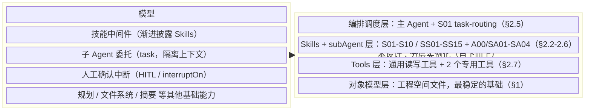
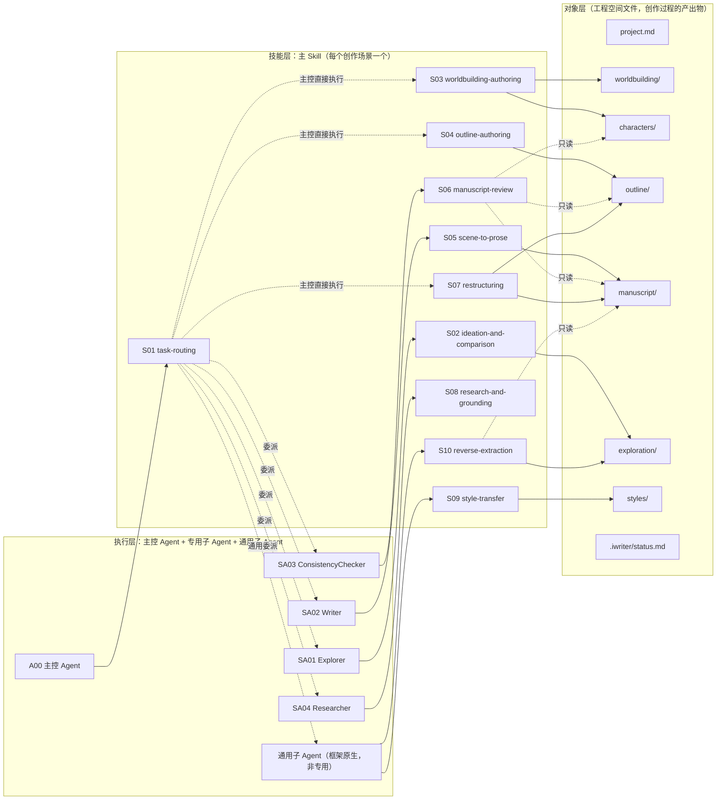

# 小说创作搭子 | AI Story Buddy：概要设计

> 本文档是小说创作搭子（`AI Story Buddy`）的概要设计文档，基于《02. 小说创作搭子 | AI Story Buddy：需求文档》展开，回答"如何满足需求"，不重复陈述需求本身的动机与约束（详见 02）。**设计的主体逻辑必须先从需求独立推导确定，现有实现（包括现有代码、现有 skills 文件、现有 subAgent 的 prompt、现有工具命名）在纯设计阶段一律不作为参考或设计依据**——它们只在设计结论确定之后的"如何利用/重构现有代码"阶段被核验是否可复用、要改还是要砍，不能反过来用现状去定义或限定设计结论。讨论过程与历次修订见 git 历史，正文不做 v1/v2/v3 式自我版本标注。

* * *

## 0. 设计方法与总体架构

本设计建立在一个**完整的通用 Agent 框架（deepagents）之上**：规划、文件系统、带隔离上下文的子代理调度、技能中间件、工具调用、人工确认中断，这些能力框架本身已经提供，不是本设计要重新发明的东西。

设计要做的事情，是把"**从灵感到一部小说完稿**"这个完整创作过程中涉及的全部场景与流程（含每个环节的产出物），忠实地复刻到这个框架已有的四类积木上：**main agent（A00）+ sub agent（SA01-SA04）+ skills（S01-S10 主技能、SS01-SS15 子技能）+ tools**。设计的主体工作不是发明一套新的架构概念，而是回答"这个场景对应哪段流程、这段流程产出什么、该由哪类积木承担"——这个映射关系本身才是设计内容，具体映射结果见 §2；§2.2 附有从灵感到完稿的**小说创作流程图**，展示这个流程如何落到 A00/SA/S/SS 各角色上，那张是流程图，不是这里要给的整体架构图。

**总体架构**：左边是通用 Agent 框架本身提供的能力（模型、技能中间件、子 Agent 委托、HITL 等，本设计不重新发明）；右边是本设计在这些能力之上做的分层实例化，从下到上：对象模型（最稳定的基础）→ Tools 层（操作对象模型的手段）→ Skills + subAgent 层（技能内容与专用执行载体）→ 编排调度层（主 Agent 借助 S01 这个技能做场景判定与委派）。右边这四层是本设计真正要交付的内容，左边是复用、不是设计对象。

这是一个静态的层级依赖关系（上层建立在下层之上，框架为整体提供能力），不是一个随时间推进的流程——用 flowchart 的有向边表达会暗示"数据/控制按顺序流动"，与实际关系不符，因此改用 mermaid 的 `block-beta`（块/分层架构图），只表达层级与从属，不带时序含义：



一条箭头概括不了框架各能力具体供给哪一层，精确对应关系是：

| 框架能力 | 供给的层 |
| --- | --- |
| 模型 | 支撑全部四层的推理能力 |
| 技能中间件 | Skills + subAgent 层的技能加载与渐进披露机制 |
| 子 Agent 委托（task） | Skills + subAgent 层的委派实现 + 编排调度层的委派决策 |
| HITL / interruptOn | Tools 层的写操作确认 + 编排调度层的高风险确认（§5） |
| 规划 / 文件系统 / 摘要 | 对象模型层的读写与长会话的上下文管理 |

**设计顺序**：场景与业务需求 → 创作流程 → Skills（核心） → Tools（服务于 skills 的流程需要）。这个顺序不可逆——tools 不反过来决定 skills，唯一的例外是工具自身复杂到需要独立操作说明时，那份说明可以拆成一类"工具专属参考技能"，但这是特例，不是设计的主干（见 §2.7）。

对这个 agent 而言，**Skills 是核心设计对象，Agent（主控 + 专用子 Agent）不是设计的主体，而是 skills 的执行载体**：一个 Agent/subAgent 的 prompt 只应该包含身份定位、工具范围、输入输出契约、安全红线这几类"执行体本身"的内容；核心创作流程逻辑、技法知识、对象结构定义，一律以 skill 的形式存在，Agent 的 prompt 通过指针引用对应的主 skill，不把流程写死在 prompt 里。这样做的好处：主 skill 可以独立于"要不要设立专用子 Agent"这个决策先行设计和调试（skill 是文档，比一整块焊死的 prompt 更容易单独修改、单独验证），也让"skills 才是核心，tools 只是配合"这个定位在架构上真正成立。

需求早期草稿曾用"通用内核/适配层/任务层"三层框架组织问题，本设计**不采用这个框架**——它不对应任何独立的架构层，也不提供任何单靠对象模型、skills 划分、S01 模式判定本身回答不了的问题，保留它只会制造一个实际不存在的层级去对应。这三层原本想覆盖的具体诉求，已经分别独立成立、不需要这层包装：对象模型的稳定部分（§1）、审批规则（§5）是长期不变的设计基础；作者成熟度/题材/风格/干预强度/风险偏好这些差异，落实为 `project.md` 的配置字段（§1.3）+ skills 的可组合规则（§2）+ S01（task-routing）的模式判定策略；具体能做什么由 §2 的场景类别与 Skills 总表决定。02 需求文档已相应去掉这一框架，不再作为需求组织原则。

* * *

## 1. 对象模型与工程空间设计

> 对应 FR-1、FR-3

### 1.1 目录与对象映射

每个目录/文件按三个维度标注：**必需/可选**（必需 = 项目存在即必须有；可选 = 特定条件触发才创建，全部走懒创建，不预先建空文件）、**维护方**（作者 = 内容应由作者书写，agent 只做编辑辅助；agent = 派生产物，作者不直接编辑；两者 = 都可以直接写）、**是否进 git**（派生产物/纯工程态内容不进 git，作者创作意图的载体进 git）。任何目录都必须能在下表里找到必要性理由，否则该目录本身就该被砍掉。

```
{workspace}/
  project.md                   # 作品对象：身份信息 + 当前版本字段（§4）
  worldbuilding/
    worldbuilding.md           # 设定对象，默认单文件
    factions.md                # 可选：规模增长后从 worldbuilding.md 拆出（阵营/地理）
  characters/
    characters.md              # 全部角色的默认登记点（见 1.3）
    {slug}.md                  # 可选：升格为独立档案的重要角色（升级阈值见 1.3）
  outline/
    master-outline.md          # 结构对象：总纲（见 1.2/1.3）
    vol{NN}-outline.md         # 可选：卷纲（仅启用卷纲层时存在，见 1.2/1.3）
    ch{NNN}-outline.md         # 结构对象：章纲（场景列表，见 1.2/1.3）
  manuscript/
    ch{NNN}.md                 # 正文对象，内含 beat 哨兵（见 1.2）
  materials/
    fragments.md               # 素材捕获区（见 1.3）
  process/
    open-questions.md          # 可选：未决创作问题（见 1.3）
    changelog.md                # 可选：累积性创作历史叙事（见 1.3）
  exploration/                 # 候选方案区，纯目录约定（见 2.8），内容命名 {类型}-{方向名}.md
  styles/
    {slug}.md                  # 可选：风格配置对象（见 1.3、SS05），懒创建
  skills/
    {slug}/SKILL.md            # 可选：作者自定义工作流 skill（见 2.9/2.11），懒创建
  .iwriter/                    # 工程态目录：仅 agent/host 读写，作者不应手动编辑，不进 git
    status.md                  # 动态状态快照（见 1.4），纯派生物
  .git/
```

| 路径 | 必需/可选 | 维护方 | 进 git | 必要性 |
| --- | --- | --- | --- | --- |
| `project.md` | 必需 | 作者+agent（agent 辅助创建/维护"当前版本"字段） | 是 | 唯一的身份对象，是其余对象创作前提的来源（§4） |
| `worldbuilding/worldbuilding.md` | 必需 | 作者（agent 可从既有草稿提炼，见 §6） | 是 | 设定的默认单文件载体 |
| `worldbuilding/factions.md` | 可选 | 同上 | 是 | `worldbuilding.md` 规模增长后的拆分产物 |
| `characters/characters.md` | 必需 | 作者+agent | 是 | 全部角色的默认登记点；即使没有角色升格独立档案，此文件也必须存在 |
| `characters/{slug}.md` | 可选 | 作者+agent | 是 | 升级阈值触发后才创建（1.3 节） |
| `outline/master-outline.md` | 必需 | 作者+agent | 是 | 结构对象的唯一总纲 |
| `outline/vol{NN}-outline.md` | 可选 | 作者+agent | 是 | 仅启用卷纲层时存在（1.2 节） |
| `outline/ch{NNN}-outline.md` | 可选（强烈建议） | 作者+agent | 是 | 提纲价值的关键载体；跳过它直接写正文，写稿会退化为无提纲创作 |
| `manuscript/ch{NNN}.md` | 可选（懒创建） | 作者+agent | 是 | 每章动笔后才存在 |
| `materials/fragments.md` | 可选（懒创建） | 作者+agent | 是 | 首次记录碎片时创建 |
| `process/open-questions.md` | 可选（懒创建） | 作者+agent | 是 | 首次出现未决创作问题时创建 |
| `process/changelog.md` | 可选（懒创建） | agent（作者可补充/修订） | 是 | 累积性创作历史叙事 |
| `exploration/*.md` | 可选 | agent 产出（作者确认/拒绝） | 是 | 候选方案区（2.8 节） |
| `styles/{slug}.md` | 可选（懒创建） | agent 产出（作者确认/拒绝） | 是 | 风格配置对象，见 1.3；一旦作者要求"按某风格写"就需要持久化载体，否则每次都要重新提取 |
| `skills/{slug}/SKILL.md` | 可选（懒创建） | 作者（agent 可代写草稿，作者确认） | 是 | 作者对默认工作流的覆盖/补充载体（FR-9.2，见 2.9/2.11） |
| `.iwriter/status.md` | 必需（agent 自动维护） | 仅 agent | 否 | 动态状态快照，纯派生物，详见 1.4 |

### 1.2 结构层级关系与章节命名约定

结构层一共四级，逐级变细，下级永远是上级某个具体条目的展开，不是平行的另一套大纲：

```
outline/master-outline.md         总纲：结构节点 + 主题落点 + 人物弧光交汇 + 伏笔总表
  └─ outline/vol{NN}-outline.md   卷纲（可选）：本卷结构节点 + 大事件序列
       └─ outline/ch{NNN}-outline.md   章纲：场景列表（每场景 目标-冲突-结果）
            └─ manuscript/ch{NNN}.md 内的 beat 哨兵   场景内节拍
                 └─ beat 统辖的正文区间          正文本身
```

**是否启用卷纲层**：篇幅规划预估达到一定规模（如 ≥ 20 章，或作者明确说明是分卷连载题材）时启用；中短篇作品章纲直接挂在总纲下。卷纲层启用时，总纲变粗（只保留全书维度的宏观弧线），每卷的结构细节下沉到卷纲中。

四级里前两级（总纲/卷纲）是"事件级"颗粒度，后两级（章纲/beat）是"场景级"颗粒度，分界线在章纲：**从章纲往下，叙事单元统一是场景（scene）**。场景结构是三段式，这是章纲层场景列表的字段定义本身：

- **目标（goal）**：场景内 POV 角色这一刻具体想要什么——必须具体到"能判断是否达成"，不能是"想变强"这种抽象欲望；
- **冲突（conflict）**：谁、什么、何种处境阻止了这个目标，没有冲突场景就是流水账；
- **结果（outcome）**：三种出口之一——目标达成但代价更大／目标未达成／目标达成但揭示了新问题。**不能是"顺利达成"**，顺利达成意味着这个场景对故事没有推进力，该被精简或删除。

beat 哨兵是场景的下一级展开：格式 `> [场景-{N}-节拍-{M}] 一句话提纲`，紧跟其统辖的正文段，回指章纲的场景序号，一个场景在正文里通常展开为 2~5 个 beat。

**章节文件命名约定**（章节故事顺序的权威机制）：

章节文件名遵循三级命名约定，保证文件字母排序始终等于故事顺序，无需维护单独的章节顺序列表：

- 第一级：`ch{NNN}.md`，三位数字，给 100 章以内的长篇留足空间（如 `ch001.md`、`ch025.md`）；
- 第二级：`ch{NNN}{a-z}.md`，在原章节后插入新章节时使用（如 `ch003a.md` 插在 `ch003.md` 之后、`ch004.md` 之前）；
- 第三级：`ch{NNN}{a-z}{a-z}.md`，第二级之后继续插入时使用（如 `ch003aa.md` 插在 `ch003a.md` 之后）。

同样的三级约定适用于章纲文件（`ch{NNN}-outline.md`、`ch{NNN}a-outline.md`），正文与章纲文件名前缀一一对应。此约定不需要额外字段维护，agent 按字母序读取目录即得正确故事顺序。

**"调整情节" = 编辑某一层、向上/向下冒泡**：改一个 beat → 只重写该 beat 统辖区间；某场景的目标/冲突/结果改变 → 提示是否需要重写该场景对应的全部 beat；章纲改动影响主线 → 提示是否需要调整卷纲/总纲。冒泡是**提示**，不是自动连锁修改（对应需求 FR-6.2：影响面必须先展示，不自动传播）。

**反向生成**（从已有正文提炼章纲/总纲）有明确写入目标：从 `manuscript/ch003.md` 提炼 → 写入 `outline/ch003-outline.md`；多章模式归纳 → 写入/校正 `outline/master-outline.md`。这一机制是 §6 反向导入设计复用的基础能力，不是两套逻辑。

### 1.3 各对象文档字段定义

按目录组织，一个对象对应一类工作任务。字段是"必须有"的下限，agent 可视项目情况增补，但缺这些字段视为对象未建立完整。字段命名一律使用 kebab-case；必选字段列前，可选字段列后；示例中字段均使用 H3 级（`###`）作为节头，便于 agent 用 `get_section` 精确读写单个字段。字段定义本身在运行时以 schema 参考技能的形式存在（SS01-SS05、SS15，见 §2.6），此处是这些技能内容的权威来源。

#### `project.md`（作品对象，单文件，全程仅一份）—— SS01 project-schema

| 字段（英文名） | 必选/可选 | 说明 |
| --- | --- | --- |
| 书名 (title) | 必选 | — |
| 题材/标签 (genre-tags) | 必选 | 自由文本，不限定枚举——题材是策略适配维度（FR-10），对象层不预设题材分类 |
| 故事核心句 (premise) | 必选 | 必须包含四要素：主角是谁、目标是什么、核心阻碍是什么、赌注（失败代价）是什么 |
| 主题 (theme) | 必选 | 一句话哲学命题，不要求文学化措辞，要求清楚 |
| 读者承诺 (reader-promise) | 必选 | 这本书向读者承诺的核心体验（爽感/悬疑解谜/情感共鸣等），全书不应违背 |
| 篇幅规划 (scale-plan) | 必选 | 预估总字数/章节数量级 + 每章目标字数，决定是否启用卷纲层 |
| 当前版本 (version) | 必选 | 形如 `1.2（初稿补写中）`，语义见 §4 |
| 目标读者 (target-audience) | 可选 | — |

**完整示例：**

```markdown
# project.md

### 书名
照片

### 题材/标签
犯罪、家庭、悬疑

### 故事核心句
退伍老兵阿坤想找回失踪的女儿，但唯一线索指向他曾经背叛过的黑帮，一旦重新接触就可能连累现在的家庭。

### 主题
复仇是否值得付出和解的代价

### 读者承诺
层层剥开的悬疑感 + 父女情感线的揪心

### 篇幅规划
约 25 万字，预计 60 章，每章约 4000 字，启用卷纲层

### 当前版本
0.3（设定收敛中）
```

#### `.iwriter/status.md`（过程对象，动态状态快照）

| 字段（英文名） | 必选/可选 | 说明 |
| --- | --- | --- |
| 重建时间 (rebuilt-at) | 必选 | ISO 时间戳，host 侧以此为基准计算 git diff，判断哪些字段需增量更新 |
| 当前进度 (progress) | 必选 | 写到第几章、最近一次写作动作 |
| 角色状态摘要 (character-status-digest) | 必选 | 每个重要角色当前所处弧光阶段的一句话摘要，详情指向 `characters/{slug}.md` |
| 开放伏笔摘要 (open-threads-digest) | 必选 | 指向 `outline/master-outline.md` 伏笔总表里尚未回收的条目 |
| 写作约束摘要 (writing-constraints-digest) | 必选 | 视角/时态/基调，从 `worldbuilding.md` 与已确认章纲提炼，不重复定义 |
| 待解决摘要 (open-questions-digest) | 必选 | 指向 `process/open-questions.md` 中状态为"待决策"的条目 |

`status.md` 不是数据源，是**全部由 agent 生成的派生摘要**，目标 500-1000 token。**重建策略**：host 侧在会话启动时执行 `git diff` 比对 `rebuilt-at` 之后的变更文件列表；若变更局限于某几个对象，agent 只更新受影响字段（如只有 `ch005.md` 改动，则只更新 `progress`）；若变更覆盖多个对象层或 `status.md` 缺失，则触发全量重建。全量重建也可由作者显式要求——**status.md 丢失或过期时，主控绝不能凭记忆猜测进度去重做已完成的工作，必须触发全量重建**：这是跨会话恢复里最昂贵的失败模式，重做已完成的工作比多花一次全量重建的成本高得多。

不存在"作者直接编辑 `status.md` 来改设定"这种用法——作者要改设定，改 `worldbuilding/worldbuilding.md` 本身。使用时机：写作任务开始前、审校全稿扫描前、查证任务需要快速定位当前故事状态时；不需要每次对话都读取，agent 按需加载。

#### `worldbuilding/worldbuilding.md`（设定对象）—— SS02 worldbuilding-schema

| 字段（英文名） | 必选/可选 | 说明 |
| --- | --- | --- |
| 规则体系 (rule-systems) | 必选 | 题材相关：magic system / 科技水平 / 社会运作规则；现实主义题材可填"无超自然规则，遵循现实社会运作规则"。要求写到"这条规则在什么情况下会被测试/违反会怎样"，不是纯背景介绍 |
| 禁区 (forbidden-zones) | 必选 | 绝对不能出现的设定矛盾，必须写明原因（"因为 X 会破坏 Y 设定的根基"，不是只列"不能做 X"） |
| 时代背景 (era) | 可选 | — |
| 阵营与势力 (factions) | 可选 | 每个阵营的诉求、与主角的关系；规模变大后拆到 `factions.md` |
| 地理信息 (geography-locations) | 可选 | 地理、城镇、地图、场景档案；规模变大后拆到 `geography.md` |
| 历史沿革 (history-timeline) | 可选 | 世界历史、故事时间线、重大历史事件 |
| 名词体系 (terminology) | 可选 | 专有名词统一表：人名/地名/机构名的标准写法，供精修期核对一致性 |

规模增长后可拆分为 `worldbuilding.md`（规则/时代/历史）+ `factions.md`（阵营），拆分时机由 agent 判断（"够用就不拆"原则），不强制预先拆分。

**完整示例：**

```markdown
# worldbuilding/worldbuilding.md

### 规则体系
无超自然规则，遵循现实社会运作规则；黑帮势力的运作逻辑遵循"人情债优先于法律"

### 禁区
阿坤不能轻易诉诸暴力解决问题——因为这会摧毁"他已经改过自新"这条主题落点的根基

### 时代背景
当代，南方某港口城市

### 阵营与势力
→ worldbuilding/factions.md

### 名词体系
| 标准写法 | 类型 | 说明 |
| --- | --- | --- |
| 和盛帮 | 机构 | 控制货运线的黑帮，勿写作"和胜帮" |
| 阿坤 | 人名 | 主角，本名陈国坤 |
```

#### `characters/{slug}.md`（重要角色个人档案）—— SS03 character-schema

| 字段（英文名） | 必选/可选 | 说明 |
| --- | --- | --- |
| 姓名/别名 (name-aliases) | 必选 | — |
| 角色重要性 (importance-tier) | 必选 | 主角 / 重要配角 / 配角——路人不升格到独立档案 |
| 功能定位 (story-function) | 必选 | 自由文本，如"导师"/"对手"/"催化者"——这个角色在叙事机器里承担什么功能，不是性格描述 |
| 外显特征 (visible-traits) | 必选 | 性别、年龄、身体状态、阶层、职业、语域——常识问题（FR-1.2 对应需求 issues#3）的直接解法：移动速度、情绪外露程度、说话方式都应能从这组字段机械推导 |
| 核心欲望 (desire) | 必选 | 心理三角之一 |
| 核心恐惧 (fear) | 必选 | 心理三角之一 |
| 虚假信念 (false-belief) | 必选 | 心理三角之一，要求是"可被推翻的错误认知"而非性格标签——例：「他相信展现脆弱等于失去尊重」是虚假信念，"他很骄傲"不是 |
| 成长弧光 (arc) | 必选 | 初始状态 → 目标状态 → 当前阶段，三段都填 |
| 关系网络 (relationships) | 必选 | 与其他角色的关系，双向标注（A 对 B 的认知 ≠ B 对 A 的认知，这种不对称往往是冲突来源） |
| 声音特征 (voice) | 必选 | 词汇选择/语速节奏/惯常沉默点 |
| 当前状态 (current-status) | 必选 | 随故事推进更新 |
| 出场章节索引 (appearance-index) | 必选 | 列出出场章节文件名 |
| 关键能力/资源 (key-abilities) | 可选 | 仅当直接影响情节可行性时才需要填 |
| 独特背景 (background) | 可选 | 只写"会被正文引用到"的过去经历 |

**完整示例：**

```markdown
# characters/老周.md

### 姓名/别名
老周

### 角色重要性
配角

### 功能定位
信息掮客 / 道义考验

### 外显特征
男，58 岁，码头退休搬运工，左手缺两指（旧工伤），说话直接不绕弯

### 核心欲望
尽快还清对和盛帮的旧债，不再被任何人欠人情

### 核心恐惧
被卷入下一代的麻烦里，连累已经成家的女儿

### 虚假信念
他相信"还清债就能彻底脱身"——事实上和盛帮从不真正放人走

### 成长弧光
初始（试图置身事外）→ 目标（彻底摆脱黑帮纠缠）→ 当前阶段（被迫再交出一个人情）

### 关系网络
欠阿坤一个旧人情（已还清，本不欠）；欠和盛帮一笔旧债（未清，是这次让步的真实原因）

### 声音特征
短句，少修饰，习惯用"行了""算了"收尾对话

### 当前状态
刚向阿坤交出照片来源，处境比之前更复杂

### 出场章节索引
ch003.md
```

#### `characters/characters.md`（全部角色登记表，单文件）

角色的**唯一名单入口**：不论一个角色是否已升格为独立档案，都必须在这里有一条记录——已升格的角色只保留一句引用，不复制内容。

| 字段（英文名） | 必选/可选 | 说明 |
| --- | --- | --- |
| 姓名 (name) | 必选 | — |
| 档案状态 (profile-status) | 必选 | 合集内 / 已升格——已升格时本条目只保留引用 |
| 功能定位 (story-function) | 条件必选（合集内） | 信使/路人/反派打手/导师，一词 |
| 与主角关系 (relation-to-protagonist) | 条件必选（合集内） | 一句话 |
| 显著特征 (notable-traits) | 条件必选（合集内） | 1-2 句，够区分声音即可 |
| 独立建档标记 (profile-flag) | 可选 | 待决策 / 已建议 / 已拒绝 |
| 独立档案引用 (profile-ref) | 条件必选（已升格） | 形如 `→ characters/老周.md` |

**完整示例：**

```markdown
# characters/characters.md

| 姓名 | 档案状态 | 功能定位 | 与主角关系 | 显著特征 | 独立建档标记 | 独立档案引用 |
| --- | --- | --- | --- | --- | --- | --- |
| 老周 | 已升格 | | | | | → characters/老周.md |
| 阿坤的妹妹 | 合集内 | 信使 | 唯一还愿意和阿坤说话的家人 | 说话快，爱替阿坤操心 | 已建议 | |
| 货运站柜员 | 合集内 | 路人 | 无 | 只在 ch002 出现一次，没有显著特征 | | |
```

**角色独立建档的阈值规则**：

- **触发独立建档**（满足任一条件即可）：① 该角色在第 2 个不同章节中出现实质性动作/对话（不只是被提及）；② 作者明确指定该角色重要；③ 该角色承担一条独立副线。
- **人数豁免阈值**：当前"重要角色"总量（已独立建档 + 已满足升级条件待处理）**≤ 5** 时允许继续合并；超过 5 后，新触发升级条件的角色强制走一次升格审批（作者可拒绝，拒绝后留在合集里但保留标记，下次再问）。5 是初始可调阈值，写入 `project.md` 或设置项。
- **合集内容溢出信号**：某条目"显著特征"超过 3-4 句时，agent 应主动提议建立独立档案。
- **不做自动降级**：独立档案降级回合集是低频操作，不提供专门工具，按普通文件操作（删除/合并）处理。

#### `outline/master-outline.md`（总纲，单文件，全程仅一份）—— SS04 outline-schema（之一）

**未启用卷纲层时**（中短篇），总纲包含全书完整结构细节：

| 字段（英文名） | 必选/可选 | 说明 |
| --- | --- | --- |
| 故事核心句 (premise) | 必选 | 与 `project.md` 一致，此处可展开为 2-3 句 |
| 主题落点 (theme-beats) | 必选 | 主题如何具体化为情节事件——通过哪几个具体情节让读者感受到主题，每个落点指向大致结构节点 |
| 结构节点 (structure-nodes) | 必选 | 默认 8 个题材中立占位节点：开篇钩子 / 激励事件 / 早期试炼 / 中点转折 / 危机加深 / 至暗时刻 / 高潮 / 结局余波。每节点填：发生什么（具体事件）、大致章节区间、关联到哪条人物弧光 |
| 人物弧光交汇点 (arc-intersections) | 必选 | 列出主要角色的弧光在哪些结构节点彼此交汇/冲突 |
| 伏笔总表 (foreshadow-table) | 必选 | 表格：伏笔内容 / 埋设章节 / 回收章节 / 所属结构节点 / 状态（待埋设/已埋设/已回收） |
| 候选方向记录 (candidate-directions) | 可选 | 若主线仍有未收敛的方向，标注"候选"并指向 `exploration/` 对应文件 |

**启用卷纲层时**，总纲只保留全书维度的宏观弧线：

| 字段（英文名） | 必选/可选 | 说明 |
| --- | --- | --- |
| 故事核心句 (premise) | 必选 | 同上 |
| 主题落点 (theme-beats) | 必选 | 全书维度的主题落点 |
| 全书结构弧 (global-arc) | 必选 | 一段话描述全书从开篇到结局的宏观走向，不精确到章节区间 |
| 人物弧光总览 (arc-overview) | 必选 | 每个主要角色的完整弧光（从起点到终点），不细化到卷内阶段 |
| 伏笔总表 (foreshadow-table) | 必选 | 全书维度的伏笔总表，各卷伏笔操作在 vol-outline 内另行记录 |
| 卷纲索引 (volume-index) | 必选 | 列出各卷目标并指向 `vol{NN}-outline.md` |

**完整示例（未启用卷纲层）：**

```markdown
# outline/master-outline.md

### 故事核心句
退伍老兵阿坤想找回失踪的女儿，但唯一线索指向他曾经背叛过的黑帮，一旦重新接触就可能连累现在的家庭。

### 主题落点
主题"复仇是否值得付出和解的代价"通过三个具体情节落地：①阿坤第一次拒绝黑帮邀请（ch008）；②阿坤为救女儿被迫代替黑帮做了一件违法的事（ch030）；③终章选择——放弃追查还是公开真相（ch058）。

### 结构节点

#### 开篇钩子（ch001）
阿坤在码头的平静生活，一个细节暗示他过去不像现在这么干净。
关联弧光：阿坤（外表改变但内心未和解）

#### 激励事件（ch002-ch003）
阿坤收到一张匿名照片，照片里的女孩侧脸与失踪的女儿有六成相似。
关联弧光：阿坤（从"已放下"到"重新被钩住"）

### 人物弧光交汇点
阿坤与老周的弧光在"激励事件"与"中点转折"两个节点交汇：前者是老周被迫交出线索，后者是老周的旧债真正暴露。

### 伏笔总表
| 伏笔内容 | 埋设章节 | 回收章节 | 所属结构节点 | 状态 |
| --- | --- | --- | --- | --- |
| 照片来源指向阿坤曾背叛过的黑帮 | ch003 | 未定 | 激励事件 | 已埋设 |
```

#### `outline/vol{NN}-outline.md`（卷纲，可选层）—— SS04 outline-schema（之二）

每一卷是全书叙事弧线上的一个独立阶段——有完整的冲突弧线，但故事本身尚未结束。卷纲相当于该卷的详细小总纲：

| 字段（英文名） | 必选/可选 | 说明 |
| --- | --- | --- |
| 本卷结构功能 (structural-role) | 必选 | 对应 `master-outline.md` 的哪段全书弧线 |
| 本卷结构节点 (structure-nodes) | 必选 | 本卷内部结构节点序列，格式同总纲 |
| 本卷核心冲突 (core-conflict) | 必选 | 本卷阶段性的主要阻碍/反派/危机 |
| 本卷人物弧光阶段 (arc-stage) | 必选 | 各主要角色在本卷经历的弧光阶段，衔接上一卷末状态 |
| 本卷伏笔操作 (foreshadow-ops) | 必选 | 埋设 / 强化 / 回收，与总纲伏笔总表对应 |
| 本卷高潮与收尾 (volume-climax) | 必选 | 本卷内部高潮 + 收尾状态 |
| 章节列表 (chapter-list) | 必选 | 本卷覆盖的章节文件名列表，按故事顺序 |
| 衔接 (transition-notes) | 可选 | 与上一卷承接点、给下一卷的铺垫 |

**完整示例：**

```markdown
# outline/vol01-outline.md

### 本卷结构功能
覆盖全书弧线"开篇钩子"到"中点转折"

### 本卷结构节点

#### 开篇钩子（ch001）
阿坤在码头的平静生活，一个细节暗示他过去不像现在这么干净。
关联弧光：阿坤（外表改变但内心未和解）

#### 激励事件（ch002-ch003）
阿坤收到匿名照片，决定重新接触线索。
关联弧光：阿坤（从"已放下"到"重新被钩住"）；老周（被迫参与）

### 本卷核心冲突
和盛帮对旧账的隐性施压：阿坤每接近一步真相，就被迫还掉一个人情

### 本卷人物弧光阶段
阿坤：从"平静但未愈合"到"主动踏入危险区"
老周：从"置身事外"到"被迫交出第二个人情"

### 本卷伏笔操作
| 伏笔内容 | 操作 | 章节 |
| --- | --- | --- |
| 照片来源指向阿坤背叛过的黑帮 | 埋设 | ch003 |
| 老周自己欠和盛帮旧债 | 强化 | ch006 |

### 本卷高潮与收尾
阿坤确认照片不是伪造，决定正面接触线索人；老周旧债暴露，两人处境均复杂化。留悬：和盛帮是否已察觉阿坤的调查。

### 章节列表
["ch001.md", "ch002.md", "ch003.md", "ch004.md", "ch005.md", "ch006.md", "ch007.md", "ch008.md"]
```

#### `outline/ch{NNN}-outline.md`（章纲，提纲价值的关键载体）—— SS04 outline-schema（之三）

| 字段（英文名） | 必选/可选 | 说明 |
| --- | --- | --- |
| 本章结构功能 (structural-role) | 必选 | 对应总纲/卷纲的哪个结构节点 |
| 状态 (status) | 必选 | 草稿中 / 已确认——对应需求 FR-2.3"候选 vs 已确认前提" |
| 场景列表 (scenes) | 必选 | 核心字段，见下表，一章通常 1-3 个场景 |
| 本章伏笔操作 (foreshadow-ops) | 可选 | 埋设 / 强化 / 回收，逐条对应总纲伏笔总表条目 |
| 开篇钩子/结尾悬念 (hook-cliffhanger) | 可选 | 章节首尾的吸引力设计 |
| 衔接 (transition-notes) | 可选 | 与上一章衔接点、给下一章的过渡铺垫 |

**场景列表字段（每个场景一段，标题格式 `### 场景-{N}`）：**

| 子字段（英文名） | 必选/可选 | 说明 |
| --- | --- | --- |
| 地点/时间 (location-time) | 必选 | — |
| 出场人物（含 POV）(characters-pov) | 必选 | 若全书用多视角叙事，必须标明本场景的 POV 角色 |
| 目标 (goal) | 必选 | POV 角色这一刻具体想要什么，要求可验证是否达成 |
| 冲突 (conflict) | 必选 | 谁/什么阻止了目标 |
| 结果 (outcome) | 必选 | 达成但代价更大 / 未达成 / 达成但揭示新问题——不能是顺利达成 |
| 情绪基调/节奏 (tone-pacing) | 可选 | 快/慢、紧张/舒缓 |
| 信息释放 (information-reveal) | 可选 | 本场景向读者揭示什么新信息、对谁仍隐藏什么 |

**完整示例：**

```markdown
# outline/ch003-outline.md

### 本章结构功能
激励事件的后半段

### 状态
已确认

### 场景-1

#### 地点/时间
码头仓库，深夜

#### 出场人物
阿坤（POV）、老周

#### 目标
阿坤想让老周说出照片的来源

#### 冲突
老周欠阿坤的人情已经还清，不愿意再卷入

#### 结果
老周说出来源，但代价是要阿坤帮他做一件违法的事——交换条件让阿坤的处境更复杂

#### 情绪基调
压抑，对话为主，节奏慢但张力累积

#### 信息释放
揭示照片来源指向阿坤曾背叛过的黑帮；对读者隐藏老周自己也欠那个黑帮的债
```

这样的章纲才有"提纲的价值"——拿到这份提纲可以直接知道该写什么对话、什么转折，而不是面对一句"阿坤去找老周问线索"自己现编冲突和结果。

#### `manuscript/ch{NNN}.md`（正文，每章一份）

beat 哨兵格式 `> [场景-{N}-节拍-{M}] 一句话提纲`，紧跟其统辖的正文段，回指章纲的场景序号（1.2 节）。文件名与 `outline/ch{NNN}-outline.md` 遵循相同的三级命名约定。

#### `process/open-questions.md`（过程对象，单文件）

登记**创作决策层面**悬而未决的问题——故事该怎么走、设定有没有矛盾——不是开发缺陷或技术 TODO。

| 字段（英文名） | 必选/可选 | 说明 |
| --- | --- | --- |
| 问题描述 (question) | 必选 | — |
| 出现章节/上下文 (context-ref) | 必选 | — |
| 提出时间 (raised-at) | 必选 | — |
| 状态 (status) | 必选 | 待决策 / 已解决 |
| 解决后归档去向 (resolved-into) | 条件必选（已解决） | 若解决方式是写入某个对象文件，记录指向哪个文件 |

**完整示例：**

```markdown
# process/open-questions.md

## 女儿失踪当年的真相要不要在卷一揭示？

### 出现章节/上下文
ch003，老周交出线索后

### 提出时间
2026-03-01

### 状态
待决策
```

#### `process/changelog.md`（过程对象，单文件）

承担**累积性创作叙事**：作者/agent 用人类语言记录"这次为什么这么改、对故事产生了什么影响"——这是 git commit message 不会写、`.iwriter/status.md`（无历史的即时快照）也不承担的东西。单文件追加写，按时间顺序堆叠。

| 字段（英文名） | 必选/可选 | 说明 |
| --- | --- | --- |
| 时间/版本号 (timestamp-version) | 必选 | 记录时间，若恰逢版本号变化可一并记录 tag |
| 变更摘要 (summary) | 必选 | — |
| 影响范围 (scope) | 必选 | 涉及哪些对象文件/章节 |
| 触发原因 (trigger) | 必选 | 大修 / 精修 / 问题修补 / 版本回退 |

**完整示例：**

```markdown
# process/changelog.md

## 2026-03-10（0.3 → 0.4）

### 变更摘要
把老周的核心恐惧从"怕死"改成"怕连累女儿"，原设定和他后续的让步动机冲突

### 影响范围
characters/老周.md，outline/ch003-outline.md 场景-1 的冲突字段同步调整

### 触发原因
一致性检查发现动机矛盾
```

#### `materials/fragments.md`（素材对象，单文件，多条目）

素材捕获区 + 路由前的暂存区，涵盖"一句对话、一个场景念头、一个人物细节、一个伏笔想法"这类归宿不同的碎片。

| 字段（英文名） | 必选/可选 | 说明 |
| --- | --- | --- |
| 原始内容 (raw-content) | 必选 | 一句话/几个词/情绪/问题，**不强制作者分类**——零摩擦记录是核心价值 |
| 采用状态 (adoption-status) | 必选 | 未采用 / 已采用 |
| 类型 (type) | 必选 | 场景念头 / 对话片段 / 人物细节 / 伏笔想法 / 情绪意象 / 调研笔记 / 未分类——**agent 在处理相关任务时顺带标注**，作为编辑动作提交审批 |
| 记录时间 (recorded-at) | 必选 | 用于按时序排序素材 |
| 关联线索 (related-refs) | 可选 | 可能关联的角色/章节/结构节点，agent 识别后填 |
| 采用去向 (adopted-into) | 条件必选（已采用） | 记录被并入了哪个对象文件 |

**完整示例：**

```markdown
# materials/fragments.md

## 老周左手缺两指

### 原始内容
老周左手缺了两指，是旧工伤，握手时会下意识把手藏在背后。

### 类型
人物细节

### 记录时间
2026-03-02

### 关联线索
老周，ch003.md

### 采用状态
已采用

### 采用去向
并入 characters/老周.md 的外显特征
```

agent 不要求作者在记录时分类，但在合适时机（如下次涉及相关对象的任务）主动提议"这条碎片要不要并入 XX"，由作者决定是否采纳。

#### `styles/{slug}.md`（风格配置对象，可选、懒创建）—— SS05 style-schema

风格提取的产物本质上更接近"项目专属技能"而不是故事事实（不像角色/设定是关于故事世界的事实，它是一套操作化的生成技术），所以单独放 `styles/` 目录，不塞进 `worldbuilding/` 或 `characters/`。

| 字段（英文名） | 必选/可选 | 说明 |
| --- | --- | --- |
| 风格标识 (slug) | 必选 | — |
| 来源说明 (source-author) | 必选 | 一句话说明提炼自谁的范文，不是凭空定义 |
| 声音 (voice) | 必选 | 叙述者姿态/距离/情感温度 |
| 措辞 (diction) | 必选 | 词汇偏好、禁用词 |
| 句法 (syntax) | 必选 | 句长模式、标志性句式、标点 |
| 意象 (imagery) | 可选 | 反复出现的意象、感官通道 |
| 生成配方 (generation-recipe) | 必选 | 写稿时可直接照做的操作化步骤，不是文学评论 |
| 自检清单 (self-check) | 必选 | 审校时核对的检查点 |
| 采用范围 (scope) | 必选 | 全书默认应用 / 仅特定人物对话适用 等 |

**完整示例：**

```markdown
# styles/lu-xun.md

### 风格标识
lu-xun

### 来源说明
提炼自作者提供的《孔乙己》《故乡》节选

### 声音
冷静克制的旁观者，情感藏在白描之下，偶尔以反讽刺破表面平静

### 措辞
偏好具体名词而非抽象形容词；不用"仿佛""似乎"这类模糊化措辞

### 句法
短句为主，长短句交替制造停顿；对话极简，很少用修饰性副词

### 生成配方
1. 先写动作/场景的白描，不直接写情绪
2. 情绪通过一个具体细节侧面带出，不直接命名情绪词
3. 对话保留口语化断句，不补全书面语法

### 自检清单
- 是否出现了"仿佛""似乎"等被禁止的模糊化措辞？
- 情绪是否被直接命名（如"他很难过"），而不是通过细节呈现？

### 采用范围
全书默认应用
```

### 1.4 `status.md` 的定位

- `project.md` = **身份信息**，几乎不变（书名/主题/读者承诺/篇幅规划），改动频率低，进 git；
- `.iwriter/status.md` = **状态快照**，随写作推进频繁重建，是 agent 派生产物，作者可读但不应把它当成编辑设定的入口，不进 git——内容随时会被下一次重建整体覆盖，进入版本历史没有意义；真正值得进 git 的"变化叙事"由 `process/changelog.md` 承担（1.3 节）。

### 1.5 对象间引用索引

**不做** wiki 式组织（`[[链接]]`、反向链接、graph view）：角色/设定规模本来就小（1.3 节的 5 人豁免阈值已把"重要对象"控制在个位数），文件树直接点开即可定位；强迫作者书写 `[[...]]` 也与需求 NFR-3"不暴露系统内部技术概念"直接冲突。

但 wiki 机制里真正有价值的部分——**精确的反向引用**——做成对作者完全隐形的 agent 侧能力：agent 已经知道全部对象名称（`characters/`/`worldbuilding/` 下的标题），扫描任意 markdown 文档的纯文本、匹配这些已知名称出现的位置，就能得到"谁提到了谁"的精确对照表——不需要作者写任何特殊语法，纯 prose 即可被索引。

用途：① 高风险操作的影响面分析（§5）；② "我在哪些章节提到过这个角色/这条设定"的检索需求。落地为工具 `find_references(name)`（§2.7），基于精确名称匹配实现，不需要维护持久化索引表。

* * *

## 2. Agent + Skills 体系设计

> 对应 FR-1、FR-2、FR-4、FR-5、FR-6、FR-9

### 2.1 设计原则：Skills 为核心，Agent 提供身份与工具边界

一个 Agent（无论是主控还是专用子 Agent）的 prompt 只承载这几类内容：**身份定位**（一句话）、**工具范围**（能调用哪些工具，明确排除哪些）、**输入输出契约**（brief 必须含哪些字段、回报用什么固定状态词表）、**安全红线**（不能做什么）。除此之外的一切——核心创作流程、技法知识、对象结构定义——都以 skill 的形式存在，Agent 通过指针引用对应的主 skill，不把流程写死在 prompt 里。

判断一个能力要不要设立专用子 Agent（而不是主控直接执行），只在满足以下任一条件时才成立：

- (a) 必须比主控更窄的工具面，且这个收窄要在工具层强制，不能只靠 prompt 约定；
- (b) 必须有独立、不被同一条推理链污染的上下文（避免确认偏差，或隔离会污染主控上下文的大段样本文本）；
- (c) 必须用不同的模型。

只是"看起来该有个专属人设"不构成理由。

执行方式实际上有三种，专用子 Agent 只是其中之一：

1. **主控直接执行**：短流程、低上下文占用的任务（S03/S04 落笔、素材记录）；
2. **委派框架原生通用子 Agent**：deepagents 自带 general-purpose 子 Agent，与主控同工具同模型，但拥有隔离上下文——凡是诉求只有"上下文隔离"的任务走这条路即可，不需要为它设立任何专用定义；
3. **专用子 Agent**：仅当满足 (a)/(c)，或该场景高频到值得固定输入输出契约时才成立——(b) 的上下文隔离本身通用委派就能拿到，单独不构成设立专用子 Agent 的理由。

按此重审，专用子 Agent 收敛为四个：SA01 Explorer（构思高频 + 产出限定候选区的固定契约）、SA02 Writer（写稿高频 + 块级编辑工具面）、SA03 ConsistencyChecker（工具层强制只读 + 独立上下文避免确认偏差）、SA04 Researcher（工具层强制 web 工具面）。专用子 Agent 本身也不写死在代码里，而是以声明式定义文件动态装配（见 §2.10）——"身份定位、工具范围、输入输出契约、安全红线"这四类 prompt 内容恰好就是一个小 markdown 文件的体量。曾设想的 WritingStyle 专用子 Agent 不满足任何专用化判据：它不需要更窄的强制工具面（写入 `styles/` 之外的路径已有 `interruptOn` 审批兜底）、不需要不同模型、频率极低（一个项目通常只提炼一两次风格）；它唯一的真实诉求是隔离大段范文文本，通用子 Agent 委派即可满足。因此风格提炼定为 **S09 技能 + 通用子 Agent 委派**，不设专用执行体。反向提炼（S10，见 §2.5、§6）同理。

### 2.2 ID 编号与总表

下图是**小说创作流程图**：从灵感到完稿这个创作过程里的场景与产出，如何落到 A00/SA/S/SS 这四类积木上，不是系统的整体架构图（整体架构建立在 deepagents 这个通用 Agent 框架之上，见 §0）。



子 skill（技法/参考类）挂在对应主 skill 之下，不单独进这张流程图，完整关系见下方总表。

| ID | 分类 | 名称 | 功能描述 | 触发条件 | 包含的子 skills |
| --- | --- | --- | --- | --- | --- |
| A00 | 主agent | Creative Domain 主 Agent | 任务理解、结果收束、直接执行设定类/大纲类/重构诊断、委派子 agent | 每轮用户输入到达 | S01（常驻指针）；直接执行时指向 S03/S04/S07 |
| SA01 | Explorer子agent | Explorer | 生成多方向候选、写入候选区 | A00 依 S01 判定为构思类并委派 | S02 |
| SA02 | Writer子agent | Writer | 已确认章纲场景扩写/改写为正文块级编辑提案 | A00 判定为写稿类并委派 | S05 |
| SA03 | ConsistencyChecker子agent | ConsistencyChecker | 忠实度+质量两阶段审校 | A00 判定为审校类并委派 | S06 |
| SA04 | Researcher子agent | Researcher | 查证现实细节/专业背景 | A00 判定为通用类并委派 | S08 |
| S01 | 主skill | task-routing | 判定场景类别+委派决策 | 每轮 A00 处理前，强制 | 无（顶层路由） |
| S02 | 主skill | ideation-and-comparison | 发散生成方向、比较、写候选区 | 构思类 | SS13、SS09、SS06 |
| S03 | 主skill | worldbuilding-authoring | 设定/角色落笔为正式对象 | 设定类 | SS02、SS03、SS06、SS09 |
| S04 | 主skill | outline-authoring | 大纲落笔为正式对象+结构诊断 | 大纲类 | SS04、SS07、SS08、SS09 |
| S05 | 主skill | scene-to-prose | 章纲场景→beat→正文（展开链路）+ 按修改意图修订既有正文（修订链路） | 写稿类 | SS03、SS04、SS10、SS06、（SS14 条件） |
| S06 | 主skill | manuscript-review | 忠实度+质量两阶段审校 | 审校类 | SS11、SS12、SS03、SS04、SS02 |
| S07 | 主skill | restructuring | 大修阶段结构诊断与重排 | 重构类 | SS08、SS07、SS04；REQUIRED SUB-SKILL: S05 |
| S08 | 主skill | research-and-grounding | 查证并给出有依据的结论 | 通用类 | 无特定 |
| S09 | 主skill | style-transfer | 范文→风格配置 | 其他类，A00 经通用子 agent 委派 | SS05 |
| S10 | 主skill | reverse-extraction | 从既有正文反向提炼章纲/总纲/角色/设定候选 | 导入/反推类，A00 经通用子 agent 委派 | SS04、SS03、SS02、SS07 |
| SS01 | 子skill | project-schema | 作品对象字段定义 | 读写 `project.md` | 无 |
| SS02 | 子skill | worldbuilding-schema | 设定对象字段定义 | 读写 `worldbuilding/*.md` | 无 |
| SS03 | 子skill | character-schema | 角色对象字段定义 | 读写 `characters/*.md` | 无 |
| SS04 | 子skill | outline-schema | 结构对象字段定义 | 读写 `outline/*.md` | 无 |
| SS05 | 子skill | style-schema | 风格配置对象字段定义 | 读写 `styles/*.md` | 无 |
| SS06 | 子skill | character-believability | 心理三角/外显特征→行为推导 | 设计/写行动/审校角色时 | REQUIRED BACKGROUND: SS03 |
| SS07 | 子skill | scene-and-plot-construction | 目标-冲突-结果、因果链、伏笔 | 写大纲/展开beat/重构 | REQUIRED BACKGROUND: SS04 |
| SS08 | 子skill | structural-pacing-diagnosis | 结构/节奏诊断 | 大纲设计/大修诊断 | REQUIRED BACKGROUND: SS04 |
| SS09 | 子skill | thematic-coherence | 情节是否落地主题命题 | 构思/设定/终审 | REQUIRED BACKGROUND: SS01、SS04 |
| SS10 | 子skill | prose-craft-by-example | 范例驱动文笔 | 写稿展开正文 | REQUIRED BACKGROUND: SS03 |
| SS11 | 子skill | fidelity-check | 忠实度核查 | 审校第一阶段 | REQUIRED BACKGROUND: SS04、SS03 |
| SS12 | 子skill | prose-quality-check | 质量核查（自然度/常识/POV/伏笔/风格） | 审校第二阶段 | REQUIRED BACKGROUND: SS03、SS02、(SS05) |
| SS13 | 子skill | direction-ideation | 排除显而易见版本，保证区分度 | 构思生成候选前 | 无 |
| SS14 | 子skill | author-style-application | 应用已确认风格 | 写稿/审校且风格已存在 | REQUIRED BACKGROUND: SS05 |
| SS15 | 子skill | materials-and-process-schema | 素材/未决问题/创作日志对象字段定义 | 读写 `materials/`、`process/` | 无 |

### 2.3 场景类别 × Skills

| 场景类别 | 对应创作阶段 | 主skill | 涉及子skill |
| --- | --- | --- | --- |
| 构思类 | 前期筹备 | S02 | SS13、SS09、SS06 |
| 设定类 | 前期筹备 | S03 | SS02、SS03、SS06、SS09 |
| 大纲类 | 前期筹备 | S04 | SS04、SS07、SS08、SS09 |
| 写稿类 | 初稿写作、二轮精修 | S05 | SS03、SS04、SS10、SS06、(SS14 条件) |
| 审校类 | 一轮大修（局部）、三审定稿（全稿） | S06 | SS11、SS12、SS03、SS04、SS02、(SS05 条件) |
| 重构类 | 一轮大修 | S07 | SS08、SS07、SS04；引用 S05 |
| 通用 | 贯穿全程 | S08 | 无特定 |
| 记录类 | 贯穿全程（灵感碎片捕获，A00 直接执行） | 无（轻量追加，不展开流程） | SS15 |
| 导入/反推类 | 导入已有作品、反向生成（§6） | S10 | SS04、SS03、SS02、SS07 |
| 其他 | 任意阶段（条件触发） | S09 | SS05 |

### 2.4 Skills × 对象模型 / 工具 / 关联 Skill

| ID | 读写对象 | 常用工具 | 关联 Skill |
| --- | --- | --- | --- |
| S01 | 无（读路径前缀 + `project.md` 版本字段判断） | 无 | — |
| S02 | `exploration/` | create_document | SS13、SS09、SS06 |
| S03 | `worldbuilding/`、`characters/` | get_section、edit_block、create_document | SS02、SS03、SS06、SS09 |
| S04 | `outline/` | get_section、get_document_outline、edit_block、create_document | SS04、SS07、SS08、SS09 |
| S05 | `manuscript/`，读 `outline/`、`characters/` | get_blocks、edit_block、insert_block、replace_range | SS03、SS04、SS10、SS06 |
| S06 | 读 `manuscript/`、`outline/`、`characters/`、`worldbuilding/`、`.iwriter/status.md` | get_blocks（全量）、find_references | SS11、SS12 |
| S07 | 读 `outline/` 全量；写经 S04/S05 | get_document_outline、find_references | SS08、SS07；引用 S05 |
| S08 | 无文档写权限，产出写 `exploration/research-*.md` | web_search、fetch_url | 无 |
| S09 | 写 `styles/{slug}.md` | create_document | SS05 |
| S10 | 读 `manuscript/` 全量；写 `exploration/`，或写对象文件但状态标注"草稿中/推断待确认" | get_blocks、create_document、edit_block | SS04、SS03、SS02、SS07 |
| SS01-04 | 对应各自对象 | get_section | 无 |
| SS05 | `styles/{slug}.md` | get_section | 无 |
| SS06 | `characters/{slug}.md` | get_section | SS03 |
| SS07 | `outline/ch{NNN}-outline.md` | get_blocks、edit_block | SS04 |
| SS08 | `outline/master-outline.md`、`vol{NN}-outline.md` | get_document_outline、find_references | SS04 |
| SS09 | `project.md`、`outline/` 主题落点字段 | get_section | SS01、SS04 |
| SS10 | `manuscript/`、`characters/` 声音字段 | edit_block、get_section | SS03 |
| SS11 | `manuscript/`、`outline/`、`characters/` | get_blocks、get_section | SS04、SS03 |
| SS12 | 同上 + `styles/`（若已激活） | get_blocks、get_section | SS03、SS02、(SS05) |
| SS13 | `exploration/` | 无特定 | 无 |
| SS14 | `manuscript/`、`styles/{slug}.md` | get_section、edit_block | SS05 |
| SS15 | `materials/fragments.md`、`process/*.md` | get_section、insert_block | 无 |

### 2.5 主 Skill 详述（S01-S10）

**S01 task-routing**（A00 的常驻指针，取代模式判定的旧有专节，是主控每轮对话开始时的一次轻量决策，直接影响上下文装配策略（§3）和工具选择）

1. 读操作对象路径前缀：`worldbuilding/`/`characters/`/`outline/` → 倾向构思；`manuscript/` → 倾向写稿；无明确对象 → 继续看其他信号；
2. 读 `project.md` version 字段作倾向参考（0.x 偏构思，1.x+ 偏写稿），不锁定；
3. 读用词特征（倾向判断，不是机械匹配）："要不要试试""有没有别的可能" → 构思；"写""续写""改成""按这个章纲" → 写稿；"写一个开篇试试" → 目的是构思判断，即使动词是"写"也属于构思；
4. 风险校验：落地目标是正式对象还是候选区，风险越高越应先澄清；
5. 信号矛盾或都不够强 → 一次轻量澄清："这是想正式定下来还是先探索一下？"不默认选风险更高的分支；
6. 确定场景类别后，决定 A00 直接执行（S03/S04/S07 诊断部分、记录类轻量追加）、委派专用子 Agent（SA01-SA04），还是经通用子 agent 委派（S09 风格提炼、S10 反向提炼，见 §2.1）；
7. 两类特殊信号单列：`manuscript/` 非空但 `worldbuilding.md`/`characters.md`/`master-outline.md` 缺失或明显单薄 → 提议进入导入/反推类（S10，只提议不自动执行，见 §6）；"记一下""先记着"这类零摩擦记录请求 → 记录类，A00 直接按 SS15 追加 `materials/fragments.md`，不展开任何流程、不强制分类；
8. 写稿委派返回"前提缺口"（章纲未确认、设定不稳）时，短暂切回构思/设定/大纲类补齐前提，经作者确认后回到原写稿任务继续（FR-2.4），不静默替作者补齐前提。

候选方案处理：构思模式产出统一写入 `exploration/`，作者明确选定后才晋升为正式对象（§2.8，纯目录约定，不需要专用工具）。

红线：不允许因"看起来简单"跳过这一步；候选内容作者确认前不得进入正式对象路径。

**S02 ideation-and-comparison（SA01 Explorer）**

1. 读当前主题/已有设定/角色/大纲草案；
2. 加载 SS13——生成前先否定"显而易见版本"；
3. 生成 2-3 个有真实区分度的方向，各写入 `exploration/{方向名}.md`；
4. 涉及角色/主题时分别加载 SS06/SS09；
5. 不评判优劣，只描述差异，交还给作者选择；
6. 固定状态回报：已完成 / 方向不足需作者决定是否继续发散 / 需要更多上下文。

红线：不擅自把候选晋升为正式结论，不擅自淘汰候选。

**S03 worldbuilding-authoring（A00 直接执行）**

1. 确认待写内容已收敛（非候选），未收敛退回 S02；
2. 加载 SS02 核对字段完整性（禁区必须写明原因）；
3. 涉及角色/主题时加载 SS06/SS09；
4. create_document/edit_block 写入 `worldbuilding/*.md` 或 `characters/*.md`；
5. 高风险改动（改动已确认的核心规则/心理三角）按 §5 机制展示影响面。

红线：禁区必须写"为什么"而非只列"不能做什么"；角色独立建档遵循已定阈值。

**S04 outline-authoring（A00 直接执行）**

1. 确认已收敛，未收敛退回 S02；
2. 加载 SS04 核对场景三段式（结果不能是顺利达成）；
3. 加载 SS07、（需要时）SS08、SS09；
4. 写入 `outline/master-outline.md` 或 vol/ch-outline 文件；
5. 全局弧线设计先跑 SS08 诊断，再落笔具体结构节点。

红线：章纲状态字段（草稿中/已确认）必须显式标注；结果字段禁止"顺利达成"。

**S05 scene-to-prose（SA02 Writer）**

1. 定位——读已确认章纲场景；场景状态非"已确认"→ 停止，返回"需要更多上下文"，不得自行编造冲突/结果；
2. 引用——按 §3 写稿模式规则装配上下文（当前章节/场景、对应章纲、已确认设定、相关人物、相邻章节、当前有效版本）；
3. 展开——章纲场景目标-冲突-结果先展开为 beat，再展开正文，SS10 范例驱动、SS06 角色依据；
4. 自检——完成后自查是否偏离章纲的目标/冲突/结果；
5. 交付——块级编辑提案形式，不直接吐正文文本。

S05 含两条执行链路，brief 必须声明是哪一条：

- **展开链路**（上述 1-5 步）：输入是已确认章纲场景，从场景展开 beat 与正文。达到 `confirm_writing_plan` 触发条件的任务（§2.7），由 **A00 在委派前**完成计划确认（子 Agent 内部没有对话通道，计划确认必须发生在委派之前），已批准的计划随 brief 下达——既是 SA02 的写作依据，也是 SS11 忠实度核查的比对基准；
- **修订链路**：输入是修改意图（审校/试读问题清单、润色要求、作者点名的局部改写/补写/重写）+ 现有正文区间，覆盖写稿场景里的全部修订类任务。不要求重新确认章纲场景，但只允许在修改意图声明的范围内动正文；若修订必须突破章纲已确认的目标/冲突/结果才能成立，停止并返回"需要先改章纲"。局部润色、小范围修订跳过 `confirm_writing_plan`（§2.7），直接进入块级编辑提案 + 章节级审批。

红线：不得擅自改变已确认的目标/冲突/结果；没有明确 target 时不得自由发挥；修订链路不得越出声明的修改范围顺手改写无关段落。

**S06 manuscript-review（SA03 ConsistencyChecker）**

1. 明确本次核查颗粒度（场景级/章节级/全稿宏观级/对象层——由触发来源决定；对象层指设定、角色、大纲之间的一致性核查，可在尚无正文的前期筹备阶段执行，覆盖"基于已有设定识别缺口、冲突与待确认项"场景）；
2. 第一阶段——加载 SS11：正文是否忠实于已确认章纲的目标-冲突-结果、心理三角；
3. 第二阶段——加载 SS12：自然度/常识/POV/伏笔回收/风格一致性（若已激活）；
4. 两个 verdict 分别产出，不合并成一个模糊结论；
5. 固定格式交付：问题描述/等级/依据对象/建议；
6. 输入除 agent 自查外，也可以是作者提供的外部反馈（试读意见，FR-5.4）：此时任务是把反馈整理为同一固定格式的分级问题清单并映射到对象/章节，不代作者裁决反馈本身是否正确。

红线：只读不写；不替作者裁决，只整理问题。

**S07 restructuring（A00 诊断 + SA02 改写）**

1. 大修开始前先做一次性预检（加载 SS08 扫全局），不是过程中零散打断；
2. 汇总所有潜在冲突/失衡点，打包成一次确认请求给作者——载体复用 `confirm_writing_plan`（重构方案就是一种写作计划，附全局冲突清单与影响面，见 §5.2）；
3. 作者确认调整方案后，章纲变动走 S04，正文改写委派 S05；
4. 加载 SS07 核对情节因果链是否因重排而断裂。

红线：结构性调整必须先一次性预检 + 作者确认，不允许边写边发现边打断。

**S08 research-and-grounding（SA04 Researcher）**

1. 核实 brief 含 `question` 和 `scope`；
2. 用 web_search/fetch_url 搜索/读取来源，分离"观察到的证据"与"解读"；
3. 不产出正式对象，结论写入 `exploration/research-{topic}.md` 或直接返回主控落地；
4. 标注置信度和信息缺口。

红线：不编造事实/来源；不做文档写入以外的文件操作。

**S09 style-transfer（A00 经通用子 agent 委派执行，不设专用子 Agent，理由见 §2.1）**

1. 读作者提供的范文（大段文本，这正是需要委派隔离上下文而非主控直接执行的原因）；
2. 按 SS05 定义的字段提炼声音/措辞/句法/意象；
3. 生成生成配方和自检清单；
4. 写入 `styles/{slug}.md`（经审批）。

红线：只依据范文本身，不臆造未出现的特征；不写入 `styles/` 以外的任何路径。

**S10 reverse-extraction（A00 经通用子 agent 委派执行，不设专用子 Agent，理由见 §2.1）**

1. 核实 brief 含提炼范围（结构层/角色层/设定层，允许只做一层）与章节区间；
2. 逐章读取 `manuscript/` 正文（大段文本，同样是需要隔离上下文的原因）；
3. 结构层加载 SS04/SS07 反推章纲场景列表（目标-冲突-结果）、归纳总纲结构节点与伏笔总表；角色层加载 SS03 从行为证据草拟心理三角；设定层加载 SS02 归纳反复出现的规则/背景；
4. 全部产出写入 `exploration/` 候选区，或直接写对象文件但状态字段必须标注"草稿中/推断，待确认"；
5. 以一批可逐项审批的候选提案交付（流程与触发条件见 §6）。

红线：提炼内容是对正文的解读而非作者确认过的事实，确认前不得写为正式（已确认）对象；从正文找不到证据的字段留空并标注信息缺口，不编造。

### 2.6 子 Skill 详述（SS01-SS15）

SS01-SS04（project/worldbuilding/character/outline-schema）字段定义见 §1.3 已有各表，不重复。

**SS05 style-schema**：见 §1.3 `styles/{slug}.md`。

**SS06 character-believability**
原则：心理三角（欲望/恐惧/虚假信念）+ 外显特征（年龄/阶层/职业/语域/体能）是行为的机械推导依据，不是事后核查清单。
正例："58 岁退休搬运工，左手缺两指"→"握手时下意识把手藏在背后"（具体、可推导）。
反例："他是个复杂的人，内心充满矛盾"（泛泛而谈，不可推导）。

**SS07 scene-and-plot-construction**
原则：场景=目标+冲突+结果（不能顺利达成）；节拍需因果必然（去掉触发这件事还会发生吗）。
正例："老周说出来源，但代价是要阿坤帮他做一件违法的事"（达成但代价更大）。
反例："老周顺利说出了来源"（顺利达成，该被精简/删除）。

**SS08 structural-pacing-diagnosis**
原则：诊断基于"压力的建立与释放"，不是章节数量；常见失衡类型：中段拖沓、开篇乏力、高潮篇幅不足。

**SS09 thematic-coherence**
原则：检查具体情节是否真的落地了 `project.md` 的主题命题，不是各说各话。

**SS10 prose-craft-by-example**
原则：范例驱动，不是逐句清单；明确禁止"每句话必须同时做两件事"这类可数清单。
正例：给一段范文示范"像这样写"，不规定具体规则。
反例："每个句子必须同时承担至少两个功能"——issues#4 的直接根因，不允许再出现这种表述。

**SS11 fidelity-check**
原则：核对生成正文是否偏离已确认章纲的目标/冲突/结果，有没有擅自加戏或漏写关键情节点；本次任务若经 `confirm_writing_plan`，已批准的计划文本是额外的比对基准（写出来的与批下去的是否一致）；逐场景比对 beat 与章纲场景字段，发现偏离先判断是"更好的方向"还是"跑题"。

**SS12 prose-quality-check**
原则：常识合理性（参照 SS06）/POV 越界/角色行为一致性/伏笔回收/风格一致性（若已激活）五个维度，合一次检查交付，不必对每个维度单独起独立技能。

**SS13 direction-ideation**
原则：生成前先否定"显而易见版本"，候选之间必须有真实区分度。

**SS14 author-style-application**
原则：已确认风格时作为约束维度；不存在时不强套默认风格。

**SS15 materials-and-process-schema**
`materials/fragments.md`、`process/open-questions.md`、`process/changelog.md` 三个对象的字段定义（权威来源见 §1.3 各表）；供 A00 记录类任务与各主 skill 顺带登记（碎片类型标注、未决问题登记、changelog 追加）时加载。

### 2.7 工具最小化设计

**审查方法**：对每个候选工具问——"这是不是只是'对一个已知 markdown 文档做读/写'，或者只是'调用一个已经存在的子 Agent'？"如果是，通用工具（`DocumentTools` 读、`EditProposalTools` 写、`FilesystemMutationTools` 文件操作、deepagents 原生 `task`）已经覆盖，不需要专用工具。只有满足以下任一条件才保留专用工具：

- (a) 需要跨多个对象做精确匹配/聚合，且这件事不需要 LLM 推理，专用工具比让模型自己拼搜索逻辑更可靠；
- (b) 必须保证模型真的会停下来等待结构化决策，纯对话文本做不到这一点。

对象拆分为独立文件之后（§1），跨大段非结构化文本解析心理三角这类需求本身就不再存在——角色已是独立文件，读心理三角直接用 `get_section` 即可。

**通用工具面清单**（"通用工具已经覆盖"指的就是这一组，共 24 个 + 框架原生能力）：

| 工具组 | 工具 | 服务对象 |
| --- | --- | --- |
| 文档读取与搜索 | get_document_outline、get_section、get_sections、get_blocks、get_block_context、search_blocks_in_document、search_sections_in_document、search_in_directory | 全部执行体的对象读取；S06/S07/S10 的全量扫描 |
| 块级编辑提案（全部经 interruptOn） | edit_block、insert_block、delete_block、replace_range、create_document | S03/S04/S05 写入；§5 章节级审批的基础 |
| 文件操作（须纳入 interruptOn） | delete_file、rename_file、move_file | 章节命名约定维护（1.2）、候选区晋升/放弃（§2.8） |
| git（版本与追溯） | git_status、git_log、git_diff、git_commit、git_tag、**git_restore（缺口，需新建）** | §4 版本语义、FR-6.4 差异/固化/回退；commit/tag/restore 须 interruptOn |
| web（仅 SA04 挂载） | web_search、fetch_url | S08 查证 |
| 框架原生 | task（子 Agent 委派）等 | §2.1 三种执行方式中的两条委派路径 |

`git_restore` 是本轮 review 发现的真实缺口：FR-6.4 要求"支持回退到上一稳定版本"，而 git 组此前只有读操作与 commit/tag——没有任何恢复手段，"回退"无从执行。补一个受审批的恢复工具（按路径/引用恢复，interruptOn 强制确认），归入通用 git 组，不算 creative 专用。

**最终保留的 creative 专用工具：2 个**

| 工具 | 保留理由 |
| --- | --- |
| `find_references(name)` | 与通用目录搜索的分工：`search_in_directory` 查"字符串"，`find_references` 查"**对象**的全部提及"。差异在搜索前后两端：搜索前做**别名解析**（读角色档案 name-aliases 字段与 worldbuilding 名词体系表，把"老周"扩展为完整别名集一次查全）；搜索后做**按对象聚合**（多别名命中合并去重，按文件→节组织成可直接放进 §5 确认请求的影响面清单）。搜索本身复用通用能力，专用工具是其上的一层确定性编排（纯字符串操作，§2.7 判据 (a)）。不固化的失败模式：模型忘查某个别名不会报错，直接表现为影响面清单缺一块、高风险操作在不完整影响面下被批准（FR-6.2 被静默违反）——这是最不该交给概率的环节 |
| `confirm_writing_plan(plan, rationale, impact?, alternatives?)` | 见下方说明；`impact` 承载 `find_references` 产出的影响面清单（§5.2） |

**为什么 `confirm_writing_plan` 需要是一个工具**（"保证模型暂停"不是主论据——写入工具本来就有 interruptOn 拦截，它的价值在以下三处）：

1. **它是 §5 写作审批模型的授权开关**。§5 的节奏是"先批意图 → 写作中逐块编辑自动通过累积 → 章节完成整章 diff 终审"，中间那段"不打断"（issues#6 要的低摩擦）之所以敢做，是因为意图已经被批准过——`confirm_writing_plan` 的通过就是"块级自动累积模式"的授权动作。砍掉它只剩两个选项：每个块都弹审批（一章几十个块，长篇写作的摩擦灾难），或中间全放行、直到整章写完才第一次把关（面对一个几千字的错误 diff，拒绝成本极高）。它把唯一一次前置把关放在最便宜的位置（几百字的计划），换来中间几十次写入不打断——"避免在错误理解下浪费一整段写作精力"的机制含义就是这个。
2. **子 Agent 里没有对话这个选项**。子 Agent 的文本输出只返回给 A00，不呈现给用户，它触达用户的唯一通道就是工具 interrupt——"输出计划文本等用户说继续"在子 Agent 内部在架构上不存在。**调用位置因此明确为：A00 在委派 SA02 前调用**，批准后的计划随 brief 下达（见 §2.5 S05）。
3. **批准的产物有下游用途**。interruptOn 的 approve/edit/reject 三态里，**edit** 允许作者直接修改计划文本再放行——"改完即契约"是对话式确认做不到的；批准后的计划文本是 SA02 的写作依据，也是 SS11 忠实度核查的比对基准（"写出来的"与"批下去的"是否一致从此有明确参照物）。

它的使用是**有条件的**，不是任何写作任务都强制先过一遍：新场景/新章节、超过一段的改写、涉及已确认设定的修改、结构性调整，才需要先过 `confirm_writing_plan`；局部润色、小范围直接修订跳过这一步，直接进入块级编辑 + 章节级审批（§5）。plan-first 的真实价值是"避免在错误理解下浪费一整段写作精力"，这个价值只在"写错了代价高"的任务上成立。

**被取消的能力及替代方式**

| 候选能力 | 替代方式 |
| --- | --- |
| 章节槽位管理（列出/创建/删除/重命名/重排章节文件） | 通用文件工具 + 章节三级命名约定（1.2 节） |
| 会话间 diff 感知 | host 侧在会话启动时执行 `git status`，注入上下文，不是 agent 可调用工具 |
| status 过期提示 | host 侧比较对象文件 mtime 与 `status.md` 的 `rebuilt-at`，过期则在上下文里提一句，不是工具 |
| 对象类别分类 | 折叠进 S01：路径前缀本身说明类别 |
| 版本声明 | 编辑 `project.md`"当前版本"字段的一次普通 `edit_block` |
| 对象文件懒创建（带默认模板） | `create_document`（已有），模板内容放在对应主 skill 里 |
| 候选区全套工作流工具 | 折叠进"目录约定 + 已有通用工具"（§2.8） |
| 一致性检查触发 | `task(subagent_type='consistency_checker', description=<brief>)`，与调用其余专用子 Agent 一致 |

**章节管理**：章节文件名遵循 1.2 节的三级命名约定，字母序 = 故事序，不需要维护单独的 `chapter_order` 字段或在重排时批量重命名文件。创建 = `create_document`；删除 = `delete_file`；改名 = `rename_file`（同时改对应章纲文件）；重新排序 = 重命名源文件使字母序反映新顺序，中间插入命名覆盖大多数"插入一章"场景。代价：大量章节之间频繁插入会积累后缀字母（`ch003abcd.md`），这是有意识接受的小代价，换来不需要维护脆弱的多文件级联重命名机制。

**去数据库化**：会话 diff 由 host 侧 `git status`/`git diff` 承担；变更日志由 `process/changelog.md`（人类可读叙事）+ git 提交历史（机器可读精确变更）共同承担；版本状态由 `project.md` 的 `version` 字段 + git tag 承担。`.iwriter/` 目录因此只保留 `status.md` 一个文件，不依赖任何数据库。

**工具专属参考技能的特例**：某个工具复杂到需要独立操作说明时（如某个搜索工具支持多种模式/过滤器），可以把它的用法拆成一份工具专属参考技能，由使用该工具的执行体按需读取；这不违反"场景→流程→skills→tools"的设计顺序，因为这份说明依附于工具本身而非驱动任何场景，只在具体工具复杂到值得拆分时才启用。**该特例已有首个实例**：块级读写工具的用法（两级块模型、分页、列表编辑决策树、批量提交、ID 生命周期）拆为跨域参考技能 `common/document-block-tools`，见 §2.12。

**现有工具的处置对照**（本小节属于 §0 所述"如何利用/重构现有代码"阶段的核验结论，不是设计输入。现状：creative 域共 11 个工具模块、58 个工具；按上文审查方法逐个对照后，保留 23 个通用 + 1 个专用，新建 2 个，其余全部下线）：

| 现有模块（工具数） | 处置 | 理由/替代方式 |
| --- | --- | --- |
| DocumentTools（8）、EditProposalTools（5）、FilesystemMutationTools（3）、WebTools（2） | **保留**（即通用工具面前四组，共 18 个） | 与对象模型无耦合的通用读写/搜索/文件/网络能力 |
| CreativeGitTools（5） | **保留，补建 `git_restore`** | §4 版本语义与 FR-6.4 的落点；commit/tag 已带审批 |
| CreativeTools 中的 `confirm_writing_plan` | **保留**（2 个专用工具之一） | 见上文；从旧模块中独立出来 |
| CreativeTools 其余 17 个（read/patch/replace/rebuild/compress_storybible、add_fragment、resolve_open_question、list/rename/reorder_chapter(s)、get_session_diff，及 6 个已标废弃的读写工具） | 下线 | storybible 单文件模型已被 §1 多文件对象取代，对象读写全部走通用工具；fragments/open-questions 是普通文档编辑（SS15 提供 schema）；章节管理 = 三级命名约定 + 文件工具；会话 diff = host 侧注入（均见上文"被取消的能力"表） |
| CreativeAnalysisTools：get_storybible_rebuild_signal（1） | 下线 | host 侧 mtime 比较（"status 过期提示"条目） |
| CreativeAdvisorTools：advise_directions、analyze_story_architecture（2） | 下线 | 方向发散与结构诊断是**技能职责**（SS13/SS08）——把 LLM 推理包装成工具违反"skills 是核心、tools 只是配合"的定位 |
| CreativeExplorationTools（7） | 下线 | 候选区是纯目录约定（§2.8），全套工作流工具被取消 |
| CreativeLogicTools：get_character_psychology（1） | 下线 | 角色独立成文件后 `get_section` 直读（上文已述的判据实例） |
| WritingStyleTools（6） | 下线 | 风格已定为工程对象 `styles/{slug}.md`（§1.3、S09）：列出 = 目录浏览、读 = get_section、写 = create_document/edit_block、删 = delete_file |
| 子 Agent 结构化提交工具（submit_consistency_findings、submit_exploration_result） | 下线 | 回报就是子 Agent 的最终响应文本；深层结构化 schema 正是 issues#1 的根因，S02/S06 的固定回报格式靠 skill 约定而非工具 schema 强制 |
| `find_references` | **新建**（2 个专用工具之一） | 实施基础：现有 `search_in_directory` 已具备块级目录内容搜索（返回文件 + 块 ID + 节标题 + 预览，支持正则/整词），在其上加"别名扩展 + 按对象聚合" |

**interruptOn 审批集合随之重审**：新集合 = 块级编辑 5 个 + 文件操作 3 个 + `confirm_writing_plan` + `git_commit`/`git_tag`/`git_restore`，共 12 个；现有审批配置中挂在被下线工具上的条目（resolve_open_question、rename/reorder_chapters、replace/rebuild/compress_storybible、start/finish/delete_exploration、delete_writing_style 等）随工具一并退役。核验结论：文件操作类（含框架文件面的 write/edit_file）已在现有文件系统脚手架层配置审批，且带路径安全策略预裁决，§2.8 候选晋升依赖的审批前提成立——完整审批设计见 §5。

### 2.8 候选区设计

`exploration/` 与正式对象目录的全部区别靠 prompt 表达，不设专用工具：

- 构思模式产出写入 `exploration/{方向名}.md`，用 `create_document`；
- 比较多个候选方向，agent 直接在对话里描述差异（候选内容本身是可打开查看的普通文件）；
- 作者选定方向后，"晋升"分两种情况：① 整篇替换正式对象 → `move_file`；② 合并进已有对象的一部分 → agent 读取候选文件内容（`get_blocks`），再用 `insert_block`/`edit_block` 写入目标对象，与日常编辑无异。这两种操作都经过 `interruptOn` 机制自带用户审批；
- 放弃候选 → `delete_file`；
- 列出/查看现有候选 → 普通目录浏览 + `get_blocks`。

### 2.9 作者自定义 Skills 的挂接与优先级

> 对应 FR-9.2、FR-9.3

内置 skills（S/SS 系列）随系统发布；作者对默认工作流的局部覆盖或补充，以项目级自定义 skill 的形式存在：

- **位置**：`{workspace}/skills/{slug}/SKILL.md`（Agent Skills 规范要求每个技能是"目录 + SKILL.md"结构，目录名即技能名），可选、懒创建、进 git——它是作者创作意图的载体，与 `styles/` 同理（目录见 §1.1）；
- **形式**：与内置 skill 相同的 markdown 技能文档（frontmatter 写何时触发，正文写怎么做），由 deepagents 技能中间件与内置 skills 一并渐进披露；作者可以用自然语言书写，不需要理解内部 ID 体系，agent 可代写草稿由作者确认；
- **优先级裁决（FR-9.3）**：用户当前对话中的明确指令 > 项目级自定义 skill > 内置 skill 默认流程。前一层靠 prompt 约定；后两层由加载机制直接实现——`{workspace}/skills` 固定挂载在每个执行体技能源列表的末位，同名技能"后者胜出"（last-wins，见 §2.11），不需要另写裁决逻辑。agent 在执行说明中提示"本步骤按项目自定义规则 X 执行"，保证裁决结果可预期、可追问；
- **不可覆盖的系统不变量**：§5 的审批机制与各 skill 的安全红线不属于"工作流的局部"，自定义 skill 不能将其关闭或绕过。

### 2.10 脚手架能力：专用子 Agent 的声明式装配与目录设计

> 对应 §2.1 执行方式三分法中的"专用子 Agent"如何落地

**脚手架定位（§2.10-§2.12 共同适用）**：这三节描述的机制统一属于**脚手架能力**——host 在 deepagents 框架之上实现的、与具体 domain 无关的通用宿主能力，edit 与 creative 两个 domain 共用。与 §0 的层次区分：框架能力是 deepagents 自带的（纯复用）；脚手架能力是本设计要交付的，但**一次实现、各域共享**，不属于任何单一 domain；domain 层只做实例化。本节的 SA01-SA04 定义文件、§2.11 的 creative 技能池与挂载矩阵，都是 creative 域在脚手架上的实例；edit 域按同一套机制组织自己的定义文件与技能池，其内容不在本设计展开。

**框架事实（deepagents，设计时已核实）**：subagent 在框架层只有编程式装配——`createDeepAgent({ subagents: SubAgent[] })`，`SubAgent` 是 `{ name, description, systemPrompt, tools?, model?, skills?, permissions?, interruptOn?, ... }` 的配置对象，框架本身没有从 markdown 加载 subagent 定义的机制；与之对照，skills 在框架层已经是文件化的（SKILL.md 按 Agent Skills 规范从目录加载）。另注意 **`agent.md` 这个文件名在 deepagents 中已被长期记忆中间件占用**（`~/.deepagents/{agentName}/agent.md` 与项目级 `.deepagents/agent.md`），子 Agent 定义文件不得使用这个名字，避免概念冲突。

**目录设计**（与 `skills/` 同级的系统资产，随应用分发并同步到运行时，同步机制与内置 skills 相同；不属于工程空间对象模型）：

```
agents/
  common/                        # 两域共用的专用子 Agent（与 skills/common/ 同理）
    sa04-researcher.md           # 查证是两域通用能力：web 工具面、红线、契约都域无关，
                                 # skills 挂 common（web-research 等）
  edit/                          # edit 域专用子 Agent（机制相同，内容不在本设计展开）
  creative/
    sa01-explorer.md
    sa02-writer.md
    sa03-consistency-checker.md
    sa04-researcher.md           # 同名覆盖 common 版本：完整替换，差异是追加挂载
                                 # creative/research 技能池（S08，产出进 exploration/）
```

- **共用池 + 域目录**：装配器扫描 `agents/common/` 与当前 domain 的目录（`agents/{domain}/*.md`），每个文件装配为一个 SubAgent；同名（frontmatter `name` 相同）时 **domain 目录覆盖 common**——与 §2.11 技能源的 last-wins 语义一致，某个域需要差异化某个共用子 Agent 时放一份同名定义即可，不必改共用池；
- **命名约定**：文件名带 ID 前缀（`sa02-writer.md`），与 §2.2 总表一一对应、排序即编号序——与 §2.11 技能目录的 ID 前缀约定一致；frontmatter `name` 不带前缀（`writer`），它才是 `task` 委派时使用的 subagent 标识；
- **不设 `{workspace}/agents/`**：定义文件是系统资产，不开放项目级覆盖（边界与约束见下）；
- 运行时现存的子 Agent 目录如何沿用/迁移，属实施阶段核验。

**定义文件格式**：每个专用子 Agent 一份 `agents/{domain}/{sa-slug}.md`，frontmatter 承载配置、正文即 systemPrompt：

| 定义文件字段 | 对应 SubAgent 字段 | 说明 |
| --- | --- | --- |
| frontmatter `name` / `description` | `name` / `description` | `description` 是 `task` 工具的委派路由信号，质量要求高（写"什么任务该派给它"，不是自我介绍） |
| frontmatter `model` | `model` | 可选，`"provider:model"` 字符串，缺省继承主控 |
| frontmatter `tools` | `tools` | **工具名白名单**，装配时经"名字→实例"注册表映射；出现未注册的工具名装配立即失败（fail fast），不静默忽略——工具面是安全边界 |
| frontmatter `skills` | `skills` | 技能源目录路径数组，即 §2.1"prompt 通过指针引用主 skill"的机制化落点；各执行体的取值见 §2.11 挂载矩阵 |
| frontmatter `permissions` | `permissions` | 纯 JSON 结构，**工具层强制收窄的实现手段**：SA03 的"只读"就在这里声明（替换而非合并父 Agent 权限） |
| frontmatter `interruptOn` | `interruptOn` | 纯 JSON，写操作的 HITL 确认点 |
| 正文 | `systemPrompt` | 只写 §2.1 允许的四类内容：身份定位、输入输出契约、安全红线（工具范围已由 frontmatter 承载）；流程逻辑一概不写，在 skill 里 |

`responseFormat`（需要 Zod schema，且子 Agent 按既有决策不使用结构化输出约束）与自定义 `middleware`（SA01-SA04 均不需要）不进入定义文件——这两项正是无法声明化的字段，方案因此无损。

**装配流程**：agent 实例创建时扫描当前 domain 的定义目录（`agents/{domain}/`）→ 解析 frontmatter → 工具名查注册表换成实例 → 组装为 `SubAgent[]` 传入 `createDeepAgent`。装配器本身是脚手架的一部分，各 domain 共用。

**边界与约束**：

- **"动态"指装配期动态，不是运行中热插拔**：subagents 在 agent 实例创建时静态固定，定义文件的改动在下次会话（实例重建）时生效。这已满足设计目标——增删改一个专用子 Agent 是文件操作而非代码变更（裁撤 SA05 那样的决策 = 删一个文件），prompt 调试不需要改代码；
- **general-purpose 子 Agent 不落定义文件**：它由框架自动提供（S09/S10 的通用委派路径依赖它），为它建文件反而制造了第二个事实来源；
- **与 §2.9 的边界**：`agents/` 定义文件是系统资产，不开放给作者项目级覆盖；若未来沿 FR-9 方向允许项目级定制子 Agent，只允许覆盖 systemPrompt 正文与 `skills` 指针，**不允许扩大 `tools`/`permissions`**——工具面与权限是系统不变量，同 §2.9 审批机制的地位；
- 具体装配代码的接入位置、现有子 Agent 构造逻辑能否复用，属于"如何利用/重构现有代码"阶段（§0），实施时核验。

### 2.11 脚手架能力：Skills 目录与文件结构（机制通用，creative 域实例化）

> S/SS 技能体系（§2.2-2.6）如何落到文件系统；挂载机制对应 §2.10 定义文件的 `skills` 字段与 §2.9 的项目级自定义。目录即挂载单元、last-wins 覆盖、共享参考池、ID 前缀命名这套机制是脚手架层的（§2.10 脚手架定位），`creative/` 树与挂载矩阵是本域实例

**框架约束（决定目录怎么切）**：deepagents 技能加载以**目录为挂载单元**——`skills: string[]` 是源目录列表，源目录下每个 `{skill-name}/SKILL.md` 是一个技能（目录名必须等于技能 `name`）；多个源之间**同名后者覆盖前者（last-wins）**；技能按渐进披露加载（frontmatter 列表常驻，正文按需读取，技能目录内可携带更深层的参考文件供执行时按需读取）。子 Agent 不继承主 Agent 的技能，唯一例外是框架自动提供的 general-purpose 子 Agent——这正是 S09/S10 走通用委派仍能拿到技能的机制前提。

**目录结构**（系统资产，随应用分发并同步到运行时技能根目录）：

```
skills/
  common/                          # 跨域通用（web-research 等，现状保留）
  edit/                            # edit 域（不属于本设计，不动）
  creative/
    main/                          # A00 直接执行的主技能：S01、S03、S04、S07
      s01-task-routing/SKILL.md
      s03-worldbuilding-authoring/SKILL.md
      s04-outline-authoring/SKILL.md
      s07-restructuring/SKILL.md
    ideation/                      # SA01：S02
      s02-ideation-and-comparison/SKILL.md
    prose/                         # SA02：S05
      s05-scene-to-prose/SKILL.md
    review/                        # SA03：S06
      s06-manuscript-review/SKILL.md
    research/                      # SA04：S08
      s08-research-and-grounding/SKILL.md
    delegated/                     # 通用委派执行的主技能：S09、S10
      s09-style-transfer/SKILL.md
      s10-reverse-extraction/SKILL.md
    reference/                     # SS01-SS15 子技能共享池（schema + 技法）
      ss01-project-schema/SKILL.md
      ...
      ss10-prose-craft-by-example/
        SKILL.md
        references/                # 深层素材：范例文本等，SKILL.md 内指引按需读取
      ...
      ss15-materials-and-process-schema/SKILL.md
{workspace}/skills/                # 项目级作者自定义（§2.9），挂载在各源列表末位
  {slug}/SKILL.md
```

组织原则：

- **主技能按执行途径分组**（main/ideation/prose/review/research/delegated）——挂载单元是目录、挂载对象是执行体，目录分组的物理意义就是挂载集合，按执行途径切分是诚实的；**子技能全部进 `reference/` 单一共享池**——SS 被多个主技能交叉引用（SS06 被 S02/S03/S05/S06 用，SS04 被五个主技能用），若按消费方分目录必然产生多份拷贝，违反单一事实来源；
- **技能目录名 = 技能 name = 带 ID 前缀的 kebab-case**（`s05-scene-to-prose`），与 §2.2 总表一一对应，排序即体系顺序；作者项目级自定义技能不要求 ID 前缀（NFR-3，作者不需要理解内部编号）；
- **一个 SS 一个目录**，技法范例、对照表等深层素材放该技能目录下的 `references/`，由 SKILL.md 正文指引按需读取——渐进披露的第三层，不占常驻上下文。

**挂载矩阵**（即 §2.10 各定义文件 `skills` 字段的取值；顺序即覆盖顺序，后者胜出）：

| 执行体 | skills 源（按序） |
| --- | --- |
| A00（主控） | `common` → `creative/reference` → `creative/main` → `creative/delegated` → `{workspace}/skills` |
| SA01 Explorer | `common` → `creative/reference` → `creative/ideation` → `{workspace}/skills` |
| SA02 Writer | `common` → `creative/reference` → `creative/prose` → `{workspace}/skills` |
| SA03 ConsistencyChecker | `common` → `creative/reference` → `creative/review` → `{workspace}/skills` |
| SA04 Researcher | `common` → `creative/research` → `{workspace}/skills` |
| general-purpose（框架自动） | 继承 A00 全部（S09/S10 由此可达） |

三点说明：① `creative/delegated` 挂给 A00 而非某个专用子 Agent——A00 自己不执行 S09/S10，但 S01 路由需要看见它们的 frontmatter 才知道可委派，且 general-purpose 继承 A00 技能集后才能实际执行；② `reference/` 全池挂载会让每个执行体常驻 15 条子技能的 frontmatter 列表（约 1-2k token），这是渐进披露机制的预期用法，换来 SS 零拷贝，成本可接受；③ **`{workspace}/skills` 固定放在每个源列表末位，last-wins 覆盖即是 FR-9.3"项目级自定义 > 内置默认"优先级裁决的机制实现**——不需要另写裁决逻辑，但 §2.9 的系统不变量（审批、红线）不在技能层，覆盖不掉。

**现有目录的映射与处置**（本小节属于 §0 所述"如何利用/重构现有代码"阶段的核验结论，不是设计输入）：现有 `builtin-skills/creative/` 按旧执行体分组（main/common/planner/writer/consistency 共 29 个技能），处置原则是**逐个作为新 SS 的素材候选收编或下线，不自动全量搬迁**（issues#7：每个技能须能回答"解决什么问题、如何验证"）：

| 现有位置 | 处置去向 |
| --- | --- |
| `creative/writer/` 7 个（show-vs-tell、dialogue-craft、character-voice、deep-pov、sensory-grounding、subtext-craft、information-density） | SS10 `references/` 的素材候选——它们正是"范例驱动文笔"的分维度技法 |
| `creative/consistency/` 5 个（character-behavior/pov/arc-progression/foreshadowing/style 检查） | SS11/SS12 的素材候选（忠实度类归 SS11，质量类归 SS12） |
| `creative/planner/` 3 个（behavior-from-psychology、character-decision-logic、causal-chain-construction） | SS06/SS07 的素材候选；planner 这个执行体分组随旧体系退役 |
| `creative/common/` 8 个（scene-structure、story-logic、character-arc-planning、thematic-depth、pacing-control、foreshadowing-placement、common-sense-audit、branch-comparison） | 分别对应 SS07/SS06/SS09/SS08/SS12/SS13 的素材候选 |
| `creative/main/` 6 个（brainstorm-quality、conflict-design、plot-extrapolation、structural-diagnosis、character-potential、character-complexity） | 分别对应 SS13/SS07/SS08/SS06 的素材候选 |
| `creative/writing-style/`（运行时动态写入的风格技能） | 退役——风格已定为工程对象 `styles/{slug}.md`（§1.3、S09），不再是技能；已有存量在迁移时转换为 styles 对象 |
| `creative/explorer/`、`creative/researcher/`（运行时空目录） | 删除，由新分组取代 |

### 2.12 脚手架能力：块级读写协议（块模型、分页、列表编辑、批量提交与 ID 生命周期）

> 对通用读写工具（文档读取组 + 块级编辑组，§2.7）行为层的重设计，属脚手架能力（§2.10 脚手架定位）——edit 与 creative 两域共用同一套读写协议与参考技能；现状缺陷的核验属于"利用现有代码"阶段结论

**现状核验：四个缺陷及根因**

1. **读得太碎、分页不自适应**：三个根因叠加——①分页单位实现为"空行分隔的文本段"而非块（实现把块内容用空行拼接后再按空行切分，含空行的块如代码块/多段引用被切碎，页内 `{b:n}` 与内容的对应断裂）；②默认每页 20 段按**段数**计数，与内容体量无关（20 个一行的列表项和 20 个长段落相差一个数量级）；③块模型对列表取**项级**粒度（每个列表项一个块），长列表一页装不下、每块只有几个字。
2. **列表写入很难做对**：块模型给列表的是项级 ID，而落地是"markdown 片段 → 局部 ProseMirror 结构替换"——单项编辑要经过 去前缀→补前缀→markdown→HTML→节点→剥掉容器取内层项 的多步往返，嵌套列表的缩进层级在往返中**没有稳定同构**；跨项修改（增删项、调整嵌套）用扁平位置区间删除会撕裂列表容器，编辑器的结构自修复产生意外结果。编辑器内路径与磁盘路径最终共用同一套局部结构替换，脆弱点相同（issues#8 同源）。
3. **批量修改逐条确认、顺序负担泄漏给交互**：一批多个编辑提案逐条审批，应用按提交顺序正序执行，先前的编辑使后续引用漂移——于是出现"审批时逆序确认"这种把**引擎的顺序正确性责任转嫁给作者交互**的用法。
4. **ID 生命周期不清**：块 ID 是快照期的顺序号，任何一次编辑后全量失效，而工具返回只说"全部重读 outline"——模型每改一块就全量重读一次；事实上提案在引擎内部按稳定节点 ID 解析，**同一快照内的多个编辑本可一次提交**，这条关键事实没有进入工具契约。

**设计**

1. **两级块模型**：块分容器块（列表/引用/代码块/表格）与叶块（段落/标题/列表项）两级；读输出中叶块标注容器归属，**容器永不跨页**。
2. **自适应分页**：分页从"按段数"改为"按内容预算"（字符预算，默认约一页 4000 字符），以块为最小单位聚集、绝不切开块；超出预算的单个大块（长代码块/表格）独占一页。`limit` 语义相应从段数改为预算上限。
3. **列表编辑规则**：单项的纯文字修改 → 叶级 `edit_block`（保留现路径）；涉及结构的修改（增删项、调整嵌套、跨项改写）→ **容器级 `edit_block`**：`new_content` 传完整容器的 markdown，落地实现为整容器替换。整容器替换在编辑器路径与磁盘路径上都是"同一段 markdown 的整体替换"，两条路径行为天然一致——结构同构问题从"逐项局部修补"降维成"整段重排"，这是把列表做对的关键。何时用哪级由工具参考技能给出决策树（见下）。
4. **批量提交协议**：同一快照上的多个编辑提案**一次性批量提交**；审批呈现为一张按**文档正序**排列的聚合 diff 卡，一次决策通过/拒绝、可逐条覆写（§5.2）；引擎负责按稳定节点 ID 解析并**按文档位置逆序应用**——顺序正确性是引擎职责，永远不是作者交互的职责。写作会话内（§5.3）自动累积的块编辑同样逆序落地。
5. **ID 生命周期契约**：块 ID 的有效期 = 一个快照版本；同一快照内可连续发出多个编辑提案，**无需中途重读**；批量落地后，工具响应直接返回受影响区域的新块映射（旧 ID→新 ID + 邻域新视图），只有结构大变时才要求全量重读 outline——取代现在"每次编辑后全量重读"的粗粒度契约。
6. **工具参考技能**：启用 §2.7"工具专属参考技能"特例的**首个实例**——`common/document-block-tools`（跨域，随 `skills/common/` 挂载给全部执行体，§2.11），承载：两级块模型、分页语义、列表编辑决策树、批量提交模式、ID 生命周期与失效恢复。edit 域与 creative 域的 system prompt 由此不再各自重复说明这套用法——这正是该特例条款设立时预期的场景：说明依附于工具本身，而非驱动任何创作场景。

* * *

## 3. 上下文装配设计

> 对应 FR-3

上下文装配规则同时覆盖两种执行模式，且必须先于任务编排完成（不应在未完成对象定位前直接生成内容）：

**构思模式**：面对的主要是定义类对象和候选方案。装配应优先围绕"当前正在讨论的方案分支"展开：已确认的创作前提优先于未确认的灵感与草案；不同候选方案可并行存在，但必须被显式区分，不能被混合引用；历史方案可用于比较，但不默认被当作当前有效结论。任务编排优先支持"发散—比较—收敛"链路：默认读取主题、题材、设定草案、角色草案、大纲草案、候选方案与相关素材，允许并行生成多个候选方向后再统一收束。

**写稿模式**：面对的主要是正文类对象和修订类对象。装配应优先围绕"当前有效正文链路"展开：优先读取当前章节或场景、对应章纲、已确认设定、相关人物资料、相邻章节与当前有效版本；历史版本、废案与旧草稿默认不注入，除非用户明确要求比较、回顾或恢复。任务编排优先支持"定位—引用—执行—校验"链路：执行后补做一致性检查、差异说明或 review。

**两种模式共同的优先级原则**：用户当前明确指令 > 当前有效版本中的正式对象 > 历史版本与候选草案；已确认前提 > 未确认候选；与当前任务局部最相关的对象 > 全局但弱相关的信息；已废弃对象若仍可检索，必须显式标注为不可直接引用。

细化规则：同一对象存在多个版本时，`git log` 中最新提交对应的内容视为当前有效版本；用户当前指令若与已确认前提冲突，系统先提示冲突而非直接服从（对应 FR-6.2）；默认注入的来源仅限上述"当前有效正文链路"/"当前方案分支"范围，其余来源只在显式请求下引入。

* * *

## 4. 版本与阶段语义设计

> 对应 FR-7

`project.md` 的"当前版本"字段（形如 `1.2（初稿补写中）`）是版本语义的唯一载体，用普通的 `edit_block` 编辑即可——不需要专用工具，也不需要数据库表缓存（`git_log`/`git_tag` 本身是廉价操作）。

版本号语义：0.x = 仍处于构思打底、设定收敛和大纲成形阶段；1.0 = 第一次形成可通读全稿；1.x = 完整初稿基础上的补写/局部改写/问题修补；2.x = 完成一轮大修后的稳定版本；3.x = 精修后的稳定版本。真正的版本固化交给 git tag，二者不强制同步，不一致时提示但不覆盖。

* * *

## 5. 审批与高风险操作设计

> 对应 FR-6、FR-8、FR-11、FR-12

### 5.1 审批底座：四层裁决管线（现状已有，复用不重建）

现有实现已经提供一条完整的审批管线，本设计直接建立在它之上（本小节为 §0 所述"利用现有代码"阶段的核验结论）：

1. **框架中断层**（deepagents `interruptOn`）：按工具名配置 `allowedDecisions`；一次中断批量携带本轮全部待审动作（actionRequests[]），恢复时以按原始索引对齐的决策数组一次性回传（`Command({ resume: { decisions } })`）。决策类型：`approved` / `edited`（修改参数后放行，"改完即契约"）/ `rejected`（带理由回传给模型）。
2. **配置层**（谁会中断）：两个来源合并——文件系统脚手架的文件写类工具（write/edit/rename/delete/move_file，approve/reject）+ 域配置（块级编辑 5 个与 creative 专项，approve/edit/reject）。§2.7 工具重审后，creative 域配置收敛为：块级编辑 5 + `confirm_writing_plan` + `git_commit`/`git_tag`/`git_restore`；挂在被下线工具上的旧条目随工具退役。
3. **策略层**（host 纯代码自动裁决，先于人工）：文件写动作先过路径策略——不安全路径段/相对路径/空路径自动拒绝，内部虚拟路径自动放行，**工作区之外的绝对路径自动拒绝**（agent 不可能越出工程空间落盘），工作区之内进入人工评审。**批次毒化语义**：同批动作中任何一个被策略拒绝，整批全部拒绝——防止"半批落地"产生不一致状态。另有域级**混类守卫**：同批出现不同类别的动作时，非主导类自动拒绝，防止混类批次一起蒙混过审。本设计新增的"写作会话自动累积"（5.3）就实现为这一层的一个新裁决来源，不需要新机制。
4. **人工评审层**（渲染端批量评审）：待审动作以卡片队列呈现，支持单条批准/编辑后放行/拒绝与整批批准/拒绝；渲染端决策态比主进程三态更丰富（含跳过、打回重做、暂停批次等），最终折算回三态回传。每个会话线程同时至多一个飞行中断，新消息到达时清理陈旧中断态。

### 5.2 审批点总表

| 审批点 | 载体 | allowedDecisions | 触发时机 | 审批卡内容 |
| --- | --- | --- | --- | --- |
| 写作计划确认 | `confirm_writing_plan` | approve / edit / reject | A00 委派 SA02 前，达到 §2.7 触发条件的写作任务 | 计划、理由、影响面（见下）、备选方案 |
| 重构方案确认（S07 预检） | **复用 `confirm_writing_plan`** | approve / edit / reject | 大修一次性预检完成后、动手前 | 重构方案 + 全局冲突清单 + 影响面 |
| 块级编辑 | edit/insert/delete_block、replace_range、create_document | approve / edit / reject | 修订链路：同一快照的多块修订聚合为一张整批卡一次决策，可逐条覆写（§2.12）；展开链路在会话内被策略层自动累积（5.3） | 按文档正序的聚合块级 diff；应用由引擎逆序执行 |
| 整章终审 | host 侧会话终点审批（非工具中断，5.3） | approve / rework / reject | 写作会话闭合时 | 整章前后 diff + 计划完成度说明 |
| 文件操作（含候选晋升 §2.8） | delete/rename/move_file（write/edit_file 属框架文件面） | approve / reject | 每次调用（经策略层预裁决） | 操作对象与去向 |
| 版本固化与回退 | `git_commit` / `git_tag` / `git_restore` | commit: approve/edit/reject；tag/restore: approve/reject | 每次调用 | 提交信息/标签/恢复范围与目标引用 |

**影响面展示（FR-6.2/FR-12 的落点）**：跨章节重写、改动 `outline/master-outline.md`、改动已确认角色心理三角这类变更扩散型高风险操作，执行前必须用 `find_references` 查出影响面，作为 `confirm_writing_plan` 的 `impact` 参数随卡片展示（工具签名相应为 `confirm_writing_plan(plan, rationale, impact?, alternatives?)`）——"如果改 X，这些位置会受影响：[清单]"。这是提醒机制而非刚性锁定：作者可以忽略提示继续，但必须显式确认。解释深度与风险等级匹配（FR-12.1）：局部低风险操作的审批卡只带简要说明，跨对象/高风险操作必须带依据对象、理由、影响面。

**构思模式的高风险**（错误决策风险）不需要专门审批点：`exploration/` 候选向正式对象的转正走 `move_file` 或块级编辑，上表已覆盖。**S01 的澄清**（§2.5 步骤 5）是对话不是审批，不进入这个体系。

### 5.3 写作会话：先批意图 → 自动累积 → 整章终审

这是本设计在现有管线上唯一需要新建的机制，覆盖 S05 展开链路：

- **会话开启**：`confirm_writing_plan` 批准即开启一个写作会话，host 记录：授权范围（计划声明的目标文件，通常是一个章节及其章纲）+ **基线快照**（会话起点各目标文件的内容副本，存 `.iwriter/` 工程态目录，不进 git）；
- **自动累积**：会话存续期间，策略层对块级编辑增加一条裁决——目标文件在授权范围内 → 自动批准并计入会话记录；**范围外的任何写动作不受会话豁免**，照常进入人工评审（防越权，SA02 越出计划范围立刻现形）；
- **会话闭合**：SA02 任务返回（或 A00 宣告章节完成）触发整章终审——host 用基线快照与当前内容生成整章 diff，以一张审批卡交付：`approve`（保留，建议顺势 `git_commit`）/ `rework`（保留结果，意见作为新一轮 S05 修订链路任务下达）/ `reject`（恢复基线快照，一键回到会话起点）；
- **异常恢复**（FR-8）：会话未正常闭合（进程退出、作者中断接管）时，未决会话状态持久化在 `.iwriter/`；下次会话启动检测到未闭合写作会话，提示作者补终审或恢复基线，不静默丢弃也不静默保留；
- **不进入会话的写作**：S05 修订链路（润色、小范围修订）不经计划批准、不开会话，按块级逐个审批——改动量小，逐块审批不构成摩擦。"先批意图、后批结果、中间不打断"与"小改动逐个批"是同一套管线的两种配置，不是两套机制。

### 5.4 子 Agent 的中断传播

SA02 在展开链路中的块级编辑调用发生在子 Agent 内部，其 interruptOn 中断经框架 checkpointer 冒泡到 host，与主控发起的中断走同一条评审管线——这是 §2.7"子 Agent 里没有对话通道，工具 interrupt 是唯一触达用户的通道"的另一面。实施核验点：子 Agent 中断的批量决策回传路径与主控一致（deepagents 的 interruptOn 声明依赖 checkpointer，架构上已具备）。

### 5.5 一致性检查触发可控（FR-5.2）

默认不"写完章节自动强制触发"，三种途径之一：①作者主动要求；②skill 驱动的自动化流程（整章终审节点顺带触发一次）；③字数变化超阈值时提示"建议做一次检查"，作者决定。检查本身只读（S06 红线），不产生审批点；检查结论驱动的修正走 S05 修订链路，按 5.2/5.3 审批。

### 5.6 现状复用 / 新建 / 退役对照

| 项 | 处置 |
| --- | --- |
| 四层裁决管线（中断批处理、决策合并回传、策略层、批次毒化、混类守卫、批量评审 UI、陈旧中断清理） | **复用**，不重建 |
| `confirm_writing_plan` 工具与其 approve/edit/reject 配置 | **复用**，增加 `impact` 参数；语义扩展为同时承载 S07 重构方案确认 |
| 写作会话（授权范围 + 基线快照 + 策略层自动累积裁决 + 整章终审卡 + 未闭合会话恢复） | **新建**——是本节唯一的新机制 |
| `git_restore` 审批条目 | **新建**（随 §2.7 新工具） |
| 挂在被下线工具上的审批条目（resolve_open_question、rename/reorder_chapters、storybible 系列、exploration 系列、delete_writing_style 等） | **退役**，随工具下线 |

* * *

## 6. 已有作品反向导入设计

> 对应 FR-14

这是一个独立场景：作者带着一部已写了一部分甚至已完结的小说进入系统——`manuscript/` 下有章节文件，但 `worldbuilding/`/`characters/`/`outline/` 全部空白或严重不完整，甚至 `.iwriter/status.md` 都不存在。

**核心原则**：反向提炼出的全部内容（设定规则、角色心理三角、章纲场景列表、总纲结构节点）都是 agent 对既有正文的解读，不是作者确认过的事实，必须先进 `exploration/` 候选区或在对象文件内标注"推断，待确认"状态，不能直接写成正式对象。通常流程是"设定 → 情节 → 正文"，这里反过来"正文 → 提炼设定/情节 → 作者确认 → 再继续正向迭代"，机制复用 1.2 节已定义的"反向生成"能力，不需要新发明。执行上映射为主 skill **S10 reverse-extraction**，由 A00 经通用子 agent 委派运行（§2.1、§2.5）——逐章通读正文的大上下文因此与主控会话隔离。

**触发条件**：agent 检测到 `manuscript/` 非空但 `worldbuilding/worldbuilding.md`/`characters/characters.md`/`outline/master-outline.md` 缺失或明显单薄时，主动提议"要不要先帮你把现有设定理出来"，不自动执行。

**提炼范围**：

- **结构层**（置信度最高，建议优先做）：逐章读取正文 → 反推每章场景列表（目标-冲突-结果）→ 归纳总纲结构节点与伏笔总表，写入 `outline/master-outline.md`/`vol{NN}-outline.md`/`ch{NNN}-outline.md`；
- **角色层**：识别反复出场的人名 → 草拟角色档案，心理三角字段从行为证据推断，标注"推断，待确认"；
- **设定层**：从正文里反复出现的规则/背景描述归纳设定草案；
- 不强求一次提炼完整：可以先只做结构层，角色/设定层视作者意愿再做。

**交付形式**：以一批可审批的候选提案呈现，作者逐项确认/修改/拒绝，不是一次性静默写入。确认后的内容才进入正式对象目录，后续按本文档其余章节定义的机制继续迭代。

* * *

## 7. 质量与自然度设计原则

> 对应 FR-4.1、FR-5；来源见《A. 问题清单》issues#1-4、issues#7

这些原则在 §2.6 已具体落到 SS10（prose-craft-by-example）、SS11（fidelity-check）、SS12（prose-quality-check）三个子 skill 里，此处只保留跨技能的总纲性原则，不重复展开：

- **Writer 自主性原则**（issues#1/#2/#4）：写作计划应约束意图、结构边界与禁止事项，不应规定逐句的遣词造句方式；`confirm_writing_plan`（§2.7）确认的是"要不要这样写"，不是"逐句怎么写"。
- **Skill 是范例引导，不是逐句检查清单**（issues#4/#7）：一旦某条 skill 的效果导致行文形式化、肤浅，应优先怀疑该 skill 本身的表述方式，而非模型能力问题——具体判定见"匹配形式与失败类型"：规则违反类失败用禁止清单，输出形状错误（shaping）类失败必须用正例/范例，用禁止清单反而会让问题更严重。
- **常识从角色定义机械推导，不做事后清单**（issues#3）：SS06 是直接解法，SS12 的常识维度负责系统性复检。
- **输出结构化程度应与内容性质匹配**（issues#1）：面向创意/正文类的输出应避免深层嵌套的强结构化 schema；结构化程度只保留给真正需要跨对象聚合、或必须让模型停下等待决策的场景（对应 §2.7 工具最小化判据 (a)(b)）。
- **Skills 数量应服从验证，而非默认全部生效**（issues#7）：新增/保留一个 skill 前，需要能回答它解决了什么具体问题、以及如何验证效果（对无此 skill 的基线场景与有此 skill 的场景做对比），无法回答的应下线或合并。
- **采样与推理强度可按任务阶段差异化**：写作阶段可适度降低 reasoning effort、提高 temperature 以利于流畅度；判断/检查类阶段维持精确设置。这是低风险的独立可调项，不影响架构本身。

* * *

## 8. 需求-设计对应关系

| 需求编号 | 需求主题 | 对应设计章节 |
| --- | --- | --- |
| FR-1 | 工作对象与工程空间 | §1 |
| FR-2 | 执行模式判定 | §2.5（S01） |
| FR-3 | 上下文装配 | §3 |
| FR-4 | 内容生成与修改 | §2、§7；风格提炼与应用见 §2.5（S09）、SS14 |
| FR-5 | 一致性与质量检查 | §2.5（S06，含外部反馈整理）、§5、§7 |
| FR-6 | 高风险操作与审批 | §5 |
| FR-7 | 版本与阶段推进 | §4 |
| FR-8 | 失败与恢复 | §5 |
| FR-9 | Skills 与 Workflow 可扩展性 | §2（全节）、§2.9（作者自定义 skills 与优先级裁决）、§7 |
| FR-10 | 策略适配 | §0（说明不单设适配层）、`project.md` 配置字段（§1.3） |
| FR-11 | 协作角色与权限 | §5 |
| FR-12 | 可观测性与解释义务 | §5（审批展示的信息颗粒度） |
| FR-13 | 个性化记忆作用域 | `project.md`（项目级）+ 作者偏好经 skill 装配（作者级）；任务级不落盘，不单列设计 |
| FR-14 | 已有作品反向导入 | §6、§2.5（S10） |
| FR-15 | 资料查证 | §2.5（S08 / SA04） |

* * *

## 9. 风险与未决问题

- **对象拆分粒度**：角色文件粒度规则已在 1.3 节给出具体阈值（5 人豁免、溢出信号），阈值是可调初始值，落地后按实际项目反馈调整。
- **文件名字母序与故事顺序**：三级命名约定保证了字母序 = 故事序，但频繁中间插入会积累后缀字母。若实测有大量章节重排需求，可考虑加一个"按需整理文件名"的辅助操作，不做成自动级联。
- **去数据库化是否会在后续反悔**：若后续确实需要持久化更多结构化操作记录（如跨会话的 review 历史），到时候再引入数据库，不提前为"可能需要"预留。
- `find_references` **的同名歧义**：不同对象重名时精确匹配会混淆，暂不做消歧，接受这个边界情况。
- **反向导入的提炼准确率**：心理三角从行为证据推断的可靠性未经验证，需要用真实外部小说样本验证。
- **Skills 尚未验证**：§2 的 10 个主 skill + 15 个子 skill 目前只是设计结论，还没有走过"无此 skill 的基线场景 → 有此 skill 的场景"这样的验证循环（issues#7 的教训），实施阶段必须补这一步，不能假设设计阶段的推理就等于实际有效。
- **通用子 agent 委派的契约稳定性**：S09/S10 不设专用子 Agent，输入输出契约只存在于 skill 文档内，没有专用 prompt 兜底；若实测通用委派的输出稳定性不足，再按 §2.1 判据评估是否升格为专用子 Agent，不预先设立。
- **S07/S04 结构诊断能力的复用边界**：restructuring 与 outline-authoring 共享 SS08，需要在实施阶段确认两种触发场景下诊断的输出格式是否需要差异化（大修阶段可能需要更强调"影响面"，前期规划阶段更强调"是否成立"）。

* * *

## 参考文件

| 文件/位置 | 说明 |
| --- | --- |
| `design/creativeagent phase 2/02. 小说创作搭子 | AI Story Buddy：需求文档.md` | 本设计的需求来源，FR 编号指向此文件 |
| `design/creativeagent phase 2/A. 小说创作搭子 | AI Story Buddy：问题清单.md` | issues#1-8 原始记录，§2.6/§7 对应于此 |

本设计不逐条引用当前实现文件作为设计依据；`electron/ai/domain/creative/` 与 `electron/ai/builtin-skills/creative/` 是本设计涉及的现有实现目录，具体文件现状与是否可复用留给实施阶段核验。
