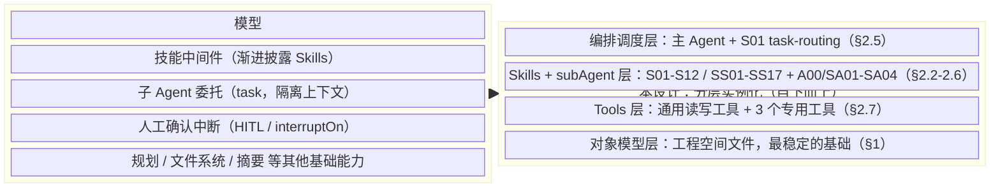
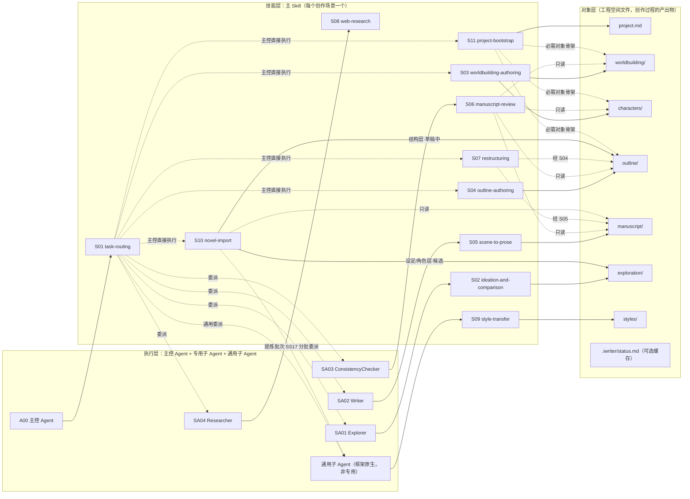

# 小说创作搭子｜AI  Story Buddy：概要设计

> 本文档是小说创作搭子（`AI Story Buddy`）的概要设计文档，基于《02. 小说创作搭子｜AI  Story Buddy：需求文档》展开，回答"如何满足需求"，不重复陈述需求本身的动机与约束（详见 02）。**设计的主体逻辑必须先从需求独立推导确定，现有实现（包括现有代码、现有 skills 文件、现有 subAgent 的 prompt、现有工具命名）在纯设计阶段一律不作为参考或设计依据**——它们只在设计结论确定之后的"如何利用/重构现有代码"阶段被核验是否可复用、要改还是要砍，不能反过来用现状去定义或限定设计结论。讨论过程与历次修订见 git 历史，正文不做 v1/v2/v3 式自我版本标注。

本文档只保留概要级设计：架构、对象模型骨架、Agent+Skills 体系总表、上下文/版本/审批的原则与结论。详细设计按领域独立成文（被拆出的章节在原位置保留概要结论存根与指引）：《04.1 全能创作搭子｜AI Writing Buddy：脚手架 详细设计》（跨域宿主能力：子 Agent 声明式装配、Skills 挂载机制、块级读写协议、Domain 记忆、审批管线）、《04.2 小说创作搭子｜AI  Story Buddy：对象模型 详细设计》（各对象字段定义与示例，schema 技能权威来源）、《04.3 小说创作搭子｜AI  Story Buddy：Agent+Skills 详细设计》（主/子 skill 详述、技能树与挂载矩阵、执行体 prompt 关键点）、《04.4 小说创作搭子｜AI  Story Buddy：工具 详细设计》（专用工具论证、被取消能力、现有工具处置）。

* * *

## 0. 设计方法与总体架构

本设计建立在一个**完整的通用 Agent 框架（deepagents）之上**：规划、文件系统、带隔离上下文的子代理调度、技能中间件、工具调用、人工确认中断，这些能力框架本身已经提供，不是本设计要重新发明的东西。

设计要做的事情，是把"**从灵感到一部小说完稿**"这个完整创作过程中涉及的全部场景与流程（含每个环节的产出物），忠实地复刻到这个框架已有的四类积木上：**main agent（A00）+ sub agent（SA01-SA04）+ skills（S01-S12 主技能、SS01-SS17 子技能）+ tools**。设计的主体工作不是发明一套新的架构概念，而是回答"这个场景对应哪段流程、这段流程产出什么、该由哪类积木承担"——这个映射关系本身才是设计内容，具体映射结果见 §2；§2.2 附有从灵感到完稿的**小说创作流程图**，展示这个流程如何落到 A00/SA/S/SS 各角色上，那张是流程图，不是这里要给的整体架构图。

**总体架构**：左边是通用 Agent 框架本身提供的能力（模型、技能中间件、子 Agent 委托、HITL 等，本设计不重新发明）；右边是本设计在这些能力之上做的分层实例化，从下到上：对象模型（最稳定的基础）→ Tools 层（操作对象模型的手段）→ Skills + subAgent 层（技能内容与专用执行载体）→ 编排调度层（主 Agent 借助 S01 这个技能做场景判定与委派）。右边这四层是本设计真正要交付的内容，左边是复用、不是设计对象。

这是一个静态的层级依赖关系（上层建立在下层之上，框架为整体提供能力），不是一个随时间推进的流程——用 flowchart 的有向边表达会暗示"数据/控制按顺序流动"，与实际关系不符，因此改用 mermaid 的 `block-beta`（块/分层架构图），只表达层级与从属，不带时序含义：



一条箭头概括不了框架各能力具体供给哪一层，精确对应关系是：

| 框架能力 | 供给的层 |
| --- | --- |
| 模型 | 支撑全部四层的推理能力 |
| 技能中间件 | Skills + subAgent 层的技能加载与渐进披露机制 |
| 子 Agent 委托（task） | Skills + subAgent 层的委派实现 + 编排调度层的委派决策 |
| HITL / interruptOn | Tools 层的写操作确认 + 编排调度层的高风险确认（§5） |
| 规划 / 文件系统 / 摘要 | 对象模型层的读写与长会话的上下文管理 |

**设计顺序**：场景与业务需求 → 创作流程 → Skills（核心） → Tools（服务于 skills 的流程需要）。这个顺序不可逆——tools 不反过来决定 skills，唯一的例外是工具自身复杂到需要独立操作说明时，那份说明可以拆成一类"工具专属参考技能"，但这是特例，不是设计的主干（见 §2.7）。

对这个 agent 而言，**Skills 是核心设计对象，Agent（主控 + 专用子 Agent）不是设计的主体，而是 skills 的执行载体**：一个 Agent/subAgent 的 prompt 只应该包含身份定位、工具范围、输入输出契约、安全红线这几类"执行体本身"的内容；核心创作流程逻辑、技法知识、对象结构定义，一律以 skill 的形式存在，Agent 的 prompt 通过指针引用对应的主 skill，不把流程写死在 prompt 里。这样做的好处：主 skill 可以独立于"要不要设立专用子 Agent"这个决策先行设计和调试（skill 是文档，比一整块焊死的 prompt 更容易单独修改、单独验证），也让"skills 才是核心，tools 只是配合"这个定位在架构上真正成立。

需求早期草稿曾用"通用内核/适配层/任务层"三层框架组织问题，本设计**不采用这个框架**——它不对应任何独立的架构层，也不提供任何单靠对象模型、skills 划分、S01 模式判定本身回答不了的问题，保留它只会制造一个实际不存在的层级去对应。这三层原本想覆盖的具体诉求，已经分别独立成立、不需要这层包装：对象模型的稳定部分（§1）、审批规则（§5）是长期不变的设计基础；题材、作品风格、设定约束、读者承诺等影响创作内容的维度，落在 `project.md`、`styles/`、正式对象与相关 skills；作者成熟度、干预强度、风险偏好等影响交互方式的维度，落在当前 domain 的用户级协作记忆（`~/.iwriter/ai/memory/{domain}/memory.md`，creative 与 edit 各一份）、S01（task-routing）的交互策略与各 prompt/skills 的执行规则；具体能做什么由 §2 的场景类别与 Skills 总表决定。02 需求文档已相应去掉这一框架，不再作为需求组织原则。

* * *

## 1. 对象模型与工程空间设计

> 对应 FR-1、FR-3

### 1.1 目录与对象映射

每个目录/文件按三个维度标注：**必需/可选**（必需 = 项目存在即必须有；可选 = 特定条件触发才创建，全部走懒创建，不预先建空文件）、**维护方**（作者 = 内容应由作者书写，agent 只做编辑辅助；agent = 派生产物，作者不直接编辑；两者 = 都可以直接写）、**是否进 git**（派生产物/纯工程态内容不进 git，作者创作意图的载体进 git）。任何目录都必须能在下表里找到必要性理由，否则该目录本身就该被砍掉。

```
{workspace}/
  project.md                   # 作品对象：身份信息 + 内容上下文 + 当前版本字段（§4）
  worldbuilding/
    worldbuilding.md           # 设定对象，默认单文件
    factions.md                # 可选：规模增长后从 worldbuilding.md 拆出（阵营/地理）
  characters/
    characters.md              # 全部角色的默认登记点（见 1.3）
    {slug}.md                  # 可选：升格为独立档案的重要角色（升级阈值见 1.3）
  outline/
    master-outline.md          # 结构对象：总纲（见 1.2/1.3）
    vol{NN}-outline.md         # 可选：卷纲（仅启用卷纲层时存在，见 1.2/1.3）
    ch{NNN}-outline.md         # 结构对象：章纲（场景列表，见 1.2/1.3）
  manuscript/
    ch{NNN}.md                 # 正文对象，内含 beat 哨兵（见 1.2）
  materials/
    fragments.md               # 素材捕获区（见 1.3）
  process/
    open-questions.md          # 可选：未决创作问题（见 1.3）
    changelog.md                # 可选：累积性创作历史叙事（见 1.3）
    review-findings.md         # 可选：审校/外部反馈问题清单（见 1.3、§2.5 S06）
  exploration/                 # 候选方案区，纯目录约定（见 2.8），内容命名 {类型}-{方向名}.md
  styles/
    {slug}.md                  # 可选：风格配置对象（见 1.3、SS05），懒创建
  .iwriter/                    # 工程态目录：agent/host 管理，不进 git；不存放记忆（协作记忆只有用户级，见 1.4/2.13）
    skills/
      {slug}/SKILL.md          # 可选：项目级作者自定义工作流 skill（见 2.9/2.11），懒创建
    status.md                  # 可选：派生状态摘要缓存（见 1.4），纯派生物
  .git/
```

| 路径 | 必需/可选 | 维护方 | 进 git | 必要性 |
| --- | --- | --- | --- | --- |
| `project.md` | 必需 | 作者+agent（agent 辅助创建/维护"当前版本"字段） | 是 | 唯一的身份对象，是其余对象创作前提的来源（§4） |
| `worldbuilding/worldbuilding.md` | 必需 | 作者（agent 可从既有草稿提炼，见 §6） | 是 | 设定的默认单文件载体 |
| `worldbuilding/factions.md` | 可选 | 同上 | 是 | `worldbuilding.md` 规模增长后的拆分产物 |
| `characters/characters.md` | 必需 | 作者+agent | 是 | 全部角色的默认登记点；即使没有角色升格独立档案，此文件也必须存在 |
| `characters/{slug}.md` | 可选 | 作者+agent | 是 | 升级阈值触发后才创建（1.3 节） |
| `outline/master-outline.md` | 必需 | 作者+agent | 是 | 结构对象的唯一总纲 |
| `outline/vol{NN}-outline.md` | 可选 | 作者+agent | 是 | 仅启用卷纲层时存在（1.2 节） |
| `outline/ch{NNN}-outline.md` | 懒创建，但**写该章前置必需** | 作者+agent | 是 | 提纲价值的关键载体；一旦作品分章节，写第 N 章前该章章纲必须先成形并 `已确认`——事件级总纲不能替代场景级章纲（闸3，见《04.5》§2）。不必一次建全部章纲，但绝不从总纲直接写正文 |
| `manuscript/ch{NNN}.md` | 可选（懒创建） | 作者+agent | 是 | 每章动笔后才存在 |
| `materials/fragments.md` | 可选（懒创建） | 作者+agent | 是 | 首次记录碎片时创建 |
| `process/open-questions.md` | 可选（懒创建） | 作者+agent | 是 | 首次出现未决创作问题时创建 |
| `process/changelog.md` | 可选（懒创建） | agent（作者可补充/修订） | 是 | 累积性创作历史叙事 |
| `process/review-findings.md` | 可选（懒创建） | agent（作者可裁决/修订） | 是 | 审校结果与外部反馈的分级问题清单持久化落点（FR-5.4"供后续修订使用"跨会话可用；SA03 只读，落盘由 A00 执行，见 §2.5 S06） |
| `exploration/*.md` | 可选 | agent 产出（作者确认/拒绝） | 是 | 候选方案区（2.8 节） |
| `styles/{slug}.md` | 可选（懒创建） | agent 产出（作者确认/拒绝） | 是 | 风格配置对象，见 1.3；一旦作者要求"按某风格写"就需要持久化载体，否则每次都要重新提取 |
| `.iwriter/skills/{slug}/SKILL.md` | 可选（懒创建） | 作者（agent 可代写草稿，作者确认） | 否 | 项目级 skills 目录：作者对默认工作流的覆盖/补充载体（FR-9.2，见 2.9/2.11） |
| `.iwriter/status.md` | 可选 | 仅 agent | 否 | 创作流程状态账本（记录当前阶段/前沿/门槛状态/建议下一步）；**派生投影、非权威、可重建**，详见 1.4 /《04.5》§5 |

协作记忆不在工程空间：只有用户级一层，位于 `~/.iwriter/ai/memory/{domain}/memory.md`（edit 与 creative 各一份，跨项目生效，本期只读装配、作者手工维护），见 §1.4、§2.13。

### 1.2 结构层级关系与章节命名约定

结构层一共四级，逐级变细，下级永远是上级某个具体条目的展开，不是平行的另一套大纲：

```
outline/master-outline.md         总纲：结构节点 + 主题落点 + 人物弧光交汇 + 伏笔总表
  └─ outline/vol{NN}-outline.md   卷纲（可选）：本卷结构节点 + 大事件序列
       └─ outline/ch{NNN}-outline.md   章纲：场景列表（每场景 目标-冲突-结果）
            └─ manuscript/ch{NNN}.md 内的 beat 哨兵   场景内节拍
                 └─ beat 统辖的正文区间          正文本身
```

**是否启用卷纲层**：篇幅规划预估达到一定规模（如 ≥ 20 章，或作者明确说明是分卷连载题材）时启用；中短篇作品章纲直接挂在总纲下。卷纲层启用时，总纲变粗（只保留全书维度的宏观弧线），每卷的结构细节下沉到卷纲中。

四级里前两级（总纲/卷纲）是"事件级"颗粒度，后两级（章纲/beat）是"场景级"颗粒度，分界线在章纲：**从章纲往下，叙事单元统一是场景（scene）**。场景结构是三段式，这是章纲层场景列表的字段定义本身：

- **目标（goal）**：场景内 POV 角色这一刻具体想要什么——必须具体到"能判断是否达成"，不能是"想变强"这种抽象欲望；
- **冲突（conflict）**：谁、什么、何种处境阻止了这个目标，没有冲突场景就是流水账；
- **结果（outcome）**：三种出口之一——目标达成但代价更大／目标未达成／目标达成但揭示了新问题。**不能是"顺利达成"**，顺利达成意味着这个场景对故事没有推进力，该被精简或删除。

beat 是场景的下一级展开，**可选辅助、不是写正文的前提**（真正的前提是章纲已确认；beat 三种来源：作者写 / A00 辅助 / 无，见《04.5》闸4）。**表示 = 扩展 GFM Alert `> [!BEAT] …`**：`[!BEAT]` 是固定标记（提取锚点、可折叠渲染、导出剥离），其后**场景坐标 `[场景-{N}-节拍-{M}]` 可选**——**agent 生成必带**（`> [!BEAT] [场景-{N}-节拍-{M}] 一句话提纲`，供一致性核对按场景对齐），**作者手写可省**（`> [!BEAT] 一句话提纲`）。紧跟其统辖的正文段，一个场景在正文里通常展开为 2~5 个 beat。有 beat → writer 按 beat 参照写；无 beat → writer 直接从章纲场景写、自行分段。

**统辖区间定界规则**：一个 beat 统辖的正文区间 = 从该 `[!BEAT]` 行之后起，到**下一个 `[!BEAT]` 行**（不含）或文件末尾为止——beat 之间不存在无归属正文。场景边界不设独立标记：坐标场景序号变化的 beat 即场景切换点，"场景-N 的正文区间"= 其全部 beat 统辖区间之并（坐标缺失的 beat 归属当前场景、不参与切分）。SA02 重写某 beat、SS11 逐场景比对均按此规则取区间；首个 beat 之前的正文若存在，视为该章无 beat 引子，归属场景-1。

beat 是创作脚手架，不是作品内容：`[!BEAT]` 标记稳定可识别，**定稿归档与任何导出产物必须剥离 beat**，剥离规则属格式转换层（实施阶段落地）。beat 在编辑器中对作者可见，是有意暴露的创作结构（作者可直接修改提纲本身），作为 GFM Alert 天然可折叠/弱化显示（见 §9）。

**章节文件命名约定**（章节故事顺序的权威机制）：

章节文件名遵循三级命名约定，保证文件字母排序始终等于故事顺序，无需维护单独的章节顺序列表：

- 第一级：`ch{NNN}.md`，三位数字，给 100 章以内的长篇留足空间（如 `ch001.md`、`ch025.md`）；
- 第二级：`ch{NNN}{a-z}.md`，在原章节后插入新章节时使用（如 `ch003a.md` 插在 `ch003.md` 之后、`ch004.md` 之前）；
- 第三级：`ch{NNN}{a-z}{a-z}.md`，第二级之后继续插入时使用（如 `ch003aa.md` 插在 `ch003a.md` 之后）。

同样的三级约定适用于章纲文件（`ch{NNN}-outline.md`、`ch{NNN}a-outline.md`），正文与章纲文件名前缀一一对应。此约定不需要额外字段维护，agent 按字母序读取目录即得正确故事顺序。

**"调整情节" = 编辑某一层、向上/向下冒泡**：改一个 beat → 只重写该 beat 统辖区间；某场景的目标/冲突/结果改变 → 提示是否需要重写该场景对应的全部 beat；章纲改动影响主线 → 提示是否需要调整卷纲/总纲。冒泡是**提示**，不是自动连锁修改（对应需求 FR-6.2：影响面必须先展示，不自动传播）。小调整 = 场景 → beat（单章内）；大调整 = 多章场景需要动。调整后是否/如何重写正文 = **提醒作者、不主动做**（重写保护）。

**创作流程与阶段门槛**：本层级链（设定/角色 → 总纲 →[卷纲]→ 章纲 →（可选 beat）→ 正文 → 随写随评 → 终审）不是靠 graph 强制的状态机，而是**默认推进序 + 每次跃迁的就绪门槛**——上游成熟到什么程度才配进下一阶段（如设定能否推导冲突、章纲能否让写手不再现编冲突结果）。**硬前提是章纲已确认（闸3），beat 是可选辅助非门槛**。门槛是质量守门 + 缺口提议，非硬锁：agent 不自越闸，作者可显式越闸并得到一次质量提示。质量另由**编辑评审回路**守（模式A 随写随评"好不好"、模式B 用户触发好不好+一致性）。完整的流程图、门槛判据、写章节前置状态机、编辑评审回路与 status.md 状态账本见《04.5 创作流程与阶段门槛 详细设计》。

**反向生成**（从已有正文提炼章纲/总纲）有明确写入目标：从 `manuscript/ch003.md` 提炼 → 写入 `outline/ch003-outline.md`；多章模式归纳 → 写入/校正 `outline/master-outline.md`。这一机制是 §6 反向导入设计复用的基础能力，不是两套逻辑。

### 1.3 各对象文档字段定义（详细设计 → 04.2）

各对象的完整字段定义（必选/可选、字段说明、完整示例，含用户级协作记忆 `~/.iwriter/ai/memory/{domain}/memory.md` 与 `.iwriter/status.md` 摘要缓存的字段与更新规则）已独立为《04.2 小说创作搭子｜AI  Story Buddy：对象模型 详细设计》，该文档是 SS01-SS05、SS15 schema 参考技能的权威来源。概要级硬性结论：

- 字段命名一律 kebab-case；字段以标题分节（顶层 H3，嵌套按层级递降），便于 `get_section` 精确读写；字段是"必须有"的下限，缺失视为对象未建立完整；
- `project.md`：故事核心句必须含四要素（主角/目标/阻碍/赌注）；"当前版本"字段语义见 §4；
- `worldbuilding.md`：禁区必须写明原因（"因为 X 会破坏 Y"），不是只列"不能做什么"；
- 角色档案：心理三角（欲望/恐惧/虚假信念）+ 外显特征必选；`characters/characters.md` 是唯一名单入口，独立建档阈值 = 第 2 个不同章节实质出场 / 作者指定 / 承担独立副线，重要角色 ≤ 5 人时允许继续合并；
- 三类大纲文件（总纲/卷纲/章纲）均有必选 status 字段（草稿中/已确认，FR-2.3 落点）；章纲场景三段式：目标（可验证）/ 冲突 / 结果（禁止"顺利达成"）；
- `styles/{slug}.md` 必须含可操作的生成配方与自检清单，不是文学评论；
- `materials/fragments.md` 记录时不强制作者分类（零摩擦，FR-1.5），类型由 agent 在后续任务中顺带标注；**"主动提议归档"的触发时点**：S03/S04/S05 落笔类主技能在"定位/引用"步骤中，若 `materials/fragments.md` 存在且非空，顺带读取其"未采用"条目，`related-refs` 或内容命中当前任务对象时在提案中附"这条碎片要不要并入"；无命中不打扰——一次定点读取，与最小必要读取原则不冲突（详见 04.3 §1）；
- `process/review-findings.md` 是审校结果与外部反馈问题清单的持久化落点（FR-5.4），与 `process/open-questions.md` 的边界：**open-questions 登记创作决策问题（作者要做的选择），review-findings 登记稿件缺陷（要修的错）**；审校中发现需要作者裁决故事走向的问题登记到前者，执行性缺陷进后者（字段见 04.2）；
- 用户级协作记忆 `~/.iwriter/ai/memory/{domain}/memory.md` 只记协作规则不记剧情事实（边界见 1.4）；`.iwriter/status.md` 是可丢弃的派生摘要缓存，不是数据源。

### 1.4 协作记忆、状态摘要与变化叙事的边界

- `project.md` = **作品身份与内容上下文**，几乎不变（书名/题材/主题/读者承诺/篇幅规划），改动频率低，进 git；
- `styles/{slug}.md` = **作品风格配置**，记录已确认的生成/审校风格，不记录作者交互偏好；
- `~/.iwriter/ai/memory/{edit,creative}/memory.md` = **domain 用户级（作者级）协作记忆**，跨项目生效，记录该 Agent 如何与这位作者协作、如何恢复上下文、作者成熟度、干预强度、风险偏好等交互规则；edit 与 creative 独立维护，不记录剧情事实或实时进度；**本期只读装配、由作者手工维护**（Agent 不写入，见 §2.13）；**不设项目级协作记忆**——工作区 `.iwriter/` 不存放记忆文件，项目特有的工作流约定由项目级自定义 skills（§2.9）或当前对话指令承载；
- `.iwriter/status.md` = **创作流程状态账本**（记录工程当前阶段、写作前沿、各阶段门槛通过情况、建议下一步——见《04.5》§5），但**是对象文件的派生投影、非权威、可重建**：ground truth 始终在对象文件（各 `status` 字段、`manuscript/` 存在性、写作会话登记）；只在阶段跃迁时机会性更新或作者要求重建，会陈旧 → 结论须与定点读取核对，不作为会话启动必读项，不做启动全局扫描，不进 git；
- `process/changelog.md` = **重要变化叙事**，记录已确认的大修、精修、问题修补、版本回退等变化原因与影响，不是自动流水账。

总原则：工程文件是事实源，用户级 `memory.md` 是当前 domain 的协作规则，`process/changelog.md` 是历史叙事，git 是版本与回退工具，`status.md` 只是可选缓存。作品上下文从正式对象读取，交互偏好从当前 domain 的 `memory.md` 或当前用户指令读取。Agent 不通过后台追踪维护全局状态，而是在每次任务中按需读取相关对象、探索必要引用，并在正式对象变更前以提案或 diff 交由作者确认。

**后续 prompt / skills 设计注意**：A00、SA01-SA04 的 prompt 与 S01-S12/SS01-SS17 技能文档都必须显式遵守上面的状态边界，不得重新写入"每轮启动读取 status / 全局扫描 / 自动 git diff / 自动重建摘要"这类流程。prompt 应强调：先理解用户意图，再按任务读取最小必要对象；skills 应把当前 domain 的用户级记忆 `~/.iwriter/ai/memory/{domain}/memory.md` 当作协作规则来源，把 `status.md` 当作可选缓存，把 git 当作按需比较/回退/固化工具。作者成熟度、干预强度、风险偏好只能改变解释、澄清、预检与提案方式，不能改变作品事实来源，也不能绕过审批红线。本期 `memory.md` 只读装配，prompt/skills 不得包含任何写入或更新记忆的步骤（§2.13）。任何需要全局态势的技能步骤，都应写成"必要时读取/提议重建/请求确认"，而不是默认执行。

### 1.5 对象间引用索引

**不做** wiki 式组织（`[[链接]]`、反向链接、graph view）：角色/设定规模本来就小（1.3 节的 5 人豁免阈值已把"重要对象"控制在个位数），文件树直接点开即可定位；强迫作者书写 `[[...]]` 也与需求 NFR-3"不暴露系统内部技术概念"直接冲突。

但 wiki 机制里真正有价值的部分——**精确的反向引用**——做成对作者完全隐形的 agent 侧能力：agent 已经知道全部对象名称（`characters/`/`worldbuilding/` 下的标题），扫描任意 markdown 文档的纯文本、匹配这些已知名称出现的位置，就能得到"谁提到了谁"的精确对照表——不需要作者写任何特殊语法，纯 prose 即可被索引。

用途：① 高风险操作的影响面分析（§5）；② "我在哪些章节提到过这个角色/这条设定"的检索需求。落地为工具 `find_references(name)`（§2.7），基于精确名称匹配实现，不需要维护持久化索引表。边界：它只覆盖"实体名提及"级引用；规则/禁区类设定对正文的语义约束没有实体名可匹配，不可机械判定——补偿方式见 §5.2 影响面展示，风险记录见 §9。

* * *

## 2. Agent + Skills 体系设计

> 对应 FR-1、FR-2、FR-4、FR-5、FR-6、FR-9

### 2.1 设计原则：Skills 为核心，Agent 提供身份与工具边界

一个 Agent（无论是主控还是专用子 Agent）的 prompt 承载这几类内容：**身份定位**（一句话）、**工具范围**（能调用哪些工具，明确排除哪些）、**输入输出契约**（brief 必须含哪些字段、回报用什么固定状态词表）、**安全红线**（不能做什么），以及**该角色的主技能本身**——定义这个角色、每次执行都要用的核心流程，它就写成 agent.md 正文 / prompt body，**不另立一份 skill 让 prompt 指过去**（那会造成"一件事两个家"的重复与漂移）。只有三类内容才以独立 skill / subSkill 存在于 prompt 之外、按契约或按需引用：**技法知识与对象结构定义**、**被多个角色共用的能力**、**随任务内容 / 意图才选载的流程片段**。（agent.md 本身也是一份可独立修改、单独验证的 markdown，"主技能入 prompt"并不牺牲旧原则里"skill 好单独改验"的好处。）

**三层分类：角色决定 skill、skill 决定 subSkill。** 把上面的原则落成一套可判定的分类，决定"一段能力/知识以什么形式存在、挂在哪里"：

- **核心角色 → 专用子 Agent（subAgent）**：需要独立执行体的角色（判据见下 (a)/(b)/(c)），以 `subagents/{domain}/{name}/agent.md` 声明，**其主 skill 直接写进 agent.md 正文**（身份/契约/红线 + 该角色的核心流程），所依赖的 subSkills 以相对路径引用。
- **主要角色 → 主 skill（挂载的 Skill）**：是一个可被 S01 路由/委派的独立能力，但不需要专属执行体（A00 直接执行，或经通用子 Agent 委派）——以独立目录 `SKILL.md` 声明并挂载，subSkills 以相对路径引用。
- **纯技能 → 子 skill（subSkill）**：在某个 agent.md / 主 skill 内被使用的技法、schema、流程片段，**本身不构成可独立委派的能力**——不单独挂载、不暴露为 skill，只在 owner 的 agent.md / SKILL.md 里以相对路径引用（形如深层 `references/*.md`）。

**总法则：流程决定角色，角色决定其职责/边界、技能与工具。** 一段流程/知识到底"并入 prompt 还是独立成 skill"，按下面四条落位判定（优先级从上到下）：

1. 是该角色的**主技能**（always、定义角色）→ 写进 agent 的 prompt / agent.md 正文。
2. 被**多个角色共用**（如写手写时要避、编辑审时要抓的同一套写法护栏）→ **独立成 skill 作单一真源**，即便 always 也不并入任一 prompt——共用就是它留在外面的理由（各自 inline 会漂移）。
3. 单角色、always、但非主技能 → 可并入 prompt（避免无意义的文件载入）。
4. **随内容 / 意图才选载**（conditional，如按场景拉某条技法 `references/*`）→ 独立 subSkill，按需读。

这条同样约束主控：A00 的 `task-routing` 是其主技能（每轮必载、单一消费者）→ 应落进 A00 prompt。落位判定与"要不要设专用子 Agent"（下面 (a)/(b)/(c)）是两个正交决策：无论是专用子 Agent、被主控委托的通用子 Agent、还是主控直接执行，都遵循"明确的主技能入 prompt + 附加技能（共用独立 / 按需选载）"这一同一结构。

**LLM provider 专属约束是横切关注点，不进任何按角色组织的 prompt / skill / styles。** 分两个家：协议 / 机械类怪癖（空 content、非法工具参数、`tool_choice` 支持、TPM/429、模型 profile）→ **代码适配层**（MessageAdapter / 模型解析 / 引擎恢复）；需要在提示层纠偏的 provider steering → 系统 prompt 组装处的**可组合 provider overlay**（与 `buildOutputLanguagePrompt(language) + BODY` 同款独立追加），永不写进角色 skill 或 agent.md 正文。理由：角色层保持 provider 无关（换 provider 不动角色设计）+ 质量归因干净（provider 怪癖指向 provider 层，不污染"该调哪一层"的定位）。

两条配套原则贯穿全设计：

- **角色存在 ⇒ 其 skill 必存**：只要一个角色（核心/主要）在流程中存在，它的 skill（agent.md 主 skill 或挂载 SKILL.md）就必须存在、不可缺——这是硬约束。
- **subSkill 增量、测试驱动**：subSkills 不是一份必须一次配齐的固定强制清单——按"这段知识是否真的让产出更好"逐个验证后才增加（§10 验证方案），能一份粗粒度方向覆盖的就不拆细分，避免为覆盖而堆技能、加重认知负载（issues#4/#7 教训的推广）。因此下文 §2.2 的 SS01-SS17 是**当前已识别的 subSkill 候选集，非强制目录**：可折叠进 owner、可走 `references/` 引用、可按验证结论增删。

判断一个能力要不要设立专用子 Agent（而不是主控直接执行），只在满足以下任一条件时才成立：

- (a) 必须比主控更窄的工具面，且这个收窄要在工具层强制，不能只靠 prompt 约定；
- (b) 必须有独立、不被同一条推理链污染的上下文（避免确认偏差，或隔离会污染主控上下文的大段样本文本）；
- (c) 必须用不同的模型。

只是"看起来该有个专属人设"不构成理由。

执行方式实际上有三种，专用子 Agent 只是其中之一：

1. **主控直接执行**：短流程、低上下文占用的任务（S03/S04 落笔、素材记录）；
2. **委派框架原生通用子 Agent**：deepagents 自带 general-purpose 子 Agent，与主控同工具同模型，但拥有隔离上下文——凡是诉求只有"上下文隔离"的任务走这条路即可，不需要为它设立任何专用定义；
3. **专用子 Agent**：仅当满足 (a)/(c)，或该场景高频到值得固定输入输出契约时才成立——(b) 的上下文隔离本身通用委派就能拿到，单独不构成设立专用子 Agent 的理由。

按此重审，专用子 Agent 收敛为四个：SA01 Explorer（构思高频 + 产出限定候选区的固定契约）、SA02 Writer（写稿高频 + 块级编辑工具面）、SA03 ConsistencyChecker（工具层强制只读 + 独立上下文避免确认偏差）、SA04 Researcher（纯共用承包商，web 工具面 + 交付件落盘会话级 `/large_tool_results/`）。专用子 Agent 本身也不写死在代码里，而是以声明式定义文件动态装配（见 §2.10）——"身份定位、工具范围、输入输出契约、安全红线"这四类 prompt 内容恰好就是一个小 markdown 文件的体量。曾设想的 WritingStyle 专用子 Agent 不满足任何专用化判据：它不需要更窄的强制工具面（写入 `styles/` 之外的路径已有 `interruptOn` 审批兜底）、不需要不同模型、频率极低（一个项目通常只提炼一两次风格）；它唯一的真实诉求是隔离大段范文文本，通用子 Agent 委派即可满足。因此风格提炼定为 **S09 技能 + 通用子 Agent 委派**，不设专用执行体。反向提炼同样不设专用执行体，但执行途径不同：S10 定为 **A00 直接执行的导入编排主技能**——整备阶段（SS16）必须与作者交互确认章节边界，而子 Agent 内没有对话通道；只有其提炼批次（SS17）需要隔离大段正文上下文，经通用子 Agent 委派（§2.5、§6）。

### 2.2 ID 编号与总表

下图是**小说创作流程图**：从灵感到完稿这个创作过程里的场景与产出，如何落到 A00/SA/S/SS 这四类积木上，不是系统的整体架构图（整体架构建立在 deepagents 这个通用 Agent 框架之上，见 §0）。



子 skill（技法/参考类）挂在对应主 skill 之下，不单独进这张流程图，完整关系见下方总表。S08（web-research）在对象层无输出边是刻意的——其交付件写入会话级 `/large_tool_results/`（非工作区对象），由 A00 读取后自行决定是否提炼进正式对象（§2.5 S08、§5.1）。

**总表按 §2.1 三层分类读**（S/SS 编号只是设计文档索引，落地形态由三层分类决定）：

- **核心角色（subAgent，主 skill 写进 agent.md）**：A00 主控；SA01 Explorer（主 skill S02）；SA02 Writer（主 skill S05b）；SA03 ConsistencyChecker（主 skill S06）；SA04 Researcher（主 skill S08，共享 `common/`）。
- **主要角色（挂载的主 skill）**：S01 task-routing、S03 worldbuilding-authoring、S04 outline-authoring、S05a writing-plan-authoring、S07 restructuring、S09 style-transfer、S10 novel-import、S11 project-bootstrap、S12 editorial-review。
- **纯技能（subSkill，引用不挂载、增量非强制）**：SS01-SS17 全部——由其 owner（核心角色 agent.md 或主要角色 SKILL.md）以相对路径引用；下表"包含的子 skills"列即引用关系，不代表独立挂载单元。

因此下表"分类"列中的"主 skill / 子 skill"是沿用的文档索引词：核心角色的主 skill（S02/S05b/S06/S08）实际折叠在 agent.md，其余主 skill 为主要角色挂载单元，"子 skill"一律是 subSkill。

| ID | 分类 | 名称 | 功能描述 | 触发条件 | 包含的子 skills |
| --- | --- | --- | --- | --- | --- |
| A00 | 主agent | Creative Domain 主 Agent | 任务理解、结果收束、直接执行设定类/大纲类/重构诊断/导入编排/初始化、委派子 agent | 每轮用户输入到达 | S01（常驻指针）；直接执行时指向 S03/S04/S07/S10/S11 |
| SA01 | Explorer子agent | Explorer | 生成多方向候选、写入候选区 | A00 依 S01 判定为构思类并委派 | S02 |
| SA02 | Writer子agent | Writer | 章纲场景（+可选 beat）扩写/改写为正文块级编辑提案；对 beat 有判断权 | A00 判定为写稿类并委派 | S05 |
| SA03 | ConsistencyChecker子agent | ConsistencyChecker | 忠实度+质量两阶段审校 | A00 判定为审校类并委派 | S06 |
| SA04 | Researcher子agent | Researcher | 查证现实细节/专业背景 | A00 判定为通用类并委派 | S08 |
| S01 | 主skill | task-routing | 判定场景类别+委派决策 | 每轮 A00 处理前，强制 | 无（顶层路由） |
| S02 | 主skill | ideation-and-comparison | 发散生成方向、比较、写候选区 | 构思类 | SS13、SS09、SS06 |
| S03 | 主skill | worldbuilding-authoring | 设定/角色落笔为正式对象 | 设定类 | SS02、SS03、SS06、SS09 |
| S04 | 主skill | outline-authoring | 大纲落笔为正式对象+结构诊断 | 大纲类 | SS04、SS07、SS08、SS09 |
| S05 | 主skill | S05a writing-plan-authoring（A00）+ S05b scene-to-prose（SA02） | 开写授权(confirm_writing_plan)+可选起草 beat（S05a）；章纲场景(+可选 beat)→正文、对 beat 有判断权（S05b 展开链路）+ 按修改意图修订既有正文（修订链路） | 写稿类 | SS03、SS04、SS10、SS06、（SS14 条件） |
| S06 | 主skill | manuscript-review | 忠实度+质量两阶段审校 | 审校类 | SS11、SS12、SS03、SS04、SS02 |
| S07 | 主skill | restructuring | 大修阶段结构诊断与重排 | 重构类 | SS08、SS07、SS04；REQUIRED SUB-SKILL: S05 |
| S08 | 主skill | web-research（共享 `common/`，域无关） | 查证并给出有依据的结论 | 通用类 | 无特定 |
| S09 | 主skill | style-transfer | 范文→风格配置 | 其他类，A00 经通用子 agent 委派 | SS05 |
| S10 | 主skill | novel-import | 整本导入编排：物理整备（SS16）→ 分批反向提炼（SS17）→ 聚合 | 导入/反推类，A00 直接执行编排（提炼批次经通用子 agent 委派） | SS16、SS17 |
| S11 | 主skill | project-bootstrap | 从零初始化小说工程（引导收集 `project.md` 必选字段、git 基线、必需对象骨架）+ `project.md` 日常维护与 §4 版本推进建议 | 初始化类（作者要求新建工程 / S01 检测缺 `project.md` 提议后作者接受），A00 直接执行 | SS01（骨架创建另引 SS02/SS03/SS04 字段标题） |
| S12 | 主skill | editorial-review | 编辑"好不好"评审：一个粗粒度全视角技能（戏剧性/人物与声音/视角/行文/结构与节奏/主题/读者体验），只给方向不写细则；模式A 随写随评（SA02 返稿后 A00 委派一个编辑分身、修订一轮、不落盘）/ 模式B 用户触发（好不好+一致性两表落 `review-findings.md`） | 编辑评审类（模式A 随写自动、模式B 作者触发），A00 编排、经通用子 agent 委派 | 无（单技能自带全视角方向） |
| SS01 | 子skill | project-schema | 作品对象字段定义 | 读写 `project.md` | 无 |
| SS02 | 子skill | worldbuilding-schema | 设定对象字段定义 | 读写 `worldbuilding/*.md` | 无 |
| SS03 | 子skill | character-schema | 角色对象字段定义 | 读写 `characters/*.md` | 无 |
| SS04 | 子skill | outline-schema | 结构对象字段定义 | 读写 `outline/*.md` | 无 |
| SS05 | 子skill | style-schema | 风格配置对象字段定义 | 读写 `styles/*.md` | 无 |
| SS06 | 子skill | character-believability | 心理三角/外显特征→行为推导 | 设计/写行动/审校角色时 | REQUIRED BACKGROUND: SS03 |
| SS07 | 子skill | scene-and-plot-construction | 目标-冲突-结果、因果链、伏笔 | 写大纲/展开beat/重构 | REQUIRED BACKGROUND: SS04 |
| SS08 | 子skill | structural-pacing-diagnosis | 结构/节奏诊断 | 大纲设计/大修诊断 | REQUIRED BACKGROUND: SS04 |
| SS09 | 子skill | thematic-coherence | 情节是否落地主题命题 | 构思/设定/终审 | REQUIRED BACKGROUND: SS01、SS04 |
| SS10 | 子skill | prose-craft-by-example | 范例驱动文笔 | 写稿展开正文 | REQUIRED BACKGROUND: SS03 |
| SS11 | 子skill | fidelity-check | 忠实度核查 | 审校第一阶段 | REQUIRED BACKGROUND: SS04、SS03 |
| SS12 | 子skill | prose-quality-check | 质量核查（常识/POV/行为一致/时序一致/伏笔/风格） | 审校第二阶段 | REQUIRED BACKGROUND: SS03、SS02、(SS05) |
| SS13 | 子skill | direction-ideation | 排除显而易见版本，保证区分度 | 构思生成候选前 | 无 |
| SS14 | 子skill | author-style-application | 应用已确认风格 | 写稿/审校且风格已存在 | REQUIRED BACKGROUND: SS05 |
| SS15 | 子skill | materials-and-process-schema | 素材/未决问题/创作日志/审校问题清单对象字段定义 | 读写 `materials/`、`process/` | 无 |
| SS16 | 子skill | source-preparation | 整本源文件整备：格式归一、章节边界识别与确认、拆章命名落盘（机械操作经 `import_manuscript` 工具执行） | 导入整备阶段（S10） | 无 |
| SS17 | 子skill | reverse-extraction | 从既有正文分批反向提炼章纲/总纲/角色/设定候选（§2.14 分批） | 导入提炼阶段（S10），经通用子 agent 委派 | REQUIRED BACKGROUND: SS04、SS03、SS02、SS07 |

### 2.3 场景类别 × Skills

| 场景类别 | 对应创作阶段 | 主skill | 涉及子skill | 装配模式（§3） |
| --- | --- | --- | --- | --- |
| 构思类 | 前期筹备 | S02 | SS13、SS09、SS06 | 构思模式 |
| 设定类 | 前期筹备 | S03 | SS02、SS03、SS06、SS09 | 构思模式 |
| 大纲类 | 前期筹备 | S04 | SS04、SS07、SS08、SS09 | 构思模式 |
| 写稿类 | 初稿写作、二轮精修 | S05 | SS03、SS04、SS10、SS06、(SS14 条件) | 写稿模式 |
| 审校类 | 一轮大修（局部）、三审定稿（全稿） | S06 | SS11、SS12、SS03、SS04、SS02、(SS05 条件) | 写稿模式的正文链路读集（只读；全稿级可加读 `status.md`） |
| 重构类 | 一轮大修 | S07 | SS08、SS07、SS04；引用 S05 | 写稿模式 |
| 通用 | 贯穿全程 | S08 | 无特定 | 最小装配（question+scope，不默认读工程对象） |
| 记录类 | 贯穿全程（灵感碎片捕获，A00 直接执行） | 无（轻量追加，不展开流程） | SS15 | 不装配 |
| 导入/反推类 | 导入已有作品、反向生成（§6） | S10 | SS16、SS17（SS17 内引 SS04、SS03、SS02、SS07） | 构思模式 |
| 初始化类 | 前期筹备（进入之前，从零新建工程） | S11 | SS01（骨架创建另引 SS02/SS03/SS04 字段标题） | 最小装配（空工程无既有对象可读；premise 引导可转 S02 构思模式） |
| 编辑评审类 | 写稿后（模式A 自动随写随评）/ 审校期（模式B 作者触发全视角） | S12 | 无（单技能自带全视角方向） | 通用子 agent 委派（隔离上下文、只回意见不改稿） |
| 其他 | 任意阶段（条件触发） | S09 | SS05 | 构思模式 |

### 2.4 Skills × 对象模型 / 工具 / 关联 Skill

| ID | 读写对象 | 常用工具 | 关联 Skill |
| --- | --- | --- | --- |
| S01 | 无（读用户级协作记忆 `~/.iwriter/ai/memory/creative/memory.md` 的协作偏好/风险规则 + 路径前缀，必要时读 `project.md` 版本字段） | 无 | — |
| S02 | `exploration/` | create_document | SS13、SS09、SS06 |
| S03 | `worldbuilding/`、`characters/` | get_section、edit_block、create_document | SS02、SS03、SS06、SS09 |
| S04 | `outline/` | get_section、get_document_outline、edit_block、create_document | SS04、SS07、SS08、SS09 |
| S05 | `manuscript/`，读 `outline/`、`characters/` | get_blocks、edit_block、insert_block、replace_range | SS03、SS04、SS10、SS06 |
| S06 | 读 `manuscript/`、`outline/`、`characters/`、`worldbuilding/`；需要全局摘要时可读 `.iwriter/status.md` | get_blocks（按核查颗粒度）、find_references | SS11、SS12 |
| S07 | 读 `outline/` 全量；写经 S04/S05 | get_document_outline、find_references | SS08、SS07；引用 S05 |
| S08 | 交付件写会话级 `/large_tool_results/`（免审批），回传路径给主控；不写工作区对象 | web_search、fetch_url、write_file（仅 `/large_tool_results/`） | 无 |
| S09 | 写 `styles/{slug}.md` | create_document | SS05 |
| S10 | 编排层：读 `import_manuscript` 边界清单与各批次回报；正文读写经 SS16/SS17 | import_manuscript（经 SS16）、task（SS17 分批委派） | SS16、SS17 |
| S11 | 写 `project.md`；创建 `worldbuilding/worldbuilding.md`、`characters/characters.md`、`outline/master-outline.md` 骨架 | create_document、edit_block、git_init、git_commit | SS01（另按骨架对象引 SS02/SS03/SS04 的字段标题） |
| SS01-04 | 对应各自对象 | get_section | 无 |
| SS05 | `styles/{slug}.md` | get_section | 无 |
| SS06 | `characters/{slug}.md` | get_section | SS03 |
| SS07 | `outline/ch{NNN}-outline.md` | get_blocks、edit_block | SS04 |
| SS08 | `outline/master-outline.md`、`vol{NN}-outline.md` | get_document_outline、find_references | SS04 |
| SS09 | `project.md`、`outline/` 主题落点字段 | get_section | SS01、SS04 |
| SS10 | `manuscript/`、`characters/` 声音字段 | edit_block、get_section | SS03 |
| SS11 | `manuscript/`、`outline/`、`characters/` | get_blocks、get_section | SS04、SS03 |
| SS12 | 同上 + `styles/`（若已激活） | get_blocks、get_section | SS03、SS02、(SS05) |
| SS13 | `exploration/` | 无特定 | 无 |
| SS14 | `manuscript/`、`styles/{slug}.md` | get_section、edit_block | SS05 |
| SS15 | `materials/fragments.md`、`process/*.md` | get_section、insert_block | 无 |
| SS16 | 读作者提供的整本源文件（仅边界附近抽样）；写 `manuscript/`（经工具机械执行） | import_manuscript（dry-run / execute，经 interruptOn） | 无 |
| SS17 | 读 `manuscript/` 章节区间；写 `outline/`（标草稿中）、`exploration/`、`/large_tool_results/`（分批中间证据） | get_blocks、create_document、edit_block、write_file（仅虚拟区） | SS04、SS03、SS02、SS07 |

### 2.5 主 Skill 详述（S01-S12）（详细设计 → 04.3）

十一个主 skill 的逐步执行流程、brief 契约、状态回报与红线详见《04.3 小说创作搭子｜AI  Story Buddy：Agent+Skills 详细设计》§1。概要级骨架结论：

- **S01 task-routing**：A00 每轮强制执行的轻量路由——作者显式指定模式或流程时直接采用、跳过判定信号（FR-2.5，审批红线不放宽）；否则依次看协作记忆（只影响方式不提供事实）、对象路径前缀、`project.md` 版本倾向、用词特征、落地目标风险；信号矛盾时一次最小澄清，不默认选高风险分支；判定后决定直接执行 / 委派 SA01-SA04 / 通用委派（S09；S10 由 A00 直接编排，其提炼批次经通用委派）；工作区缺 `project.md` → 提议初始化（S11，只提议不自动执行）；`manuscript/` 非空而设定单薄 → 提议 S10（只提议不自动执行）；"我写到哪了"类进度恢复请求 → 定点读取（`manuscript/` 目录列表 + 末章章纲状态 + 未闭合会话登记 + `open-questions.md` 待决策条目，`status.md` 存在时可作快速提示但须核对）汇总回答并提议下一步，不做全局扫描；"记一下"类请求 → 按 SS15 直接追加碎片，不展开流程；写稿委派返回前提缺口 → 切回构思补齐后继续（FR-2.4）。**阶段跃迁的就绪门槛**：判断"该不该进下一阶段"（设定→总纲、总纲→章纲、章纲→写章节）时读《04.5》创作流程与门槛——上游不就绪则摆缺口、提议先补，agent 不自越闸，作者显式越闸给一次质量提示（前提缺口回补机制从写稿推广到所有跃迁）。候选内容作者确认前不得进入正式对象路径。**"每轮强制执行"的保证机制**：技能中间件的按需加载是建议性的，强制靠 A00 system prompt 顶层写死——"每轮第一个动作 = 加载 S01 正文，未加载不得执行任何其他动作"；该动作是可观察的工具调用，作为 §10 验证方案的客观勾检项审计；即便模型跳过，损害也被审批体系兜底为"低效"而非"越权"（候选不进正式对象、写作过 `confirm_writing_plan`）。
- **S02（SA01 Explorer）**：先加载 SS13 否定显而易见版本，产出 2-3 个有真实区分度的方向写入 `exploration/`，只描述差异不评优劣，不擅自晋升或淘汰候选。
- **S03 / S04（A00 直接执行）**：先确认已收敛（未收敛退回 S02）；按 schema 核对字段完整性后落笔正式对象；大纲全局弧线先跑 SS08 诊断再落笔；大纲状态字段必须显式标注，场景结果禁止"顺利达成"。
- **S05（SA02 Writer）**：双链路，brief 必须声明是哪一条。展开链路：已确认章纲场景 → beat → 正文，计划经 `confirm_writing_plan` 由 A00 在委派前确认（子 Agent 内无对话通道），计划须声明场景清单（§5.3 会话闭合判定依据）；修订链路：修改意图 + 现有区间，不越声明范围，需突破已确认章纲时停止返回"需要先改章纲"。交付一律块级编辑提案。
- **S06（SA03 ConsistencyChecker）**：只读；忠实度（SS11）与质量（SS12，含 FR-5.1 时序/时间线一致性维度）两阶段、两 verdict 分开产出；输入可为作者提供的外部试读反馈（整理为分级问题清单，不裁决对错）；全稿宏观级超单批预算时由 A00 按卷/结构节点分批委派、跨批聚合（§2.14）。**问题清单持久化**：SA03 保持只读、结果以响应文本回传；落盘由 A00 执行——全稿审校与外部反馈整理默认提议写入 `process/review-findings.md`（经普通编辑审批），局部自查默认只在对话呈现、作者要求时才落盘；后续修订任务（S05 修订链路）可引用该清单，修复后顺带更新条目状态（经审批）。
- **S07（A00 诊断 + SA02 改写）**：一次性预检（SS08 扫全局）→ 复用 `confirm_writing_plan` 打包确认（动手前建议先 commit 固化基线）→ 章纲变动走 S04、正文改写逐章委派 S05（brief 引用已批准方案，不重复计划审批，每章独立会话）。
- **S08（SA04 Researcher）**：证据与解读分离，标注来源、置信度与信息缺口；交付件写入**会话级 `/large_tool_results/`**（免审批的内部虚拟区，见《04.1》§6）并回传路径给主控，**不写 `exploration/`**——研究结果是中间原料，要留的内容由主控读取后提炼、另行写入正式对象。researcher 是纯共用承包商（`subagents/common/`，edit/creative 直接复用不覆盖），挂共享技能 `common/web-research`。
- **S09（A00 经通用子 agent 委派）**：风格提炼只写 `styles/`，只依据范文不臆造。
- **S10（A00 直接执行的导入编排）**：四段编排——①判定入口：作者带整本单文件（txt/docx/md）→ 从整备开始，`manuscript/` 已有规范化章节 → 跳过整备直达提炼；②整备（SS16）：LLM 只判章节边界（`import_manuscript` dry-run 产候选清单 + 边界附近抽样核对，不读全稿），边界清单经作者确认后由工具 execute 机械完成转换/拆章/命名/噪声剥离——**整备不得由模型逐字搬运正文**；③提炼（SS17，经通用子 agent 委派）：超单批预算时按 §2.14 分批（5-8 章/批），逐批章纲草稿落盘 + 证据落 `/large_tool_results/`；④聚合委派反推总纲、合并候选。结构层写 `outline/` 标"草稿中"，角色/设定层只进 `exploration/`，无证据字段留空标注缺口。
- **S11 project-bootstrap（A00 直接执行）**：从零初始化小说工程（FR-1.6）——对话式引导收集 `project.md` 必选字段（SS01），故事核心句四要素（主角/目标/阻碍/赌注）必须成立，不成立时引导补齐或转 S02 构思，不代作者虚构；工作区无 git 仓库时调用 `git_init` 建立版本基线（经 interruptOn 审批，非 host 静默创建）；写入 `project.md` 并创建必需对象骨架（`worldbuilding.md`/`characters.md`/`master-outline.md`，大纲标 `status: 草稿中`），均经审批；完成后建议首次 `git_commit` 固化基线。`project.md` 日常维护与 §4 版本推进建议流程同属本技能。初始化必须经作者确认，不得静默执行。

### 2.6 子 Skill 详述（SS01-SS17）（详细设计 → 04.3）

SS01-SS17 均为 **subSkill（纯技能，§2.1）**：不单独挂载、不暴露为可委派 skill，由其 owner（核心角色 agent.md 或主要角色 SKILL.md）以相对路径引用，且**按 §10 验证结论增量增删、非强制目录**（能被一份粗粒度方向覆盖的可不独立成文）。分工：SS01-SS05、SS15 是 schema 参考，字段定义的权威来源在《04.2 对象模型 详细设计》；SS06-SS14 技法/核查的原则与正反例详见《04.3 Agent+Skills 详细设计》§2；SS16-SS17 是 S10 导入编排下的流程子技能（整备/提炼，见 §6 与《04.3》§2）。概要级不变量：

- SS06 character-believability：心理三角 + 外显特征是行为的**机械推导依据**（issues#3 的直接解法），不是事后核查清单；
- SS07 scene-and-plot-construction：场景 = 目标 + 冲突 + 结果（禁止顺利达成），节拍要求因果必然；
- SS08 structural-pacing-diagnosis：诊断基于"压力的建立与释放"，不是章节数量；
- SS09 thematic-coherence：检查情节是否真的落地主题命题；
- SS10 prose-craft-by-example：范例驱动，明确禁止"每句话必须同时做两件事"式可数清单（issues#4 根因，不允许再出现）；
- SS11 fidelity-check：以已确认章纲与已批准计划为比对基准；SS12 prose-quality-check：常识/POV/行为一致/时序一致（FR-5.1 时间线，按需核对不建持久时间线表）/伏笔/风格六维合一交付；
- SS13 direction-ideation：生成候选前先否定显而易见版本；SS14 author-style-application：风格已确认才应用，不强套默认风格；
- SS16 source-preparation：整备是机械操作，LLM 只负责判断边界（读边界附近抽样，不读全稿），转换/拆分/落盘一律经 `import_manuscript` 工具执行，导入正文与原文逐字一致（FR-14.3）；SS17 reverse-extraction：提炼是对正文的解读不是事实，候选分流按 FR-14.2、分批规则按 §2.14。

### 2.7 工具最小化设计

**审查方法**：对每个候选工具问——"这是不是只是'对一个已知 markdown 文档做读/写'，或者只是'调用一个已经存在的子 Agent'？"如果是，通用工具（`DocumentTools` 读、`EditProposalTools` 写、`FilesystemMutationTools` 文件操作、deepagents 原生 `task`）已经覆盖，不需要专用工具。只有满足以下任一条件才保留专用工具：

- (a) 需要跨多个对象做精确匹配/聚合，且这件事不需要 LLM 推理，专用工具比让模型自己拼搜索逻辑更可靠；
- (b) 必须保证模型真的会停下来等待结构化决策，纯对话文本做不到这一点。

对象拆分为独立文件之后（§1），跨大段非结构化文本解析心理三角这类需求本身就不再存在——角色已是独立文件，读心理三角直接用 `get_section` 即可。

**通用工具面清单**（"通用工具已经覆盖"指的就是这一组，共 25 个 + 框架原生能力）：

| 工具组 | 工具 | 服务对象 |
| --- | --- | --- |
| 文档读取与搜索 | get_document_outline、get_section、get_sections、get_blocks、get_block_context、search_blocks_in_document、search_sections_in_document、search_in_directory | 全部执行体的对象读取；S06/S07/S10 的全量扫描 |
| 块级编辑提案（全部经 interruptOn） | edit_block、insert_block、delete_block、replace_range、create_document | S03/S04/S05 写入；§5 章节级审批的基础 |
| 文件操作（须纳入 interruptOn） | delete_file、rename_file、move_file | 章节命名约定维护（1.2）、候选区晋升/放弃（§2.8） |
| git（版本与追溯） | git_status、git_log、git_diff、git_commit、git_tag、**git_restore（缺口，需新建）**、**git_init（缺口，需新建）** | §4 版本语义、FR-6.4 差异/固化/回退、S11 初始化版本基线；init/commit/tag/restore 须 interruptOn |
| web（仅 SA04 挂载） | web_search、fetch_url | S08 查证；SA04 另用 write_file 将交付件落盘会话级 `/large_tool_results/`（策略层免审批） |
| 框架原生 | task（子 Agent 委派）、ls/glob/grep 等文件系统原生工具（实施前核验当前 deepagents 版本确实向执行体暴露 ls） | §2.1 三种执行方式中的两条委派路径；S01 进度恢复的 `manuscript/` 目录列表依赖 ls |

`git_restore` 是本轮 review 发现的真实缺口：FR-6.4 要求"支持回退到上一稳定版本"，而 git 组此前只有读操作与 commit/tag——没有任何恢复手段，"回退"无从执行。补一个受审批的恢复工具（按路径/引用恢复，interruptOn 强制确认），归入通用 git 组，不算 creative 专用。`git_init` 是同类缺口：版本/回退体系建立在 git 仓库存在的前提上，而工程初始化（S11，FR-1.6）此前没有建仓手段——补一个受审批的初始化工具（经 interruptOn，由 S11 流程调用，不由 host 静默建仓），同归通用 git 组。

**最终保留的 creative 专用工具：3 个**（完整论证见《04.4 小说创作搭子｜AI  Story Buddy：工具 详细设计》§1）：

- `find_references(name)`：查"**对象**的全部提及"（与 `search_in_directory` 查"字符串"分工）——搜索前做别名解析（各归属对象权威名/别名：角色 name-aliases、阵营 factions、地名 geography + 名词体系表覆盖长尾专名），搜索后按对象聚合为可直接放进 §5 确认请求的影响面清单；不固化的失败模式是漏查别名 → 影响面清单缺块 → 高风险操作在不完整影响面下被批准（FR-6.2 被静默违反）；
- `confirm_writing_plan(plan, rationale, impact?, alternatives?)`：§5 写作审批模型的**授权开关**——批准即开启"块级自动累积"的写作会话（§5.3）；子 Agent 内没有对话通道，因此由 A00 在委派 SA02 前调用。批准后（若含 beat）A00 把 beat 写进目标正文文件（`> [!BEAT] [场景-{N}-节拍-{M}] 一句话提纲`，agent 生成必带场景坐标），SA02 从文件读、只写 beat 下正文——**不经 brief 转述 beat**（子 Agent 被隔离，转述必然脆弱）；比对基准 = 有 beat 时正文 beat + 已确认章纲，无 beat 时章纲场景。approve/edit/reject 中 edit 即"改完即契约"。它是写作会话的授权闸：新章节/超过一段的改写/涉及已确认设定的修改/结构性调整触发；局部润色与小范围修订跳过，直接进入块级编辑 + 章节级审批。
- `import_manuscript(source, boundaries?)`：整本物理导入（FR-14.3、SS16）的机械执行器，两段式——**dry-run** 按启发式（章节标题正则、目录、分隔符、编号模式）返回候选章节边界清单，供 LLM 抽样核对、作者确认；**execute** 按确认的边界做格式归一（复用 iWriter 现有 Pandoc 导入管线）、拆章、按 `ch{NNN}.md` 命名、剥离格式噪声，一次性写入 `manuscript/`（经 interruptOn）。判据 (a) 的典型实例：数十万字的转换与拆分是纯机械操作，让模型逐字搬运既昂贵又必然引入抄写错误，而导入正文必须与原文逐字一致——这是不该交给概率的环节。

**被取消的能力**：章节槽位管理、会话间 diff 感知、状态摘要自动扫描、对象类别分类、版本声明、懒创建模板、候选区工作流工具、一致性检查触发器等候选工具全部取消，由通用工具 + 目录/命名约定 + skill 承担；逐项替代方式、章节管理约定，与现有 11 模块 58 个工具的处置对照（保留 23 通用 + 1 专用、新建 4 个、其余下线）见《04.4》§2-§3。

**去数据库化**：不建立长期结构化状态数据库，也不以后台追踪维护全局状态。变更解释由 `process/changelog.md`（人类可读叙事）+ 按需读取的 git 历史/差异（机器可读精确变更）共同承担；版本状态由 `project.md` 的 `version` 字段 + git tag 承担。`.iwriter/` 目录只承载项目级自定义 skills（§2.9）、可丢弃的派生缓存与运行中工程态（如写作会话基线快照），不存放记忆文件，不作为剧情事实来源。

**工具专属参考技能的特例**：某个工具复杂到需要独立操作说明时（如某个搜索工具支持多种模式/过滤器），可以把它的用法拆成一份工具专属参考技能，由使用该工具的执行体按需读取；这不违反"场景→流程→skills→tools"的设计顺序，因为这份说明依附于工具本身而非驱动任何场景，只在具体工具复杂到值得拆分时才启用。**该特例已有首个实例**：块级读写工具的用法（两级块模型、分页、列表编辑决策树、批量提交、ID 生命周期）拆为跨域参考技能 `common/document-block-tools`，见 §2.12。

**interruptOn 审批集合随之重审**：新集合 = 块级编辑 5 个 + 文件操作 3 个 + `confirm_writing_plan` + `git_init`/`git_commit`/`git_tag`/`git_restore`，共 13 个（其中文件操作 3 个由文件系统脚手架层配置，其余 10 个为域配置，来源划分见 §5.1）；现有审批配置中挂在被下线工具上的条目（resolve_open_question、rename/reorder_chapters、replace/rebuild/compress_storybible、start/finish/delete_exploration、delete_writing_style 等）随工具一并退役。核验结论：文件操作类（含框架文件面的 write/edit_file）已在现有文件系统脚手架层配置审批，且带路径安全策略预裁决，§2.8 候选晋升依赖的审批前提成立——完整审批设计见 §5。

### 2.8 候选区设计

`exploration/` 与正式对象目录的全部区别靠 prompt 表达，不设专用工具：

- 构思模式产出写入 `exploration/{方向名}.md`，用 `create_document`；
- 比较多个候选方向，agent 直接在对话里描述差异（候选内容本身是可打开查看的普通文件）；
- 作者选定方向后，"晋升"分两种情况：① 整篇替换正式对象 → `move_file`；② 合并进已有对象的一部分 → agent 读取候选文件内容（`get_blocks`），再用 `insert_block`/`edit_block` 写入目标对象，与日常编辑无异。这两种操作都经过 `interruptOn` 机制自带用户审批；
- 放弃候选 → `delete_file`（内容留在 git 历史，**工作区不保留废弃态**）；**前提校验（§5.6）**：若该候选文件从未被 commit，"留在 git 历史"不成立、删除即永久丢失——delete 审批卡此时显式提示"该候选无 git 历史，删除即永久丢失，建议先 commit 再删"，作者仍可径直删除；值得记的否决理由写入 `process/changelog.md`——真正有价值的是"决定 + 原因"而非废稿全文。**不设 `exploration/deprecated/` 或失效标记字段**：废弃对象没有活消费者（作者已裁决完毕），保留只会堆积无人读的 cruft、且陈旧废稿反被误当当前依据（正是 FR-3.4 要防的风险）；回看被否方向的低频需求由 git 兜底（FR-3.3）。作者若明确想把某个方向留作参考，可选择不删——那是作者的个别决定，不是系统的常设义务；
- 列出/查看现有候选 → 普通目录浏览 + `get_blocks`。

### 2.9 作者自定义 Skills 的挂接与优先级

> 对应 FR-9.2、FR-9.3

内置 skills（S/SS 系列）随系统发布；作者对默认工作流的局部覆盖或补充，以项目级自定义 skill 的形式存在：

- **位置**：`{workspace}/.iwriter/skills/{slug}/SKILL.md`——项目级 skills 目录（Agent Skills 规范要求每个技能是"目录 + SKILL.md"结构，目录名即技能名），可选、懒创建、不进 git（`.iwriter/` 整体不进 git，目录见 §1.1）；
- **形式**：与内置 skill 相同的 markdown 技能文档（frontmatter 写何时触发，正文写怎么做），由 deepagents 技能中间件与内置 skills 一并渐进披露；作者可以用自然语言书写，不需要理解内部 ID 体系，agent 可代写草稿由作者确认；
- **优先级裁决（FR-9.3）**：用户当前对话中的明确指令 > 项目级自定义 skill > 内置 skill 默认流程。前一层靠 prompt 约定；后两层由加载机制直接实现——`{workspace}/.iwriter/skills` 固定挂载在每个执行体技能源列表的末位，同名技能"后者胜出"（last-wins，见 §2.11），不需要另写裁决逻辑。agent 在执行说明中提示"本步骤按项目自定义规则 X 执行"，保证裁决结果可预期、可追问；
- **不可覆盖的系统不变量**：§5 的审批机制与各 skill 的安全红线不属于"工作流的局部"，自定义 skill 不能将其关闭或绕过。

### 2.10 脚手架能力：专用子 Agent 的声明式装配与目录设计（详细设计 → 04.1 §2）

> 对应 §2.1 执行方式三分法中的"专用子 Agent"如何落地

**脚手架定位（§2.10-§2.13 共同适用）**：这四节描述的机制统一属于**脚手架能力**——host 在 deepagents 框架之上实现的、与具体 domain 无关的通用宿主能力，edit 与 creative 两个 domain 共用。与 §0 的层次区分：框架能力是 deepagents 自带的（纯复用）；脚手架能力是本设计要交付的，但**一次实现、各域共享**，不属于任何单一 domain；domain 层只做实例化。本节的 SA01-SA04 定义文件、§2.11 的 creative 技能池与挂载矩阵、§2.13 的 creative 记忆策略，都是 creative 域在脚手架上的实例；edit 域按同一套机制组织自己的定义文件、技能池与记忆策略，其内容不在本设计展开。

机制结论（详见《04.1 全能创作搭子｜AI Writing Buddy：脚手架 详细设计》§2）：专用子 Agent 以声明式定义文件装配——用户级运行时根 `~/.iwriter/ai/` 下的 `subagents/{common,edit,creative}/{name}/agent.md`（目录即子 Agent，目录名 = 子 Agent name、不带 ID 前缀，与技能命名一致；定义文件固定名 `agent.md`），frontmatter 承载 name/description（task 委派路由信号）、model、tools 白名单（未注册名 fail fast）、skills 源列表、permissions（工具层强制收窄的实现手段，如 SA03 只读）、interruptOn，正文即 systemPrompt（只写 §2.1 允许的四类内容，流程逻辑一概在 skill 里）；同名时 domain 目录覆盖 common（完整替换非合并）；"动态"指装配期动态而非运行中热插拔；general-purpose 子 Agent 由框架自动提供，不落定义文件；`subagents/` 是系统资产，不开放项目级覆盖（若未来开放，只许改 systemPrompt 与 skills 指针，不许扩大 tools/permissions）。

### 2.11 脚手架能力：Skills 目录与文件结构（机制 → 04.1 §3；creative 实例 → 04.3 §3）

> S/SS 技能体系（§2.2-2.6）如何落到文件系统；挂载机制对应 §2.10 定义文件的 `skills` 字段与 §2.9 的项目级自定义

机制结论：deepagents 技能加载以**目录为挂载单元**、多个源之间同名 last-wins；子 Agent 不继承主 Agent 技能（框架自动提供的 general-purpose 例外——S09 与 S10 提炼批次（SS17）通用委派的承重假设，实施前优先核验）；项目级 skills 目录 `{workspace}/.iwriter/skills` 固定挂各源列表末位，last-wins 即 FR-9.3"项目级自定义 > 内置默认"优先级裁决的机制实现。creative 实例结论（按 §2.1 三层分类）：**核心角色的主 skill（S02/S05b/S06/S08）折叠进各自 `subagents/{name}/agent.md`，不在 skills/ 下单独挂载**；**主要角色的主 skill 挂载**（`creative/main`：S01/S03/S04/S05a/S07/S10/S11；`creative/delegated`：S09/S12，挂 A00 供 general-purpose 继承）；**SS01-SS17 是 subSkill、引用不挂载**（放共享文件池 `creative/reference/` 供相对路径引用、零拷贝，但不进任何执行体的 `skills` 源；过渡期暂挂载，随 §10 验证逐步归位）；技能目录名 = 技能 name（常规 kebab-case，不带 ID 前缀——编号是设计文档层索引，见 §2.2 总表）。完整目录树、挂载矩阵与现有旧技能的收编/下线映射见《04.3》§3。

### 2.12 脚手架能力：块级读写协议（详细设计 → 04.1 §5）

> 对通用读写工具（文档读取组 + 块级编辑组，§2.7）行为层的重设计；edit 与 creative 两域共用同一套读写协议与参考技能

现状四缺陷（读得太碎、列表写入难做对、批量修改逐条审批、块 ID 生命周期不清）的根因核验与完整设计见《04.1》§5、§7.1。概要结论：**两级块模型**（容器块/叶块，容器永不跨页）；**按内容预算自适应分页**（块不切开）；列表结构性修改走**容器级整容器替换**（编辑器/磁盘两路径行为天然一致）；同一快照多编辑**一次性批量提交**——聚合 diff 卡按文档正序呈现一次决策、引擎按位置逆序应用，顺序正确性是引擎职责、永远不是作者交互的职责；**块 ID 有效期 = 快照版本**，落地后返回新块映射免全量重读；**单一内容路由**——打开的文件操作编辑器缓冲、未打开的操作磁盘，两侧不得静默分叉（NFR-4），§5.3 基线快照与整章 diff 取同一路由；工具用法拆为跨域参考技能 `common/document-block-tools`（§2.7 特例的首个实例）。

### 2.13 脚手架能力：Domain 记忆装配（本期只读；详细设计 → 04.1 §4）

> 对应 FR-13.4、FR-13.5、FR-13.6；edit 与 creative 共用的脚手架能力，creative 只是其中一个 domain 实例

概要结论：协作记忆只有用户级（作者级）一层，固定 `~/.iwriter/ai/memory/{domain}/memory.md`，按 domain 隔离，不共享单一文件、不落框架默认记忆路径、**不设项目级记忆**（工作区 `.iwriter/` 不存放记忆文件）；脚手架在创建 agent 实例时按当前 domain 装配记忆源。**本期只读装配**（FR-13.5）：不提供 `memory_update` 或任何 Agent 写入路径，记忆内容由作者手工维护；deepagents 默认 memory prompt 会鼓励 agent 自动更新记忆，装配时必须覆盖为"记忆只读"；记忆文件位于工作区之外，普通文件写工具经 §5.1 策略层"工作区外自动拒绝"天然封死。记忆的自动沉淀与更新（候选捕获、作用域分类、边界过滤、合并去重、受限写入）属于整体记忆系统设计，本期不做，延后统一考虑（FR-13.6，风险见 §9）。装配逻辑见《04.1》§4。

### 2.14 大体量任务分批编排模式（S06 / S10 共用）

> 前提约束：整本审校（S06 全稿宏观级）与整本反向提炼（S10）在数十万字体量下，单个子 Agent 会话装不下全稿。任何设计都不得假设全稿能装进单一上下文。

- **预算红线**：单次委派的正文输入预算约 **5 万字**（实施期按模型上下文与实测质量调优）。超预算的任务必须分批，每批是一次独立的 task 委派。
- **切批原则**：S10 按章节区间切批（**5-8 章/批**）；S06 全稿宏观级按**卷/结构节点**切批（保持结构单元完整、批内章节连续）。切批与批次顺序由 A00 编排；S06/S10 的 brief 契约增加**章节区间与批次标识**字段（第几批/共几批）。
- **批间传递靠落盘中间产物 + A00 编排聚合**，不靠子 Agent 会话延续、批与批的子 Agent 之间不直接通信：
  - **S10** 逐批产出两类中间产物——章纲草稿直接写 `outline/ch{NNN}-outline.md`（标 `status: 草稿中`，经审批，本身就是交付的一部分）；角色/设定层的行为证据与中间归纳落会话级 `/large_tool_results/`（免审批虚拟区，复用 SA04 交付件通道，见《04.1》§6；执行提炼批次（SS17）的通用子 agent 因此开放 `write_file`，**仅限该虚拟区**）。终批完成后 A00 追加一次**聚合委派**：读全部批次中间产物与已落盘章纲草稿（不重读全稿正文），反推总纲结构节点与伏笔总表、合并去重角色/设定候选写 `exploration/`。
  - **S06** 每批以固定格式响应文本回传 A00（宏观级结论紧凑，响应文本装得下），回报中单列**"跨批线索"段**（未回收伏笔、未闭合时间线锚点、批末角色状态快照）；A00 把前批跨批线索摘要随下一批 brief 前向下达，终批后跨批聚合，两 verdict 仍分开产出。**SA03 保持严格只读——不给 `/large_tool_results/` 写权限，中间结论只经响应文本回传。**
- **中断恢复**：`/large_tool_results/` 会话级即弃，批次中间证据可重建，不做断点续传机制；跨会话恢复时以已落盘的章纲草稿（S10）或已交付的问题清单（S06）判断进度，缺失的批次重跑。

* * *

## 3. 上下文装配设计

> 对应 FR-3

上下文装配采用 code agent 式的按需恢复逻辑：系统不通过后台追踪维护实时全局状态，也不在每次会话启动时默认扫描工程、执行 git diff 或重建摘要。每轮任务先理解用户当前意图，再从工程空间中读取完成该任务所需的最小对象集合；只有当目标不明、引用缺失、需要比较/回退、断点恢复、块 ID 失效或高风险影响面分析时，才扩大读取范围或引入版本信息。

状态来源分层如下：

1. **工程文件是事实源**：`project.md`、`worldbuilding/`、`characters/`、`outline/`、`manuscript/`、`materials/`、`process/` 的当前内容构成当前事实；未提交到 git 的手工修改同样属于当前事实。
2. **用户当前指令是意图源**：若用户当前指令与既有正式对象冲突，agent 先暴露冲突和影响面，不用旧事实压制新方向。
3. **用户级协作记忆是协作规则**：creative 任务读取 `~/.iwriter/ai/memory/creative/memory.md`，edit 任务读取 `~/.iwriter/ai/memory/edit/memory.md`；它承载作者成熟度、干预强度、风险偏好等交互维度，影响解释深度、风险阈值、默认 workflow 与上下文恢复策略，但不提供剧情事实。
4. **`process/changelog.md` 与 git 是历史/版本工具**：只在需要解释历史、比较、回退、固化版本或展示差异时引入。
5. **`.iwriter/status.md` 是可选缓存**：只在任务需要快速全局态势时按需读取；缺失或过期时回到正式对象读取。

上下文装配规则同时覆盖两种执行模式，且必须先于任务编排完成（不应在未完成对象定位前直接生成内容）；各场景类别（§2.3）适用哪种装配模式见该节对照表：

**构思模式**：面对的主要是定义类对象和候选方案。装配应优先围绕"当前正在讨论的方案分支"展开：已确认的创作前提优先于未确认的灵感与草案；不同候选方案可并行存在，但必须被显式区分，不能被混合引用；历史方案可用于比较，但不默认被当作当前有效结论。任务编排优先支持"发散—比较—收敛"链路：默认读取主题、题材、设定草案、角色草案、大纲草案、候选方案与相关素材，允许并行生成多个候选方向后再统一收束。

**写稿模式**：面对的主要是正文类对象和修订类对象。装配应优先围绕"当前正文链路"展开：优先读取当前章节或场景、对应章纲、已确认设定、相关人物资料、相邻章节与工作区当前正式对象；历史版本、废案与旧草稿默认不注入，除非用户明确要求比较、回顾或恢复。任务编排优先支持"定位—引用—执行—校验"链路：执行后补做一致性检查、差异说明或 review。

**两种模式共同的优先级原则**：用户当前明确指令 > 工作区当前正式对象 > 历史版本与候选草案；已确认前提 > 未确认候选；与当前任务局部最相关的对象 > 全局但弱相关的信息；已废弃对象若仍可检索，必须显式标注为不可直接引用。

细化规则：当前有效状态 = 工作区当前文件内容 + 用户当前指令 + 已确认正式对象。git commit/tag 是稳定基线与回退点，不是实时事实源；同一对象存在历史版本时，历史版本默认不进入上下文，只有在用户要求比较、恢复、解释版本变化，或高风险操作需要展示影响面时才读取。用户当前指令若与已确认前提冲突，系统先提示冲突而非直接服从（对应 FR-6.2）；默认注入的来源仅限上述"当前有效正文链路"/"当前方案分支"范围，其余来源只在显式请求下引入。

* * *

## 4. 版本与阶段语义设计

> 对应 FR-7

`project.md` 的"当前版本"字段（形如 `1.2（初稿补写中）`）是**作品创作阶段/工程成熟度声明**，不是作者成熟度、当前事实来源、进度缓存或状态追踪表。它可以影响模式判定与上下文装配的倾向（例如 0.x 更可能处于构思/打底，1.x+ 更可能处于写稿/修订），但不能替代读取正式对象，也不能用来推断"当前写到哪里"、"哪些文件最近变了"或"角色此刻处于什么状态"。修改该字段用普通的 `edit_block` 即可，不需要专用工具，也不需要数据库表缓存。

版本号语义：

- 0.x = 仍处于构思打底、设定收敛和大纲成形阶段；
- 1.0 = 第一次形成可通读全稿；
- 1.x = 完整初稿基础上的补写、局部改写、问题修补；
- 2.x = 完成一轮大修后的稳定版本；
- 3.x = 精修后的稳定版本。

阶段推进不是隐藏状态机。Agent 可以在成果物出现"闭合"迹象时提出推进建议，但不得自动推进版本字段。闭合判断必须按需读取相关当前对象，例如主题/读者承诺是否明确、核心设定是否稳定、主要人物是否足以支撑主线、总纲/章纲是否可写、是否已有可通读全稿；不得依据 `status.md`、git 最新提交或历史 tag 直接判断。推进建议应说明依据对象、当前缺口、建议的新版本语义，并在作者确认后才通过普通编辑写入 `project.md`。**这条"读取成果物 → 给出依据与缺口 → 建议 → 确认后编辑"的流程归属主技能 S11 project-bootstrap**（`project.md` 的创建与日常维护同属其职责，§2.5）。

真正的版本固化交给 git tag，二者不强制同步：`project.md` version 是创作阶段声明，git tag 是稳定里程碑/回退点，`process/changelog.md` 记录重要变化叙事。不一致时只在用户要求版本固化、回退、发布整理、历史解释或版本对齐时提示，不在普通写作/构思对话中打扰。git commit/tag/log/diff 用于固化、比较、回退和解释历史，不用于会话启动时主动判定当前事实；当前事实始终以工作区当前文件内容为准。

**后续 prompt / skills 设计注意**：任何 prompt 或 skill 不得把版本字段、git tag、git log 或 `status.md` 摘要解释为当前事实来源；它们只能辅助判断创作阶段、比较历史或固化里程碑。涉及阶段推进的技能步骤必须写成"读取相关成果物 → 给出依据与缺口 → 向作者提出版本推进/暂缓建议 → 作者确认后编辑 `project.md`"，而不是默认自动更新。

* * *

## 5. 审批与高风险操作设计

> 对应 FR-6、FR-8、FR-11、FR-12

**高风险判据 → 机制对照（FR-6.1）**：本设计不做形式化风险打分，而把 FR-6.1 的五条判据操作化到既有机制上——
- **影响面广度 / 连锁反应强度** → `confirm_writing_plan` 触发条件（涉及已确认设定、跨对象、结构性调整即触发前置确认）+ `find_references` 影响面清单（§5.2）；
- **验证成本** → 写作会话"先批意图、后批整章"把唯一一次前置把关放在最便宜的位置（几百字的计划而非几千字的成稿，§5.3）；
- **是否破坏当前稳定版本 / 是否难以回滚** → 由 git 化解，但以基线存在为前提：正式变更落地时 commit 是默认建议而非强制（§5.6）、稳定基线是 commit/tag、`git_restore` 提供受审批的回退——有 commit/tag 基线时回滚为低成本操作，这两条无需运行期显式判定；作者持续拒绝 commit 时回退粒度退化，该边界在 §9 显式记录。未闭合写作会话内的回退不依赖 git（基线快照支持 reject 一键回基线，§5.3），退化只影响终审落地后及非正文对象的变更。

即：FR-6.1 的判据不是一张运行期计算的风险分，而是分摊到"触发条件 + 影响面工具 + git 架构"三处的结构性保证。这与去数据库化、去状态机的整体取向一致（§1.4）。

### 5.1 审批底座：五段裁决级联（四段复用现状 + 一段新增；详细 → 04.1 §6）

现有实现已提供完整审批管线，本设计以**五段固定级联**建立在它之上——四段复用、仅 Stage 2 新增（核验细节见《04.1》§6、§7.2）：**Stage 0 框架捕获**——deepagents `interruptOn`（文件写工具 + 域配置两源合流），一次中断批量携带本轮全部待审动作，恢复时按原始索引对齐一次性回传，决策态 approved / edited（"改完即契约"）/ rejected / responded；**Stage 1 路径策略**——host 纯代码，仅文件写工具：内部虚拟路径（`/large_tool_results/` 等）自动放行、**工作区之外自动拒绝**（记忆只读即由此兜底）、工作区内转人工；**Stage 2 会话授权（新增）**——读 host 会话登记，对授权域（计划声明的 `manuscript/` 章节）内的块级编辑自动放行累积，域外/新建文件转人工（越界即现形，§5.3）；**Stage 3 混类守卫**——同批混类时非主导类自动拒绝；**Stage 4 批次毒化**——仅 Stage 1 安全拒绝触发整批全灭（人工逐条拒绝不触发，逐项独立）；**Stage 5 人工评审 + 合并回传**——批量卡片队列，块级聚合成按文档正序的 diff 卡（引擎逆序应用），渲染端决策态折算回四态，`_mergeResumeDecisions` 三重叠加回传，每线程至多一个飞行中断、可从孤儿 tool_call 再水化。

### 5.2 审批点总表

| 审批点 | 载体 | allowedDecisions | 触发时机 | 审批卡内容 |
| --- | --- | --- | --- | --- |
| 写作计划确认 | `confirm_writing_plan` | approve / edit / reject | A00 委派 SA02 前，达到 §2.7 触发条件的写作任务；已批准重构方案覆盖的章节改写不重复此审批（§5.3） | 计划、理由、影响面（见下）、备选方案 |
| 重构方案确认（S07 预检） | **复用 `confirm_writing_plan`** | approve / edit / reject | 大修一次性预检完成后、动手前 | 重构方案 + 全局冲突清单 + 影响面 |
| 块级编辑 | edit/insert/delete_block、replace_range、create_document | approve / edit / reject | 修订链路：同一快照的多块修订聚合为一张整批卡一次决策，可逐条覆写（§2.12）；展开链路在会话内被策略层自动累积（5.3） | 按文档正序的聚合块级 diff；应用由引擎逆序执行 |
| 整章终审 | **`finalize_chapter`（A00 显式闭合信号）+ host 兜底**（run 结束仍有活动会话+累积则补卡；写作会话闭合原语，5.3、04.4 §1.5） | approve / rework / reject | 写作会话闭合时 | 整章前后 diff + 计划完成度说明 |
| 文件操作（含候选晋升 §2.8） | delete/rename/move_file（write/edit_file 属框架文件面） | approve / reject | 每次调用（经策略层预裁决） | 操作对象与去向 |
| 版本固化与回退 | `git_init` / `git_commit` / `git_tag` / `git_restore` | commit: approve/edit/reject；init/tag/restore: approve/reject | 每次调用 | 建仓位置/提交信息/标签/恢复范围与目标引用 |

**影响面展示（FR-6.2/FR-12 的落点）**：跨章节重写、改动 `outline/master-outline.md`、改动已确认角色心理三角这类变更扩散型高风险操作，执行前必须用 `find_references` 查出影响面，作为 `confirm_writing_plan` 的 `impact` 参数随卡片展示（工具签名相应为 `confirm_writing_plan(plan, rationale, impact?, alternatives?)`）——"如果改 X，这些位置会受影响：[清单]"。改动规则/禁区类设定（自身没有实体名可查）时，agent 须先提取该规则文本中提及的实体名，再对这些实体逐一查 `find_references`，以并集近似影响面——剩余盲区由 SS11/SS12 审校兜底（见 §9）。这是提醒机制而非刚性锁定：作者可以忽略提示继续，但必须显式确认。解释深度与风险等级匹配（FR-12.1）：局部低风险操作的审批卡只带简要说明，跨对象/高风险操作必须带依据对象、理由、影响面。

**构思模式的高风险**（错误决策风险）不需要专门审批点：`exploration/` 候选向正式对象的转正走 `move_file` 或块级编辑，上表已覆盖。**S01 的澄清**（§2.5 S01 的最小澄清，详见 04.3 §1）是对话不是审批，不进入这个体系。

### 5.3 写作会话：先批意图 → 自动累积 → 整章终审

这是本设计在现有管线上唯一需要新建的机制，覆盖 S05 展开链路。写作会话的开启单位是**单个正文文件**；一次意图授权可覆盖多个目标正文文件（授权中的章节清单），每个正文文件懒激活一个独立会话。单章与重构统一为**授权登记 + 懒激活**一个机制——`confirm_writing_plan` 被 approve 时，host 登记一份**写作授权** {计划文本, 章节清单}（普通 S05 任务清单长度为 1；S07 重构方案是多章节的共同意图授权，方案必须列出受影响章节清单）：host 只依赖这个必然可见的审批事件，**不感知 task 委派**——批准后 A00 逐章委派 S05 时在 brief 中引用该已批准方案，不再对每章重复 `confirm_writing_plan`，每章会话由后续块级编辑首次命中该章时**懒激活**（见下），独立基线快照、独立整章终审；重构中的章纲改动走 S04 常规块级审批，与会话无关。登记结构为 threadId → {授权清单, 活动会话集合}；**一个正文文件至多一个活动会话，跨文件会话可并存**；授权在其章节清单全部终审完成或作者显式取消时结束。

**内容三态与"正式变更"边界**（必须写清，否则与 FR-4.2 字面别扭）：会话把内容分三态——**基线**（会话起点快照，上一个已提交的正式态）、**工作树草稿**（会话期自动累积的块级编辑，落在 `manuscript/` 文件里、编辑器打开时实时可见，但未终审、未提交，可整体回退到基线）、**正式变更**（终审通过的整章 diff + `git_commit`）。FR-4.2"正式变更须以可见提案/差异交付、不得静默落地"的满足点因此从块级**上移到章级**：会话期块级写入是工作树草稿、不是正式变更，正式变更发生在终审，整章 diff 就是那个可见提案（文件未打开时也由终审 diff 一次性摊给作者）。这是会话机制的本质——拿"逐块审批"换"低打扰"，审批**粒度上移、义务不豁免**。

- **授权登记与懒激活**：`confirm_writing_plan` 被 approve 即登记写作授权（见上）；会话本身不在批准时刻开启，而是**块级编辑首次命中授权清单中某章节文件时懒激活该章会话**——此刻才取**基线快照**（该文件的内容副本，按 §2.12 单一内容路由取当前有效内容，存 `.iwriter/` 工程态目录，不进 git），消除"批准到动笔之间"的基线陈旧。授权范围**仅含计划声明的正文文件**（`manuscript/` 下目标章节）——章纲及其他任何对象不进入豁免范围：展开链路的前提就是章纲已确认，SA02 对章纲的写入照常进入人工评审，越界即现形；
- **自动累积**：会话存续期间，策略层对块级编辑增加一条裁决——目标文件在授权范围内 → 自动批准并计入会话记录；**范围外的任何写动作不受会话豁免**，照常进入人工评审（防越权，SA02 越出计划范围立刻现形）。**前提缺口切回构思**（FR-2.4）时会话保持开启、不引入挂起态——构思/设定/大纲的写入本就在授权域外、照常人工审批，无泄漏面；
- **作者并发编辑（code agent 式并发语义）**：会话进行中作者随时可手工修改同一章——不挂起、不弹窗，编辑器仅显示安静的"AI 写作会话进行中"标识。作者编辑与 agent 写入同样推进内容快照版本（§2.12 契约）：agent 每次块级写入做**新鲜度校验**，持有陈旧快照 ID 的写入失败并返回新块映射，SA02 重读适应后继续——作者修改是新事实，不是冲突错误。**终审卡归因明示**：host 以会话累积记录比对整章 diff，检测到非 agent 来源的修改时在终审卡上标注"本章含手工修改，reject 将连同手工修改一并回退到基线"，此时 `reject` 需二次确认；想保留手工部分的出口是 `approve` 或 `rework`，不提供选择性回退；
- **会话闭合**：A00 判定计划声明的场景已全部落笔（可能经多次 SA02 委派）或作者要求收束时，**调用 `finalize_chapter(chapter, summary?)` 显式发出闭合信号**触发整章终审——单次 SA02 返回不自动闭合会话。**host 兜底**：若 A00 未调 `finalize_chapter` 而一次 run 交回控制时该章会话仍活动且有累积块编辑，host 追加"本章尚未终审"提示/终审卡，闭合义务不押在模型自觉上（`finalize_chapter` 是与 `confirm_writing_plan` 成对的写作会话闭合原语，见 04.4 §1.5）。host 用基线快照与当前内容生成整章 diff，以一张审批卡交付：`approve`（保留；审批卡默认勾选伴随 `git_commit`，作者可取消）/ `rework`（保留结果，意见作为新一轮 S05 修订链路任务下达）/ `reject`（恢复基线快照，一键回到会话起点）。**三档是刻意的、不提供逐块"局部采纳"**：对散文，整章聚合改动内部往往叙事互依，挑着留某些区块、回退另一些易产出不连贯文本，且没有机制能替作者保证连贯；"方向认可、局部要改"由 `rework` 承担（整体保留 + 意见转下一轮定向修订，是"修正"而非"删除留洞"）——FR-4.3 据此已去掉"局部采纳"档。多提案批次的逐条决策是另一回事（§5.1 块级批量卡的逐条覆写 = 各提案各自批准/拒绝），不受影响；
- **rework 与修订链路的衔接**：rework 不闭合会话、不重置基线（下一次终审 diff 仍相对原基线）——该章授权未完成、会话保持激活，A00 把意见转为 S05 修订链路任务委派，其块级编辑**仍在活动会话内自动累积**（Stage 2 按目标文件裁决，不区分链路），收束于再次整章终审。修订链路"逐块审批"的默认配置只适用于**无活动会话**的独立修订任务；整章 rework 的改动量因此不构成逐块摩擦，也无须重新 `confirm_writing_plan`；
- **异常恢复**（FR-8）：会话未正常闭合（进程退出、作者中断接管）时，未决会话状态持久化在 `.iwriter/`；下次会话启动检测到未闭合写作会话，提示作者补终审或恢复基线，不静默丢弃也不静默保留；**作者中断（FR-8.2）= 停止后续动作**：已累积写入不自动回滚、留在工作树由作者处置（补终审 / 恢复基线 / 手工继续），详见 §5.7；
- **不进入会话的写作**：S05 修订链路（润色、小范围修订）不经计划批准、不开会话，按块级逐个审批——改动量小，逐块审批不构成摩擦。"先批意图、后批结果、中间不打断"与"小改动逐个批"是同一套管线的两种配置，不是两套机制。

### 5.4 子 Agent 的中断传播

SA02 在展开链路中的块级编辑调用发生在子 Agent 内部，其 interruptOn 中断经框架 checkpointer 冒泡到 host，与主控发起的中断走同一条评审管线——这是 §2.7"子 Agent 里没有对话通道，工具 interrupt 是唯一触达用户的通道"的另一面。实施前优先核验：子 Agent 中断的批量决策回传路径与主控一致（deepagents 的 interruptOn 声明依赖 checkpointer，架构上已具备）——S05 展开链路的审批完全押在这条冒泡链上。

### 5.5 一致性检查触发可控（FR-5.2）

默认不"写完章节自动强制触发"，三种途径之一：①作者主动要求；②skill 驱动的自动化流程（整章终审节点顺带触发一次）；③在写作会话终审与版本固化（`git_commit`）两个时点计算字数变化量（前者有基线快照、后者有 diff 统计，均为现成数据，不做独立的后台字数追踪——与 §1.4/§2.7 的无后台追踪原则一致），超阈值则在同一张卡上顺带提示"建议做一次检查"，作者决定。**途径③的阈值**：默认单次变化 ≥ 5000 字（约一章有效体量，实施期可按反馈调优）；存放为**应用设置项**（host 设置层，与 autoSave 等编辑设置同级），不是工程对象字段——它是交互打扰策略，不是作品事实，不做 per-project 覆盖。检查本身只读（S06 红线），不产生审批点；检查结论驱动的修正走 S05 修订链路，按 5.2/5.3 审批。

### 5.6 commit 建议时点（FR-6.4 回退粒度的保障）

FR-6.4 的回退能力依赖 git 提交存在；commit 始终是**建议**（作者显式确认，`git_commit` 经 interruptOn），不是强制。内置建议时点从正文侧的两处扩展为五处，覆盖非正文对象的正式变更：

1. **整章终审 approve**（§5.3，已内置）：审批卡默认勾选伴随 commit；
2. **重构预检批准后动手前**（§2.5 S07，已内置）：回退点价值最高的时刻；
3. **候选晋升为正式对象落地后**（§2.8 的 move/合并）：晋升审批卡顺带附"建议 commit"勾选，与整章终审卡同款交互；
4. **大纲/设定/角色对象的确认里程碑**：三类大纲 status 从"草稿中"改为"已确认"、或已确认对象的核心字段（心理三角、禁区、结构节点）发生批准变更落地后，agent 顺带建议 commit；
5. **S11 初始化完成**（§2.5）：首次 commit 固化工程基线。

配套校验：放弃候选（`delete_file`）前若该文件从未被 commit，审批卡显式提示"无 git 历史，删除即永久丢失"（§2.8）——堵住"放弃候选留 git 历史"在候选从未被 commit 时不成立的漏洞。作者持续拒绝 commit 时回退粒度退化的边界照旧（§9），本节只是把建议时点铺到非正文对象，不改变"建议非强制"的性质。

### 5.7 引擎级失败与手动接管（FR-8）

FR-8 的落点不止"未闭合会话恢复"，还包括引擎级失败的发现/恢复与作者的主动中断接管：

**引擎级失败的发现与恢复**（FR-8.1）——三类已知失败模式，处理原则都是"失败必须现形、现场必须保留、恢复由明确一方负责"：

- **非法工具调用参数**（实测：部分模型在创作域生成非法 JSON 导致会话静默终止）：host 在工具分发层捕获解析/校验错误，**转为错误 tool result 回传模型**（说明错误原因，供其修正重试），不静默终止会话；同一工具连续失败超限（默认 2 次）时停止重试、把失败原文呈现给作者。这一兜底属脚手架层（04.1 §6）；
- **委派失败 / 子 Agent 异常终止**：`task` 调用的错误回报返回 A00，由 A00 决定重试、降级为直接执行、还是报告作者——不静默吞掉；已发生的写入（若有）留在工作树并向作者说明；
- **子 Agent 输出畸形**（回报不符合 brief 契约/固定状态词表）：识别与处置是 **A00 的契约责任**（04.3 §4）——不得把畸形回报当作有效结果收束，应重新委派（附纠正说明）或向作者暴露原始回报。

失败现场的保留由既有机制承担：审批中断状态与未闭合会话持久化（§5.3）、工作树草稿不自动回滚、`/large_tool_results/` 中间产物按 §2.14 可重建。

**手动接管**（FR-8.2）——作者可在任意执行环节中断自动流程：

- **中断 = 停止后续动作**：host 中止当前 run（含飞行中的子 Agent 委派——deepagents 基于 checkpointer，中止即停在最后完成的步骤）；飞行中**未落地**的工具调用作废，**已落地**的累积写入保留在工作树，不自动回滚；
- **中断后的状态处置**：未决审批卡保留（作者可稍后处置或整批拒绝）；未闭合写作会话走 §5.3 恢复条款（补终审 / 恢复基线）；host 在对话中明示"已中断，累积写入保留于工作树"，不静默；
- 中断后作者手工修改工作树是正常路径（§5.3 并发语义：作者修改是新事实），下次任务按当前文件内容继续。

### 5.8 现状复用 / 新建 / 退役对照

| 项 | 处置 |
| --- | --- |
| 审批管线五段中的四段（Stage 0 中断批处理、Stage 1 路径策略、Stage 3 混类守卫、Stage 4 批次毒化、Stage 5 决策合并回传/批量评审 UI/陈旧中断清理与再水化） | **复用**，不重建 |
| 审批管线 Stage 2 会话授权（host 会话登记 + 域内块级自动放行 + 会话状态机） | **新增**（五段中唯一需新写的一段，§5.3、04.1 §6/§7.2） |
| `confirm_writing_plan` 工具与其 approve/edit/reject 配置 | **复用**，增加 `impact` 参数；语义扩展为同时承载 S07 重构方案确认 |
| 写作会话（授权登记 + 懒激活基线快照 + 策略层自动累积裁决 + 整章终审卡 + 未闭合会话恢复） | **新建**——本节的主体新机制 |
| 工具分发层非法调用参数兜底（错误 tool result 回传 + 重试上限，§5.7） | **新增**（脚手架层，04.1 §6） |
| `git_restore` / `git_init` 审批条目 | **新建**（随 §2.7 新工具） |
| 挂在被下线工具上的审批条目（resolve_open_question、rename/reorder_chapters、storybible 系列、exploration 系列、delete_writing_style 等） | **退役**，随工具下线 |

* * *

## 6. 已有作品反向导入设计

> 对应 FR-14

这是一个独立场景：作者带着一部已写了一部分甚至已完结的小说进入系统。入口有两种：**整本单文件**（txt/docx/md，需先物理导入，FR-14.3）；或 `manuscript/` 下已有章节文件——两种情况下 `worldbuilding/`/`characters/`/`outline/` 都可能全部空白或严重不完整，甚至 `.iwriter/status.md` 都不存在。

执行上映射为主 skill **S10 novel-import**（A00 直接执行的导入编排，§2.1、§2.5），四段：判定入口 → 整备（SS16）→ 分批提炼（SS17，经通用子 agent 委派——逐章通读正文的大上下文与主控会话隔离）→ 聚合。

**物理导入（整备，SS16 + `import_manuscript` 工具）**：整备是机械操作，LLM 只负责判断，不得逐字搬运正文。流程：`import_manuscript` dry-run 按启发式（章节标题正则、目录、分隔符、编号模式）产出候选章节边界清单 → A00 读边界附近文本抽样核对（不读全稿），无明显标记的段落补判候选边界 → 边界清单交作者确认（整备阶段唯一审批点，另有 execute 写入时的 interruptOn）→ execute 按确认清单机械完成格式归一（复用 Pandoc 导入管线）、拆章、`ch{NNN}.md` 命名、剥离页眉页脚/软换行等格式噪声，一次性写入 `manuscript/`。导入正文必须与原文逐字一致。`manuscript/` 已有规范化章节文件时跳过整备。

**核心原则**：反向提炼出的全部内容（设定规则、角色心理三角、章纲场景列表、总纲结构节点）都是 agent 对既有正文的解读，不是作者确认过的事实，必须先进 `exploration/` 候选区，或——仅限大纲对象——直接写入 `outline/` 并标 `status: 草稿中`，不能直接写成正式（已确认）对象。通常流程是"设定 → 情节 → 正文"，这里反过来"正文 → 提炼设定/情节 → 作者确认 → 再继续正向迭代"，机制复用 1.2 节已定义的"反向生成"能力，不需要新发明。

**触发条件**：作者直接提供整本文件时进入物理导入；agent 检测到 `manuscript/` 非空但 `worldbuilding/worldbuilding.md`/`characters/characters.md`/`outline/master-outline.md` 缺失或明显单薄时，主动提议"要不要先帮你把现有设定理出来"，不自动执行。

**提炼范围**：

- **结构层**（置信度最高，建议优先做）：逐章读取正文 → 反推每章场景列表（目标-冲突-结果）→ 归纳总纲结构节点与伏笔总表，写入 `outline/master-outline.md`/`vol{NN}-outline.md`/`ch{NNN}-outline.md`，状态一律标"草稿中"；
- **角色层**：识别反复出场的人名 → 草拟角色档案候选写入 `exploration/`，心理三角字段从行为证据推断，找不到证据的字段留空并标注信息缺口；
- **设定层**：从正文里反复出现的规则/背景描述归纳设定草案，写入 `exploration/`；
- 不强求一次提炼完整：可以先只做结构层，角色/设定层视作者意愿再做。

**规模策略**：整本体量超单批正文预算时，提炼阶段（SS17）按 §2.14 大体量任务分批编排模式执行——A00 按 5-8 章/批切批逐批委派，批间靠已落盘章纲草稿与 `/large_tool_results/` 中间证据传递，终批后聚合委派反推总纲、合并去重角色/设定候选，不假设全稿装进单一子 Agent 上下文。

**交付形式**：以一批可审批的候选提案呈现，作者逐项确认/修改/拒绝，不是一次性静默写入。确认后的内容才进入正式对象目录，后续按本文档其余章节定义的机制继续迭代。

* * *

## 7. 质量与自然度设计原则

> 对应 FR-4.1、FR-5；来源见《A. 问题清单》issues#1-4、issues#7

这些原则部分落到 SS10（prose-craft-by-example）、SS11（fidelity-check）、SS12（prose-quality-check）等 subSkill 里，此处保留跨技能的总纲性原则，不重复展开：

- **正向声音范文（style exemplar）是文笔质量的主锚**（issues 之后的写作实测结论）：writer 写得像不像小说，主要由"给它一段**具体的、作者拥有的目标嗓子正文**"决定，而不是靠一堆技法细则或负向护栏——削掉坏习惯 ≠ 长出好能力，一段范文胜过十条规则。落点：`styles/{slug}.md` 的**范文字段是 writer 的一等输入、主锚**——"照这个嗓子写、别抄内容"；声音/措辞/句法等分析字段退为围绕范文的操作化支撑，SS10 技法与 restraint 负向护栏退为**补充**（无范文时回落到角色声音特征 + SS10 范例驱动）。**主题/分析不进 writer 的即时输入**：主题命题与深层解读留在规划层（S04/S05a），喂给 writer 的是具体动作（章纲场景 + 可选 beat）+ 声音样本；把主题/分析塞进 writer 会漏成 telling 旁白说教（这是"每个字都很设计、不像人话"的一大来源）。
- **Writer 自主性原则**（issues#1/#2/#4）：写作计划应约束意图、结构边界与禁止事项，不应规定逐句的遣词造句方式；`confirm_writing_plan`（§2.7）确认的是"要不要这样写"，不是"逐句怎么写"。
- **Skill 是范例引导，不是逐句检查清单**（issues#4/#7）：一旦某条 skill 的效果导致行文形式化、肤浅，应优先怀疑该 skill 本身的表述方式，而非模型能力问题——具体判定见"匹配形式与失败类型"：规则违反类失败用禁止清单，输出形状错误（shaping）类失败必须用正例/范例，用禁止清单反而会让问题更严重。
- **常识从角色定义机械推导，不做事后清单**（issues#3）：SS06 是直接解法，SS12 的常识维度负责系统性复检。
- **输出结构化程度应与内容性质匹配**（issues#1）：面向创意/正文类的输出应避免深层嵌套的强结构化 schema；结构化程度只保留给真正需要跨对象聚合、或必须让模型停下等待决策的场景（对应 §2.7 工具最小化判据 (a)(b)）。
- **Skills 数量应服从验证，而非默认全部生效**（issues#7）：新增/保留一个 skill 前，需要能回答它解决了什么具体问题、以及如何验证效果（对无此 skill 的基线场景与有此 skill 的场景做对比），无法回答的应下线或合并。
- **采样与推理强度可按任务阶段差异化**：写作阶段可适度降低 reasoning effort、提高 temperature 以利于流畅度；判断/检查类阶段维持精确设置。这是低风险的独立可调项，不影响架构本身。**机制落点**：子 Agent 定义文件 frontmatter 增加可选 `model-params` 字段（temperature / top-p / reasoning-effort），装配时与 `model` 一并解析为模型实例（04.1 §2）——SA02 Writer 可据此配置生成向参数，SA03 保持精确默认；A00 主控的参数由 domain 配置承载。参数对具体 provider 的支持差异（如部分推理模型不接受 temperature）由装配层校验，不支持的参数忽略并告警，不让装配失败。

* * *

## 8. 需求-设计对应关系

| 需求编号 | 需求主题 | 对应设计章节 |
| --- | --- | --- |
| FR-1 | 工作对象与工程空间 | §1；FR-1.6 工程初始化见 §2.5（S11） |
| FR-2 | 执行模式判定 | §2.5（S01，含 FR-2.5 显式指定优先） |
| FR-3 | 上下文装配 | §3 |
| FR-4 | 内容生成与修改 | §2、§7；风格提炼与应用见 §2.5（S09）、SS14 |
| FR-5 | 一致性与质量检查 | §2.5（S06，含外部反馈整理）、§5、§7；FR-5.4 问题清单持久化见 `process/review-findings.md`（§1.3、04.2） |
| FR-6 | 高风险操作与审批 | §5 |
| FR-7 | 版本与阶段推进 | §4 |
| FR-8 | 失败与恢复 | §5.3（未闭合会话恢复）、§5.7（引擎级失败与手动接管） |
| FR-9 | Skills 与 Workflow 可扩展性 | §2（全节）、§2.9（作者自定义 skills 与优先级裁决）、§7 |
| FR-10 | 策略适配 | §0（内容维度与交互维度分开）、`project.md`/`styles/`/正式对象承载作品上下文（§1.3），用户级协作记忆（`~/.iwriter/ai/memory/{domain}/memory.md`）+ S01/prompt/skills 承载交互协作偏好（§1.3、§2.5、§2.13） |
| FR-11 | 协作角色与权限 | §5 |
| FR-12 | 可观测性与解释义务 | §5（审批展示的信息颗粒度） |
| FR-13 | 个性化记忆作用域 | 项目级只有作品上下文配置（`project.md`/`styles/`/正式对象/项目自定义 `.iwriter/skills/`），不设项目级协作记忆；协作记忆只有用户级 `~/.iwriter/ai/memory/{domain}/memory.md`（按 domain 隔离，本期只读装配、作者手工维护，自动更新延后）；任务级不落盘，除非作者确认写入对象/候选/过程记录（§1.4、§2.13） |
| FR-14 | 已有作品导入（物理导入 + 反向提炼） | §6、§2.5（S10）、§2.14 |
| FR-15 | 资料查证 | §2.5（S08 / SA04） |
| NFR-4 | 内容一致性（编辑器/磁盘不分叉） | §2.12（单一内容路由） |

问题清单（《A. 问题清单》issues#1-8）到设计位置的对照如下——问题到需求的映射见 02 §9；设计侧章节号只在本表维护，02 不引用：

| 问题编号 | 对应设计位置 |
| --- | --- |
| issues#1 | §2.7（工具最小化、子 Agent 结构化提交工具下线）、§7 |
| issues#2 | §2.6（SS10）、§7 |
| issues#3 | §1.3（角色外显特征字段）、§2.6（SS06） |
| issues#4 | §2.6（SS10/SS12）、§7 |
| issues#5 | §1.2（结构层级与冒泡）、§2.6（SS07） |
| issues#6 | §5.5 |
| issues#7 | §7、§9 |
| issues#8 | §2.12（单一内容路由） |

* * *

## 9. 风险与未决问题

- **对象拆分粒度**：角色文件粒度规则已给出具体阈值（5 人豁免、溢出信号，见 §1.3 存根与 04.2），阈值是可调初始值，落地后按实际项目反馈调整。
- **文件名字母序与故事顺序**：三级命名约定保证了字母序 = 故事序，但频繁中间插入会积累后缀字母。若实测有大量章节重排需求，可考虑加一个"按需整理文件名"的辅助操作，不做成自动级联。
- **去数据库化是否会在后续反悔**：若后续确实需要持久化更多结构化操作记录（如跨会话的 review 历史），到时候再引入数据库，不提前为"可能需要"预留。
- `find_references` **的同名歧义与别名覆盖**：不同对象重名时精确匹配会混淆，暂不做消歧；别名解析依赖独立档案的 name-aliases 字段与登记表的可选别名列，未登记的别名查不到。接受这两个边界情况。
- **规则类设定的影响面盲区**：`find_references` 只能判定"实体名提及"级引用，规则/禁区类设定对正文的语义约束不可机械判定；以"提取规则文本中的实体名再查引用"近似（§5.2），剩余盲区靠 SS11/SS12 审校兜底，接受此边界。
- **beat 哨兵的作者可见性**：哨兵驻留正文文件、对作者可见，与 NFR-3 存在张力——处理为有意暴露的创作结构（作者可直接改提纲），导出/归档时强制剥离（§1.2）；编辑器折叠/弱化渲染留实施阶段决定。
- **commit 纪律与回退边界**：FR-6.4 的回退依赖 git 提交存在；commit 建议时点已扩展为 §5.6 的五类（整章终审、重构预检、候选晋升、大纲/设定/角色确认里程碑、S11 初始化）。作者持续拒绝 commit 时 git 级回退粒度退化：正文在活动写作会话内仍可靠会话基线快照回退（§5.3），非正文对象（设定/角色/大纲等）没有会话基线，只能退回最近一次 git 基线或由作者手工处理，接受此边界。
- **记忆系统整体设计延后**：本期用户级 `memory.md` 仅只读装配、由作者手工维护，无任何 Agent 写入路径（§2.13）；自动沉淀/更新策略、边界过滤、跨项目适用性等属于整体记忆系统设计，留待后期统一考虑。本期实施要点：装配时必须覆盖 deepagents 默认的"鼓励自动更新记忆"提示，防止 agent 尝试写入（写入本身会被 §5.1 策略层"工作区外自动拒绝"封死，但反复尝试会浪费轮次并污染对话）。
- **交互偏好误写入 `project.md`**：若把作者成熟度、干预强度、风险偏好放进作品对象，会把协作方式伪装成作品事实，并干扰内容上下文装配。约束：`project.md` 只放作品身份、题材、主题、读者承诺、篇幅与版本阶段；交互偏好属于用户级协作记忆 `~/.iwriter/ai/memory/{domain}/memory.md`（本期由作者手工维护）。
- **跨 domain 记忆串扰**：edit 与 creative 共用脚手架但不共用记忆，若路径解析错误或误用 deepagents 默认 `.deepagents/agent.md`，会把审阅偏好、创作偏好和剧情上下文混在一起。约束：脚手架按当前 domain 只装配对应的 `~/.iwriter/ai/memory/{domain}/memory.md`。
- **反向导入的提炼准确率**：心理三角从行为证据推断的可靠性未经验证，需要用真实外部小说样本验证。
- **Skills 尚未验证**：§2 的 12 个主 skill + 17 个子 skill 目前只是设计结论，还没有走过"无此 skill 的基线场景 → 有此 skill 的场景"这样的验证循环（issues#7 的教训）。验证方案的完整设计见 §10，实施阶段按该方案执行，不能假设设计阶段的推理就等于实际有效。
- **通用子 agent 委派的契约稳定性**：S09 与 S10 的提炼批次（SS17）不设专用子 Agent，输入输出契约只存在于 skill 文档内，没有专用 prompt 兜底；若实测通用委派的输出稳定性不足，再按 §2.1 判据评估是否升格为专用子 Agent，不预先设立。
- **S07/S04 结构诊断能力的复用边界**：restructuring 与 outline-authoring 共享 SS08，需要在实施阶段确认两种触发场景下诊断的输出格式是否需要差异化（大修阶段可能需要更强调"影响面"，前期规划阶段更强调"是否成立"）。

* * *

## 10. Skills 验证方案

> 对应 02 §6（判断维度）；issues#7 的教训（skills 一股脑上、无从验证）的正面回答。执行时机：实施阶段技能文档成文后、全量启用前，逐技能过一遍本方案；后续新增/修改技能同样适用。

### 10.1 固定样本工程

验证在**固定样本工程**上进行，不在作者的真实工程上试错。两个样本，各覆盖一半验证面：

- **正向样本**：按 04.2 的完整示例体系（"照片"工程）构造的迷你工程——已确认的 `project.md`/设定/角色档案、已确认总纲 + 若干章纲（含"草稿中"与"已确认"混布）、5-10 章正文（含 beat 哨兵）、少量候选与碎片。覆盖构思/设定/大纲/写稿/审校/重构类技能的验证。
- **导入样本**：一部真实的外部完结小说（作者提供，公开领域或自有版权），保留原始单文件形态。覆盖 S10/SS16/SS17 的物理导入与提炼准确率验证（§9"反向导入的提炼准确率"风险的验证载体）。

两个样本工程各打 git tag 固定基线；每轮验证从同一基线开跑，跑完重置——结果可复现、轮次间可比。

### 10.2 对比方法：基线 vs 启用

每个技能的验证单元是一对运行：**基线**（该技能从挂载源移除，其余不变）vs **启用**（完整挂载）。验证任务集从 02 §10 场景清单映射——每个技能至少一个典型任务，任务指令文本固定（写入验证清单，不即兴）。这直接回答 issues#7 的两问："这个 skill 解决什么问题"由技能文档自答（04.3 §5 已要求），"如何验证"即本对比。

### 10.3 评价方式：客观勾检 + 主观盲评

按 02 §6 的两类维度分开评价，不折算总分：

- **客观维度（清单勾检）**：schema 完整性（产出对象含全部必选字段）、约定遵守（候选进 `exploration/`、大纲标 status、写入路径不越界、固定状态词表）、红线违反（越权写入、跳过审批、擅自晋升候选）、流程符合（S01 正文是否被加载——审计执行轨迹的工具调用序列，见 §2.5 S01 保证机制）。勾检项可由人工或检查者 agent 按清单执行，结论是布尔的。
- **主观维度（作者盲评）**：行文自然度（issues#2"像不像人话"）、方向区分度、建议可执行性等。两版本产出去标识、随机顺序，作者盲选更优或判平——不打分、只做成对比较；每技能至少 2-3 对样本，避免单例误判。

### 10.4 通过与处置判据

- **启用显著优于基线**（客观勾检通过 + 盲评占优）→ 保留；
- **无区分**（客观相同 + 盲评判平）→ 该技能候选下线或与相邻技能合并——"没有害处"不是保留理由（issues#7）；
- **启用反而更差**（形式化、肤浅化）→ 优先怀疑技能表述方式（§7"匹配形式与失败类型"），改写后复验，复验仍差则下线。

### 10.5 验证顺序

按承重程度排序，先验证骨架再验证技法：①路由与审批骨架（S01 路由正确率——对场景清单逐条判定类别并核对，S05 展开链路 + 写作会话闭环）；②高频主链路（S03/S04/S06）；③导入链路（S10/SS16/SS17，用导入样本，提炼准确率以"作者认可的字段比例"衡量）；④技法类 SS（SS06-SS14，依附于所属主技能的任务验证）。上一层不通过时下一层的结果不作数——技法差异在路由错误的执行里无法归因。

* * *

## 参考文件

| 文件/位置 | 说明 |
| --- | --- |
| `design/creativeagent phase 2/02. 小说创作搭子｜AI Story Buddy：需求文档.md` | 本设计的需求来源，FR 编号指向此文件 |
| `design/creativeagent phase 2/A. 小说创作搭子｜AI Story Buddy：问题清单.md` | issues#1-8 原始记录，§2.6/§7 对应于此 |
| `design/creativeagent phase 2/04.1 全能创作搭子｜AI Writing Buddy：脚手架 详细设计.md` | 脚手架详细设计：§2.10-§2.13、§5.1 的完整内容 |
| `design/creativeagent phase 2/04.2 小说创作搭子｜AI  Story Buddy：对象模型 详细设计.md` | §1.3 各对象字段定义与示例的权威来源 |
| `design/creativeagent phase 2/04.3 小说创作搭子｜AI  Story Buddy：Agent+Skills 详细设计.md` | §2.5/§2.6 详述、§2.11 creative 实例、执行体 prompt 关键点与技能文档写作要点 |
| `design/creativeagent phase 2/04.4 小说创作搭子｜AI  Story Buddy：工具 详细设计.md` | §2.7 的专用工具论证、被取消能力与现有工具处置对照 |

本设计不逐条引用当前实现文件作为设计依据；`electron/ai/domain/creative/` 与 `electron/ai/builtin-skills/creative/` 是本设计涉及的现有实现目录，具体文件现状与是否可复用留给实施阶段核验。
