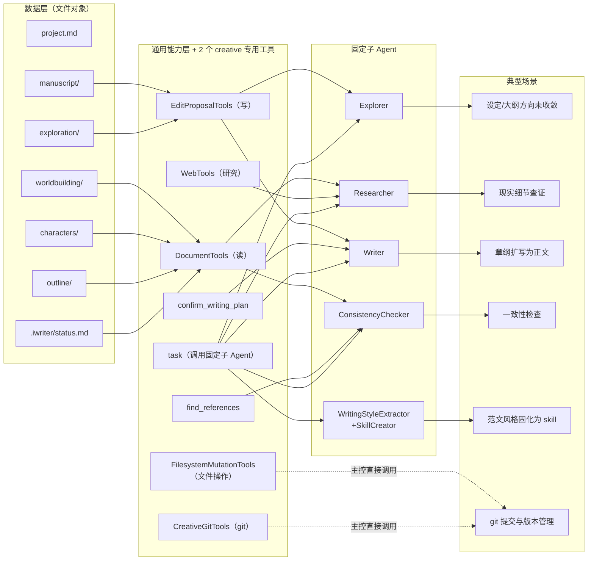

# AI小说创作伙伴：重构设计

> 本文档是对现有 `design/creativeagent/` 实现的重构设计，起点是《正式需求与设计前置约束》（同目录下），而不是现有实现本身——现有代码只在每个设计点上被单独核验是否真的复用得上。本文档记录的是多轮讨论后的最终结论；讨论过程与历次修订请查 git 历史（`git log -- "design/creativeagent phase 2/AI小说创作伙伴：重构设计.md"`），文档正文不再用 v1/v2/v3 这类内部版本标签自我指代。

* * *

## 0\. 从新需求倒推：这次要解决的是什么

《正式需求与设计前置约束》把系统重新定义为"面向小说创作工程的通用 Agent 框架"，核心是三层设计（通用内核 / 适配层 / 任务层）+ 三层架构（主控 Agent / 通用能力层 / 可组装子 Agent）+ 三层控制面（Prompt / Skills / Workflow）。这三组"三层"是同一个系统的三个切面：

*   **通用内核**回答"工作对象是什么、怎么装配上下文、怎么定责任边界"——落地为第 1 节的对象模型；
    
*   **三层架构**回答"谁来执行"——落地为第 3 节的 Agent 重新设计；
    
*   **三层控制面**回答"复杂度放在哪"——落地为第 5 节的工具最小化设计。
    

下面各节按"先从需求推导应该是什么样 → 再核验现有代码哪部分能直接用、哪部分要改、哪部分要砍"的顺序展开。两个先于设计的事实纠正（影响多处判断）：

1.  **Skills 不是空目录，是已有 29 个真实** `SKILL.md` **文件**（`electron/ai/builtin-skills/creative/{common,main,consistency,planner,writer}/*/SKILL.md`）。内容质量整体不差，真正的问题是：①从未做过埋点验证（issues#7）；②个别条目内容本身有害——`creative/writer/information-density/SKILL.md` 明文要求"每个句子至少同时做两件事"，与 issues#4"每一个字都很设计、肤浅、形式化"是直接因果关系。
    
2.  `writer.ts` **当前系统提示词仍然写着**"Execute the approvedPlan ... precisely. Do not improvise plot changes, character decisions, or structural deviations."——这是 issues#2/#3/#4 的直接代码证据，不是已经修复的历史遗留（第 6 节）。
    

* * *

## 1\. 对象模型与工程空间（通用内核）

### 1.1 目录与对象映射

判据先于列表：下面每个目录/文件都按三个维度标注——**必需/可选**（必需 = 项目存在即必须有；可选 = 仅特定条件触发才创建，缺失不代表项目不完整，全部走懒创建，没有"预先建空文件"）、**维护方**（作者 = 内容应由作者书写、agent 只做编辑辅助；agent = 派生产物，作者不直接编辑；两者 = 都可以直接写）、**是否进 git**（原则：派生产物/纯工程态内容不进 git，作者创作意图的载体进 git）。任何一个目录的存在都必须能在下面的总表里找到对应的"必要性"理由——找不到理由的目录/文件本身就该被砍掉，这正是新需求对"agent 衍生目录"提出的约束。

```
{workspace}/
  project.md                   # 作品对象：身份信息 + 当前版本字段（第 4 节）
  worldbuilding/
    worldbuilding.md           # 设定对象，默认单文件
    factions.md                # 可选：规模增长后从 worldbuilding.md 拆出（阵营/地理）
  characters/
    characters.md              # 全部角色的默认登记点（见 1.3）
    {slug}.md                  # 可选：升格为独立档案的重要角色（升级阈值见 1.3）
  outline/
    master-outline.md          # 结构对象：总纲（见 1.2/1.3）
    vol{NN}-outline.md         # 可选：卷纲（仅启用卷纲层时存在，见 1.2/1.3）
    ch{NNN}-outline.md         # 结构对象：章纲（场景列表，见 1.2/1.3）
  manuscript/
    ch{NNN}.md                 # 正文对象，内含 beat 哨兵（见 1.2）
  materials/
    fragments.md               # 素材捕获区（见 1.3）
  process/
    open-questions.md          # 可选：未决创作问题（见 1.3）
    changelog.md               # 可选：累积性创作历史叙事（见 1.3）
  exploration/                 # 候选方案区，纯目录约定（见 5.5），内容命名 {类型}-{方向名}.md
  .iwriter/                    # 工程态目录：仅 agent/host 读写，作者不应手动编辑，不进 git
    status.md                  # 动态状态快照（见 1.4），纯派生物
  .git/
```

|   路径   |   必需/可选   |   维护方   |   进 git   |   必要性   |
| --- | --- | --- | --- | --- |
|   `project.md`   |   必需   |   作者+agent（agent 辅助创建/更新和维护"当前版本"字段）   |   是   |   唯一的身份对象，是其余对象创作前提的来源（第 4 节）   |
|   `worldbuilding/worldbuilding.md`   |   必需   |   作者（agent 可从从既有的草稿提炼，反向导入，见第 8 节）   |   是   |   设定的默认单文件载体   |
|   `worldbuilding/factions.md`   |   可选   |   同上   |   是   |   `worldbuilding.md` 规模增长后的拆分产物   |
|   `characters/characters.md`   |   必需   |   作者+agent   |   是   |   全部角色的默认登记点；即使一个角色都没升格独立档案，这个文件也必须存在，否则角色信息无处可查   |
|   `characters/{slug}.md`   |   可选   |   作者+agent   |   是   |   升级阈值触发后才创建（1.3 节）   |
|   `outline/master-outline.md`   |   必需   |   作者+agent   |   是   |   结构对象的唯一总纲   |
|   `outline/vol{NN}-outline.md`   |   可选   |   作者+agent   |   是   |   仅启用卷纲层时存在（见 1.2 节）   |
|   `outline/ch{NNN}-outline.md`   |   可选（强烈建议）   |   作者+agent   |   是   |   提纲价值的关键载体；跳过它直接写正文，Writer 会退化为无提纲创作   |
|   `manuscript/ch{NNN}.md`   |   可选（懒创建）   |   作者+agent   |   是   |   每章动笔后才存在   |
|   `materials/fragments.md`   |   可选（懒创建）   |   作者+agent（agent 辅助创建/更新+分类标注）   |   是   |   首次记录碎片时创建   |
|   `process/open-questions.md`   |   可选（懒创建）   |   作者+agent   |   是   |   首次出现未决创作问题时创建   |
|   `process/changelog.md`   |   可选（懒创建）   |   agent（作者可补充/修订）   |   是   |   累积性创作历史叙事   |
|   `exploration/*.md`   |   可选   |   agent 产出（作者确认/拒绝）   |   是   |   候选方案区（5.5 节）   |
|   `.iwriter/status.md`   |   必需（agent 自动维护，作者不必操心创建）   |   仅 agent   |   否   |   动态状态快照，纯派生物，详见 1.4 节   |

`status.md` 从工作区根目录移入 `.iwriter/`：它是纯派生快照、作者不应直接编辑——这个定位使它理应"不进 git、不出现在作者可见的工作区根目录"。它依然是"必需"对象，只是必需性由 agent 自动保证，不需要作者操心创建或维护。

### 1.2 结构层级关系与章节命名约定

结构层一共四级，逐级变细，下级永远是上级某个具体条目的展开，不是平行的另一套大纲：

```
outline/master-outline.md         总纲：结构节点 + 主题落点 + 人物弧光交汇 + 伏笔总表
  └─ outline/vol{NN}-outline.md   卷纲（可选）：本卷结构节点 + 大事件序列（详见 1.3）
       └─ outline/ch{NNN}-outline.md   章纲：场景列表（每场景 目标-冲突-结果）
            └─ manuscript/ch{NNN}.md 内的 beat 哨兵   场景内节拍
                 └─ beat 统辖的正文区间          正文本身
```

**是否启用卷纲层**：篇幅规划预估达到一定规模（如 ≥ 20 章，或作者明确说明是分卷连载题材）时启用；中短篇作品章纲直接挂在总纲下，不强制要求卷纲文件存在。卷纲层启用时，总纲变粗（只保留全书维度的宏观弧线），每卷的结构细节下沉到卷纲中（卷纲相当于本卷的详细小总纲，见 1.3 节字段定义）。

四级里前两级（总纲/卷纲）是"事件级"颗粒度，后两级（章纲/beat）是"场景级"颗粒度，分界线在章纲：**从章纲往下，叙事单元统一是场景（scene），不再是抽象的事件描述**。场景结构是三段式，这是章纲层场景列表的字段定义本身：

*   **目标（goal）**：场景内 POV 角色这一刻具体想要什么——必须具体到"能判断是否达成"，不能是"想变强"这种抽象欲望；
    
*   **冲突（conflict）**：谁、什么、何种处境阻止了这个目标，没有冲突场景就是流水账；
    
*   **结果（outcome）**：三种出口之一——目标达成但代价更大／目标未达成／目标达成但揭示了新问题。**不能是"顺利达成"**，顺利达成意味着这个场景对故事没有推进力，该被精简或删除。
    

beat 哨兵是场景的下一级展开：格式 `> [场景-{N}-节拍-{M}] 一句话提纲`，紧跟其统辖的正文段，回指章纲的场景序号，一个场景在正文里通常展开为 2~5 个 beat。

**章节文件命名约定**（章节故事顺序的权威机制）：

章节文件名遵循三级命名约定，保证文件字母排序始终等于故事顺序，无需维护单独的章节顺序列表：

*   第一级：`ch{NNN}.md`，三位数字，给 100 章以内的长篇留足空间（如 `ch001.md`、`ch025.md`）；
    
*   第二级：`ch{NNN}{a-z}.md`，在原章节后插入新章节时使用（如 `ch003a.md` 插在 `ch003.md` 之后、`ch004.md` 之前）；
    
*   第三级：`ch{NNN}{a-z}{a-z}.md`，第二级之后继续插入时使用（如 `ch003aa.md` 插在 `ch003a.md` 之后）。
    

同样的三级约定适用于章纲文件（`ch{NNN}-outline.md`、`ch{NNN}a-outline.md`），正文与章纲文件名前缀保持一一对应。此约定不需要额外字段维护，agent 按字母序读取目录即得正确故事顺序。

**四级串联的完整示例**（同一条情节线从总纲到正文）：

```markdown
总纲 master-outline.md › 结构节点「激励事件」
  阿坤收到一张匿名照片，照片里的女孩侧脸与失踪的女儿有六成相似。章节区间 ch002-ch003。

  └─ 卷纲 vol01-outline.md › 大事件「码头线索浮现」
       本卷范围内，这条激励事件具体落在码头仓库一场对话上。

       └─ 章纲 ch003-outline.md › 场景-1
            地点/时间：码头仓库，深夜
            出场人物：阿坤（POV）、老周
            目标：阿坤想让老周说出照片来源
            冲突：老周欠阿坤的人情已经还清，不愿意再卷入
            结果：老周说出来源，但代价是要阿坤帮他做一件违法的事

            └─ 正文 manuscript/ch003.md 内的 beat
                 > [场景-1-节拍-1] 阿坤找到老周，老周回避话题
                 > [场景-1-节拍-2] 阿坤亮出人情账，老周松口但提条件
                 > [场景-1-节拍-3] 老周说出照片来源，交换条件成立
```

**"调整情节"= 编辑某一层、向上/向下冒泡**：改一个 beat → Writer 只重写该 beat 统辖区间；某场景的目标/冲突/结果改变 → 提示是否需要重写该场景对应的全部 beat；章纲改动影响主线 → 提示是否需要调整卷纲/总纲。冒泡是**提示**，不是自动连锁修改（新需求 §4.10：变更传播是需要被显式分析、说明和确认的工程行为，不是刚性状态机）。

**反向生成**（从已有正文提炼章纲/总纲）有明确写入目标：从 `manuscript/ch003.md` 提炼 → 写入 `outline/ch003-outline.md`；多章模式归纳 → 写入/校正 `outline/master-outline.md`。

### 1.3 各对象文档详细字段定义

按目录结构组织——一个对象对应一类工作任务，agent 处理某类任务时，应该清楚自己读写的是这里的哪一份文件。字段是"必须有"的下限，agent 可以视项目情况增补，但缺这些字段视为对象未建立完整。

**字段命名约定**：英文字段名一律使用 kebab-case（多个单词用 `-` 连接，如 `story-function`）；必选字段列在前，可选字段列在后；示例中所有字段均使用 H3 级（`###`）作为字段节头，便于 agent 用 `get_section` 精确读写单个字段。

#### `project.md`（作品对象，单文件，全程仅一份）

|   字段（英文名）   |   必选/可选   |   选项   |   说明   |
| --- | --- | --- | --- |
|   书名 (title)   |   必选   |   —   |    |
|   题材/标签 (genre-tags)   |   必选   |   自由文本，不限定枚举   |   题材是适配层维度，通用内核不预设题材分类   |
|   故事核心句 (premise)   |   必选   |   —   |   **不是随意一句话**，必须包含四要素：主角是谁、目标是什么、核心阻碍是什么、赌注（失败的代价）是什么   |
|   主题 (theme)   |   必选   |   —   |   一句话哲学命题，不要求文学化措辞，要求清楚   |
|   读者承诺 (reader-promise)   |   必选   |   —   |   这本书向读者承诺的核心体验（爽感/悬疑解谜/情感共鸣等），全书不应违背   |
|   篇幅规划 (scale-plan)   |   必选   |   —   |   预估总字数/章节数量级，以及每章目标字数，决定是否启用卷纲层（1.2 节）   |
|   当前版本 (version)   |   必选   |   形如 `1.2（初稿补写中）`   |   语义见第 4 节   |
|   目标读者 (target-audience)   |   可选   |   —   |    |

**完整示例：**

```markdown
# project.md

### 书名
照片

### 题材/标签
犯罪、家庭、悬疑

### 故事核心句
退伍老兵阿坤想找回失踪的女儿，但唯一线索指向他曾经背叛过的黑帮，一旦重新接触就可能连累现在的家庭。

### 主题
复仇是否值得付出和解的代价

### 读者承诺
层层剥开的悬疑感 + 父女情感线的揪心

### 篇幅规划
约 25 万字，预计 60 章，每章约 4000 字，启用卷纲层

### 当前版本
0.3（设定收敛中）
```

#### `.iwriter/status.md`（过程对象，动态状态快照，见 1.4）

|   字段（英文名）   |   必选/可选   |   选项   |   说明   |
| --- | --- | --- | --- |
|   重建时间 (rebuilt-at)   |   必选   |   ISO 时间戳   |   host 侧以此时间点为基准计算 git diff，判断哪些字段需要增量更新   |
|   当前进度 (progress)   |   必选   |   —   |   写到第几章、最近一次写作动作   |
|   角色状态摘要 (character-status-digest)   |   必选   |   —   |   每个重要角色当前所处弧光阶段的一句话摘要，详情指向 `characters/{slug}.md`   |
|   开放伏笔摘要 (open-threads-digest)   |   必选   |   —   |   指向 `outline/master-outline.md` 伏笔总表里尚未回收的条目   |
|   写作约束摘要 (writing-constraints-digest)   |   必选   |   —   |   视角/时态/基调，从 `worldbuilding/worldbuilding.md` 与已确认章纲提炼，不重复定义   |
|   待解决摘要 (open-questions-digest)   |   必选   |   —   |   指向 `process/open-questions.md` 中状态为"待决策"的条目   |

`status.md` 不是数据源，是**全部由 agent 生成的派生摘要**，目标 500-1000 token。**重建策略**：host 侧在会话启动时执行 `git diff` 比对 `rebuilt-at` 之后的变更文件列表；若变更文件局限于某几个对象，agent 只更新受影响的字段（如只有 `ch005.md` 改动，则只更新 `progress`）；若变更文件覆盖多个对象层或 `status.md` 缺失，则触发全量重建（重新读取全部对象文件生成）。全量重建也可由作者显式要求。

不存在"作者直接编辑 `status.md` 来改设定"这种用法——作者要改设定，改 `worldbuilding/worldbuilding.md` 本身。

**使用时机**：写作任务开始前、ConsistencyChecker 全稿扫描前、Researcher 需要快速定位当前故事状态时。不需要每次对话都读取，agent 按需加载。

**完整示例：**

```markdown
# .iwriter/status.md（agent 自动生成，请勿手动编辑）

### 重建时间
2026-03-15T14:30:00Z

### 当前进度
写到 ch005，最近动作：完成场景-2 的 beat 扩写

### 角色状态摘要
阿坤——已重新接触线索，尚未与黑帮正面冲突；老周——交出线索后处境复杂化，详见 characters/老周.md

### 开放伏笔摘要
照片来源指向的黑帮身份尚未回收，见 master-outline.md 伏笔总表

### 写作约束摘要
第三人称有限视角（阿坤为主，偶尔老周），现在时叙事，基调压抑克制

### 待解决摘要
1 条待决策——女儿失踪当年的真相要不要在卷一揭示，见 process/open-questions.md
```

#### `worldbuilding/worldbuilding.md`（设定对象）

|   字段（英文名）   |   必选/可选   |   选项   |   说明   |
| --- | --- | --- | --- |
|   规则体系 (rule-systems)   |   必选   |   题材相关：magic system / 科技水平 / 社会运作规则；现实主义题材可填"无超自然规则，遵循现实社会运作规则"   |   要求写到"这条规则在什么情况下会被测试/违反会怎样"，不是纯背景介绍   |
|   禁区 (forbidden-zones)   |   必选   |   —   |   绝对不能出现的设定矛盾，**必须写明原因**（不是只列"不能做 X"，要写"因为 X 会破坏 Y 设定的根基"）   |
|   时代背景 (era)   |   可选   |   —   |    |
|   阵营与势力 (factions)   |   可选   |   —   |   每个阵营的诉求、与主角的关系；规模变大后拆到 `factions.md`，届时本字段替换为 `→ worldbuilding/factions.md`   |
|   地理信息 (geography-locations)   |   可选   |   —   |   地理、城镇、地图、场景档案；规模变大后拆到 `geography.md`，届时本字段替换为 `→ worldbuilding/geography.md`   |
|   历史沿革 (history-timeline)   |   可选   |   —   |   世界历史、故事时间线、重大历史事件   |
|   名词体系 (terminology)   |   可选   |   —   |   专有名词统一表：人名/地名/机构名/重要物品的标准写法一栏，供精修期检查统一性时直接比对   |

规模增长后可拆分为 `worldbuilding/worldbuilding.md`（规则/时代/历史）+ `worldbuilding/factions.md`（阵营），拆分时机由 agent 判断（"够用就不拆"原则），不强制预先拆分。

**完整示例：**

```markdown
# worldbuilding/worldbuilding.md

### 规则体系
无超自然规则，遵循现实社会运作规则；黑帮势力的运作逻辑遵循"人情债优先于法律"

### 禁区
阿坤不能轻易诉诸暴力解决问题——因为这会摧毁"他已经改过自新"这条主题落点的根基

### 时代背景
当代，南方某港口城市

### 阵营与势力
→ worldbuilding/factions.md

### 名词体系
| 标准写法 | 类型 | 说明 |
| --- | --- | --- |
| 和盛帮 | 机构 | 控制货运线的黑帮，勿写作"和胜帮" |
| 阿坤 | 人名 | 主角，本名陈国坤 |
```

#### `characters/{slug}.md`（重要角色个人档案）

|   字段（英文名）   |   必选/可选   |   选项   |   说明   |
| --- | --- | --- | --- |
|   姓名/别名 (name-aliases)   |   必选   |   —   |    |
|   角色重要性 (importance-tier)   |   必选   |   主角 / 重要配角 / 配角   |   路人不会升格到独立档案，能出现在这里的至少是"配角"级   |
|   功能定位 (story-function)   |   必选   |   自由文本，如"导师"/"对手"/"催化者"   |   这个角色在叙事机器里承担什么功能，不是性格描述   |
|   外显特征 (visible-traits)   |   必选   |   —   |   性别、年龄、身体状态、阶层、职业、语域——issues#3 常识问题的直接解法：角色的移动速度、情绪外露程度、说话方式都应能从这组字段机械推导，不是事后核查清单   |
|   核心欲望 (desire)   |   必选   |   —   |   心理三角之一   |
|   核心恐惧 (fear)   |   必选   |   —   |   心理三角之一   |
|   虚假信念 (false-belief)   |   必选   |   —   |   心理三角之一，要求是"可被推翻的错误认知"而不是性格标签——例：「他相信展现脆弱等于失去尊重」是虚假信念，"他很骄傲"不是   |
|   成长弧光 (arc)   |   必选   |   初始状态 → 目标状态 → 当前阶段   |   三段都填，不能只填"当前阶段"   |
|   关系网络 (relationships)   |   必选   |   —   |   与其他角色的关系，双向标注（A 对 B 的认知 ≠ B 对 A 的认知，这种不对称往往是冲突来源）   |
|   声音特征 (voice)   |   必选   |   —   |   词汇选择/语速节奏/惯常沉默点，直接供 `character-voice` skill 引用   |
|   当前状态 (current-status)   |   必选   |   —   |   随故事推进更新   |
|   出场章节索引 (appearance-index)   |   必选   |   —   |   列出出场章节文件名   |
|   关键能力/资源 (key-abilities)   |   可选   |   —   |   仅当能力/资源直接影响情节可行性时才需要填，与情节无关的设定属于过度建档   |
|   独特背景 (background)   |   可选   |   —   |   只写"会被正文引用到"的过去经历，不要求完整人生传记   |

**完整示例：**

```markdown
# characters/老周.md

### 姓名/别名
老周

### 角色重要性
配角

### 功能定位
信息掮客 / 道义考验

### 外显特征
男，58 岁，码头退休搬运工，左手缺两指（旧工伤），说话直接不绕弯

### 核心欲望
尽快还清对和盛帮的旧债，不再被任何人欠人情

### 核心恐惧
被卷入下一代的麻烦里，连累已经成家的女儿

### 虚假信念
他相信"还清债就能彻底脱身"——事实上和盛帮从不真正放人走

### 成长弧光
初始（试图置身事外）→ 目标（彻底摆脱黑帮纠缠）→ 当前阶段（被迫再交出一个人情）

### 关系网络
欠阿坤一个旧人情（已还清，本不欠）；欠和盛帮一笔旧债（未清，是这次让步的真实原因）

### 声音特征
短句，少修饰，习惯用"行了""算了"收尾对话

### 当前状态
刚向阿坤交出照片来源，处境比之前更复杂

### 出场章节索引
ch003.md
```

#### `characters/characters.md`（全部角色登记表，单文件）

这是角色的**唯一名单入口**：不论一个角色是否已经升格为独立档案，都必须在这里有一条记录——已升格的角色只保留一句引用，不复制内容，避免双份维护；未升格的角色保留完整的合集字段。

|   字段（英文名）   |   必选/可选   |   选项   |   说明   |
| --- | --- | --- | --- |
|   姓名 (name)   |   必选   |   —   |    |
|   档案状态 (profile-status)   |   必选   |   合集内 / 已升格   |   已升格时本条目只保留引用，详情见独立档案   |
|   功能定位 (story-function)   |   条件必选（档案状态=合集内 时必填）   |   信使/路人/反派打手/导师，一词   |   已升格条目不填   |
|   与主角关系 (relation-to-protagonist)   |   条件必选（合集内）   |   —   |   一句话   |
|   显著特征 (notable-traits)   |   条件必选（合集内）   |   —   |   1-2 句，够 Writer 区分声音即可   |
|   独立建档标记 (profile-flag)   |   可选   |   待决策 / 已建议 / 已拒绝   |   是否已触发"建议独立建档"，规则见下方   |
|   独立档案引用 (profile-ref)   |   条件必选（档案状态=已升格 时必填）   |   —   |   形如 `→ characters/老周.md`   |

**完整示例：**

```markdown
# characters/characters.md

| 姓名 | 档案状态 | 功能定位 | 与主角关系 | 显著特征 | 独立建档标记 | 独立档案引用 |
| --- | --- | --- | --- | --- | --- | --- |
| 老周 | 已升格 | | | | | → characters/老周.md |
| 阿坤的妹妹 | 合集内 | 信使 | 唯一还愿意和阿坤说话的家人 | 说话快，爱替阿坤操心 | 已建议 | |
| 货运站柜员 | 合集内 | 路人 | 无 | 只在 ch002 出现一次，没有显著特征 | | |
```

**角色独立建档的阈值规则**（决定何时从这张表升格出一份独立档案）：

*   **触发独立建档**（满足任一条件即可）：① 该角色在第 2 个不同章节中出现实质性动作/对话（不只是被提及）；② 作者明确指定该角色重要；③ 该角色承担一条独立副线。
    
*   **人数豁免阈值**：当前"重要角色"总量（已独立建档 + 已满足升级条件待处理）**≤ 5** 时，允许继续维持合并状态；超过 5 后，新触发升级条件的角色强制走一次升格审批（作者可拒绝，拒绝后留在合集里但保留独立建档标记，下次再问）。5 是初始可调阈值，写入 `project.md` 或设置项，允许作者调整。
    
*   **合集内容溢出信号**：`characters.md` 中某条目的"显著特征"超过 3-4 句时，agent 应主动提议建立独立档案。
    
*   **不做自动降级**：独立档案降级回合集是低频操作，不提供专门工具，按作者指示走普通文件操作（删除/合并）即可。
    

#### `outline/master-outline.md`（总纲，单文件，全程仅一份）

**未启用卷纲层时**（中短篇），总纲包含全书完整的结构细节：

|   字段（英文名）   |   必选/可选   |   选项   |   说明   |
| --- | --- | --- | --- |
|   故事核心句 (premise)   |   必选   |   —   |   与 `project.md` 一致，此处可展开为 2-3 句   |
|   主题落点 (theme-beats)   |   必选   |   —   |   主题如何具体化为情节事件——不是抽象命题，是"通过哪几个具体情节让读者感受到主题"，每个落点指向大致结构节点   |
|   结构节点 (structure-nodes)   |   必选   |   **默认 8 个题材中立占位节点**：开篇钩子 / 激励事件 / 早期试炼 / 中点转折 / 危机加深 / 至暗时刻 / 高潮 / 结局余波   |   每节点填：发生什么（具体事件，不是阶段描述）、大致章节区间、关联到哪条人物弧光   |
|   人物弧光交汇点 (arc-intersections)   |   必选   |   —   |   列出主要角色的弧光在哪些结构节点彼此交汇/冲突   |
|   伏笔总表 (foreshadow-table)   |   必选   |   状态：待埋设 / 已埋设 / 已回收   |   表格：伏笔内容 / 埋设章节 / 回收章节 / 所属结构节点 / 状态   |
|   候选方向记录 (candidate-directions)   |   可选   |   —   |   若主线仍有未收敛的方向，标注"候选"并指向 `exploration/` 中对应文件   |

**启用卷纲层时**，总纲只保留全书维度的宏观弧线，结构细节下沉到各卷的 `vol{NN}-outline.md`：

|   字段（英文名）   |   必选/可选   |   说明   |
| --- | --- | --- |
|   故事核心句 (premise)   |   必选   |   同上   |
|   主题落点 (theme-beats)   |   必选   |   全书维度的主题落点   |
|   全书结构弧 (global-arc)   |   必选   |   用一段话描述全书从开篇到结局的宏观走向，不需要精确到章节区间   |
|   人物弧光总览 (arc-overview)   |   必选   |   每个主要角色的完整弧光（从起点到终点），不细化到卷内阶段   |
|   伏笔总表 (foreshadow-table)   |   必选   |   全书维度的伏笔总表，各卷伏笔操作在 vol-outline 内另行记录   |
|   卷纲索引 (volume-index)   |   必选   |   列出各卷目标并指向 `vol{NN}-outline.md`   |

**完整示例（未启用卷纲层）：**

```markdown
# outline/master-outline.md

### 故事核心句
退伍老兵阿坤想找回失踪的女儿，但唯一线索指向他曾经背叛过的黑帮，一旦重新接触就可能连累现在的家庭。

### 主题落点
主题"复仇是否值得付出和解的代价"通过三个具体情节落地：①阿坤第一次拒绝黑帮邀请（ch008）；②阿坤为救女儿被迫代替黑帮做了一件违法的事（ch030）；③终章选择——放弃追查还是公开真相（ch058）。

### 结构节点

#### 开篇钩子（ch001）
阿坤在码头的平静生活，一个细节暗示他过去不像现在这么干净。
关联弧光：阿坤（外表改变但内心未和解）

#### 激励事件（ch002-ch003）
阿坤收到一张匿名照片，照片里的女孩侧脸与失踪的女儿有六成相似。
关联弧光：阿坤（从"已放下"到"重新被钩住"）

### 人物弧光交汇点
阿坤与老周的弧光在"激励事件"与"中点转折"两个节点交汇：前者是老周被迫交出线索，后者是老周的旧债真正暴露。

### 伏笔总表
| 伏笔内容 | 埋设章节 | 回收章节 | 所属结构节点 | 状态 |
| --- | --- | --- | --- | --- |
| 照片来源指向阿坤曾背叛过的黑帮 | ch003 | 未定 | 激励事件 | 已埋设 |
```

#### `outline/vol{NN}-outline.md`（卷纲，可选层）

每一卷是全书叙事弧线上的一个独立阶段——有完整的冲突弧线，但故事本身尚未结束。卷纲相当于该卷的详细小总纲，其颗粒度与总纲（未启用卷纲层时）相当：

|   字段（英文名）   |   必选/可选   |   选项   |   说明   |
| --- | --- | --- | --- |
|   本卷结构功能 (structural-role)   |   必选   |   —   |   对应 `master-outline.md` 的哪段全书弧线（如"开篇钩子到中点转折"）   |
|   本卷结构节点 (structure-nodes)   |   必选   |   —   |   本卷内部的结构节点序列，格式同总纲"结构节点"字段：每个节点填事件/章节区间/关联弧光   |
|   本卷核心冲突 (core-conflict)   |   必选   |   —   |   本卷阶段性的主要阻碍/反派/危机，驱动本卷叙事的中心张力   |
|   本卷人物弧光阶段 (arc-stage)   |   必选   |   —   |   各主要角色在本卷经历的弧光阶段（从本卷起点到本卷终点），衔接上一卷末状态   |
|   本卷伏笔操作 (foreshadow-ops)   |   必选   |   埋设 / 强化 / 回收   |   本卷涉及的伏笔操作，与总纲伏笔总表对应   |
|   本卷高潮与收尾 (volume-climax)   |   必选   |   —   |   本卷内部高潮 + 收尾状态（留给下卷的悬念或转折）   |
|   章节列表 (chapter-list)   |   必选   |   —   |   本卷覆盖的章节文件名列表，按故事顺序（字母序）   |
|   衔接 (transition-notes)   |   可选   |   —   |   与上一卷承接点、给下一卷的铺垫   |

**完整示例：**

```markdown
# outline/vol01-outline.md

### 本卷结构功能
覆盖全书弧线"开篇钩子"到"中点转折"

### 本卷结构节点

#### 开篇钩子（ch001）
阿坤在码头的平静生活，一个细节暗示他过去不像现在这么干净。
关联弧光：阿坤（外表改变但内心未和解）

#### 激励事件（ch002-ch003）
阿坤收到匿名照片，决定重新接触线索。
关联弧光：阿坤（从"已放下"到"重新被钩住"）；老周（被迫参与）

#### 早期试炼（ch004-ch008）
……

### 本卷核心冲突
和盛帮对旧账的隐性施压：阿坤每接近一步真相，就被迫还掉一个人情

### 本卷人物弧光阶段
阿坤：从"平静但未愈合"到"主动踏入危险区"
老周：从"置身事外"到"被迫交出第二个人情"

### 本卷伏笔操作
| 伏笔内容 | 操作 | 章节 |
| --- | --- | --- |
| 照片来源指向阿坤背叛过的黑帮 | 埋设 | ch003 |
| 老周自己欠和盛帮旧债 | 强化 | ch006 |

### 本卷高潮与收尾
阿坤确认照片不是伪造，决定正面接触线索人；老周旧债暴露，两人处境均复杂化。留悬：和盛帮是否已察觉阿坤的调查。

### 章节列表
["ch001.md", "ch002.md", "ch003.md", "ch004.md", "ch005.md", "ch006.md", "ch007.md", "ch008.md"]
```

#### `outline/ch{NNN}-outline.md`（章纲，提纲价值的关键载体）

|   字段（英文名）   |   必选/可选   |   选项   |   说明   |
| --- | --- | --- | --- |
|   本章结构功能 (structural-role)   |   必选   |   —   |   对应 `master-outline.md` / `vol{NN}-outline.md` 的哪个结构节点   |
|   状态 (status)   |   必选   |   草稿中 / 已确认   |   对应新需求 §4.5"候选 vs 已确认前提"   |
|   场景列表 (scenes)   |   必选   |   —   |   **核心字段**，见下表，一章通常 1-3 个场景   |
|   本章伏笔操作 (foreshadow-ops)   |   可选   |   埋设 / 强化 / 回收   |   逐条对应总纲伏笔总表条目   |
|   开篇钩子/结尾悬念 (hook-cliffhanger)   |   可选   |   —   |   章节首尾的吸引力设计   |
|   衔接 (transition-notes)   |   可选   |   —   |   与上一章衔接点、给下一章的过渡铺垫   |

**场景列表字段（每个场景一段，标题格式：**`### 场景-{N}`**）：**

|   子字段（英文名）   |   必选/可选   |   选项   |   说明   |
| --- | --- | --- | --- |
|   地点/时间 (location-time)   |   必选   |   —   |    |
|   出场人物（含 POV）(characters-pov)   |   必选   |   —   |   若全书用多视角叙事，必须标明本场景的 POV 角色   |
|   目标 (goal)   |   必选   |   —   |   POV 角色这一刻具体想要什么，要求可验证是否达成，不能是抽象欲望   |
|   冲突 (conflict)   |   必选   |   —   |   谁/什么阻止了目标   |
|   结果 (outcome)   |   必选   |   达成但代价更大 / 未达成 / 达成但揭示新问题   |   **不能是顺利达成**——若确实顺利达成，说明这个场景该被精简或合并   |
|   情绪基调/节奏 (tone-pacing)   |   可选   |   —   |   快/慢、紧张/舒缓，供 `pacing-control` skill 参考   |
|   信息释放 (information-reveal)   |   可选   |   —   |   本场景向读者揭示什么新信息、对谁仍隐藏什么   |

**完整示例：**

```markdown
# outline/ch003-outline.md

### 本章结构功能
激励事件的后半段

### 状态
已确认

### 场景-1

#### 地点/时间
码头仓库，深夜

#### 出场人物
阿坤（POV）、老周

#### 目标
阿坤想让老周说出照片的来源

#### 冲突
老周欠阿坤的人情已经还清，不愿意再卷入

#### 结果
老周说出来源，但代价是要阿坤帮他做一件违法的事——交换条件让阿坤的处境更复杂

#### 情绪基调
压抑，对话为主，节奏慢但张力累积

#### 信息释放
揭示照片来源指向阿坤曾背叛过的黑帮；对读者隐藏老周自己也欠那个黑帮的债
```

这样的章纲才有"提纲的价值"——Writer 拿到这份提纲可以直接知道该写什么对话、什么转折，而不是面对一句"阿坤去找老周问线索"自己现编冲突和结果。

#### `manuscript/ch{NNN}.md`（正文，每章一份，原 `draft/`）

beat 哨兵格式 `> [场景-{N}-节拍-{M}] 一句话提纲`，紧跟其统辖的正文段，回指章纲的场景序号（1.2 节）。文件名与 `outline/ch{NNN}-outline.md` 遵循相同的三级命名约定（1.2 节）。

#### `process/open-questions.md`（过程对象，单文件）

这里登记的是**创作决策层面**悬而未决的问题——故事该怎么走、设定有没有矛盾——不是开发缺陷或技术 TODO。

|   字段（英文名）   |   必选/可选   |   选项   |   说明   |
| --- | --- | --- | --- |
|   问题描述 (question)   |   必选   |   —   |    |
|   出现章节/上下文 (context-ref)   |   必选   |   —   |    |
|   提出时间 (raised-at)   |   必选   |   —   |    |
|   状态 (status)   |   必选   |   待决策 / 已解决   |    |
|   解决后归档去向 (resolved-into)   |   条件必选（状态=已解决 时必填）   |   —   |   若解决方式是写入某个对象文件，记录指向哪个文件，便于追溯   |

**完整示例：**

```markdown
# process/open-questions.md

## 女儿失踪当年的真相要不要在卷一揭示？

### 出现章节/上下文
ch003，老周交出线索后

### 提出时间
2026-03-01

### 状态
待决策
```

#### `process/changelog.md`（过程对象，单文件）

`changelog.md` 承担**累积性创作叙事**：作者/agent 用人类语言记录"这次为什么这么改、对故事产生了什么影响"。这是 git commit message 不会写、`.iwriter/status.md`（无历史的即时快照）也不承担的东西——单文件追加写，按时间顺序往下堆，保持叙事的连续可读性。

|   字段（英文名）   |   必选/可选   |   选项   |   说明   |
| --- | --- | --- | --- |
|   时间/版本号 (timestamp-version)   |   必选   |   —   |   记录时间，若恰逢版本号变化可一并记录 tag   |
|   变更摘要 (summary)   |   必选   |   —   |    |
|   影响范围 (scope)   |   必选   |   —   |   涉及哪些对象文件/章节   |
|   触发原因 (trigger)   |   必选   |   大修 / 精修 / 问题修补 / 版本回退   |    |

**完整示例：**

```markdown
# process/changelog.md

## 2026-03-10（0.3 → 0.4）

### 变更摘要
把老周的核心恐惧从"怕死"改成"怕连累女儿"，原设定和他后续的让步动机冲突

### 影响范围
characters/老周.md，outline/ch003-outline.md 场景-1 的冲突字段同步调整

### 触发原因
一致性检查发现动机矛盾
```

#### `materials/fragments.md`（素材对象，单文件，多条目，独立顶层目录）

新需求 §9.1 把碎片明确为"一句对话、一个场景念头、一个人物细节、一个伏笔想法"——这几类东西的归宿完全不同，fragments 不是终点，而是**捕获区 + 路由前的暂存区**。

|   字段（英文名）   |   必选/可选   |   选项   |   说明   |
| --- | --- | --- | --- |
|   原始内容 (raw-content)   |   必选   |   —   |   一句话/几个词/情绪/问题，**不强制作者分类**——零摩擦记录是核心价值   |
|   采用状态 (adoption-status)   |   必选   |   未采用 / 已采用   |    |
|   类型 (type)   |   必选   |   场景念头 / 对话片段 / 人物细节 / 伏笔想法 / 情绪意象 / 调研笔记 / 未分类   |   **agent 在处理相关任务时顺带标注**，不需要作者主动分类；若 agent 读取 fragments.md 时发现未分类条目，根据 raw-content 内容自动打标，作为编辑动作提交审批   |
|   记录时间 (recorded-at)   |   必选   |   —   |   用于按时序排序素材、推断素材与会话的关联   |
|   关联线索 (related-refs)   |   可选   |   —   |   可能关联的角色/章节/结构节点，agent 识别后填   |
|   采用去向 (adopted-into)   |   条件必选（采用状态=已采用 时必填）   |   —   |   记录被并入了哪个对象文件（如"并入 `characters/老周.md` 的外显特征"）   |

**完整示例：**

```markdown
# materials/fragments.md

## 老周左手缺两指

### 原始内容
老周左手缺了两指，是旧工伤，握手时会下意识把手藏在背后。

### 类型
人物细节

### 记录时间
2026-03-02

### 关联线索
老周，ch003.md

### 采用状态
已采用

### 采用去向
并入 characters/老周.md 的外显特征
```

agent 不要求作者在记录时分类，但在合适时机（如下次涉及相关对象的任务）主动提议"这条碎片要不要并入 XX"，由作者决定是否采纳。

### 1.4 `storybible.md` → `.iwriter/status.md`

`storybible.md` 这个名字暗示"权威圣经/数据源"，与它实际定位（动态状态快照，不是数据源）矛盾，本版正名为 `status.md` 并移入 `.iwriter/`：

*   `project.md` = **身份信息**，几乎不变（书名/主题/读者承诺/篇幅规划），改动频率低，进 git；
    
*   `.iwriter/status.md` = **状态快照**，随写作推进频繁重建，是 agent 派生产物，作者可读但不应该把它当成编辑设定的入口，不进 git——它的内容随时会被下一次重建整体覆盖，进入版本历史没有意义，真正值得进 git 的"变化叙事"由 `process/changelog.md` 承担（1.3 节）。
    

### 1.5 对象间引用索引——不做 wiki 化，做隐形的 agent 侧引用索引

**不做** wiki 式组织（`[[链接]]`、反向链接、graph view）：角色/设定规模本来就小（1.3 节的 5 人豁免阈值已经把"重要对象"控制在个位数），文件树直接点开即可定位；强迫作者书写 `[[...]]` 本身就是"系统内部技术概念暴露"，与 §6"不向作者暴露系统内部的技术概念"直接冲突。

但 wiki 机制里真正有价值的部分——**精确的反向引用**——值得单独留下，做成一个对作者完全隐形的 agent 侧能力：agent 已经知道全部对象名称（`characters/`/`worldbuilding/` 下的标题），扫描任意 markdown 文档的纯文本、匹配这些已知名称出现的位置，就能得到"谁提到了谁"的精确对照表——**不需要作者写任何特殊语法，纯 prose 即可被索引**。

用途：① 高风险操作的影响面分析（第 7 节）；② "我在哪些章节提到过这个角色/这条设定"的检索需求。落地为工具 `find_references(name)`（5.2 节），基于现有 `DocumentSearch` 能力做精确名称匹配，不需要维护持久化索引表。

* * *

## 2\. 模式判定机制（构思 / 写稿）

模式判定是主控 Agent 每轮对话开始时的一次轻量决策，直接影响上下文装配策略和工具选择。以下是可落地的判定协议：

**第一步：读取工程状态信号**

*   当前操作对象的路径前缀直接说明类别，无需工具：`worldbuilding/`/`characters/`/`outline/` → 倾向构思；`manuscript/` → 倾向写稿；无明确对象 → 继续看其他信号。
    
*   `project.md` 的 `version` 字段：0.x → 设定/大纲未收敛，偏构思；1.x+ → 有初稿，偏写稿；但版本号只是倾向，不是锁定。
    

**第二步：读取任务意图信号**

*   用词特征（不是机械匹配，是倾向判断）：
    
    *   "要不要试试""有没有别的可能""我在想"→ 构思；
        
    *   "写""续写""改成""扩写""按这个章纲" → 写稿；
        
    *   "写一个开篇试试""看看效果" → 目的是构思判断，即使动词是"写"也属于构思。
        
*   操作范围：影响已确认前提（修改已确认章纲/角色心理三角/总纲结构节点）→ 高风险，提高澄清优先级。
    

**第三步：风险校验**

*   落地目标：是直接写入正式对象，还是先进 `exploration/`？
    
*   风险越高（覆盖范围越大、涉及已确认内容越多）→ 越应该先澄清、先进候选区；
    
*   风险低（局部润色/beat 扩写/记录碎片）→ 直接执行，不需要澄清。
    

**信号矛盾时的处置**：任何单一信号都不构成最终结论。当信号矛盾或都不够强时，执行一次轻量澄清："这是想正式定下来还是先探索一下？"不要在不确定时悄悄选择风险更高的那个。这是新需求 §3.3"最小化澄清"与 §4.5"候选不能被默认当作正式结论"在同一情境下的同一个方向。

**候选方案处理**：构思模式产出统一写入 `exploration/`（覆盖范围从"仅正文方向探索"扩大到设定/大纲候选），作者明确选定后才晋升为正式对象（5.5 节，纯目录约定，不需要专用工具）。`exploration/` 不是临时目录，而是有效的候选草稿区——文件在作者未明确选定或拒绝前始终保留，进入 git。

**对象类别判定不需要工具**：路径前缀本身就说明类别，这是一行字符串判断，模型自己读路径就知道，没有必要包装成工具调用。

* * *

## 3\. Agent 架构

### 3.1 5层标准架构

### 3.1.1 **场景交互层（Surface Layer）**

用户入口，所有交互场景统一接入，输出标准化用户意图；

包含：VSCode IDE 插件、CLI 命令行、Web 控制台、Agent SDK、Headless 自动化流水线、API 调用入口。

*   **Harness 控制层（核心中层，你要求：Agents + Tools + Skills + Prompts 全部在此层）**
    
    Harness = Agents 调度器 + Tools 工具引擎 + Skills 技能库 + Prompt 上下文组装 + 权限 / 观测 / 沙箱安全 + HITL 人机交互管线；
    
    核心循环：AgentLoop 自主决策循环（接收 prompt→模型推理→工具调用→观测反馈→迭代）。
    
*   **Workspace 数据文件持久层（底层存储）**
    
    项目本地文件沙箱、会话持久化、项目元数据、记忆库、[CLAUDE.md](http://CLAUDE.md) 配置、技能 / 子 Agent 静态文件、操作快照。
    
*   **安全执行沙箱层**
    
    命令沙箱、文件读写权限校验、MCP 外部服务隔离、操作回滚机制。
    
*   **底层模型后端层**
    
    Claude Sonnet/Opus 模型调度、上下文压缩、Prompt 缓存、token 计费。
    

### 数据层 → 工具层 → Agent 层 → 场景层



主控 Agent 不作为一个固定子 Agent 出现在图里，但它是所有 `task` 调用的发起方，也是 `FilesystemMutationTools`/`CreativeGitTools` 的直接使用方。

### 3.1 主控 Agent 与固定子 Agent 花名册

主控 Agent 是唯一对话入口，负责任务/模式判定、上下文装配、结果收束，同时直接使用 git 工具（`git_status`/`git_log`/`git_diff`/`git_commit`/`git_tag`）处理版本操作——这些操作足够轻量，不需要派给子 Agent。通用能力层（第 5 节）不是 agent，是共享函数/工具。

固定子 Agent 按新需求 §7.7 判据（跨项目高频、工具链稳定、I/O 边界清楚、值得独立监控复用）裁决为 **5 组（6 实体）**：

|   角色   |   裁决   |   理由   |
| --- | --- | --- |
|   Researcher   |   保留   |   通用研究，边界清楚，直接服务 issues#3 常识问题（时代/职业/阶层细节查证）。核心能力是 web search；未来可扩展 RAG 和 Graph 化，配合不同 skills 做复杂研究。Researcher 不与写作强绑定——它是通用研究能力，也被 edit 域等其他场景复用   |
|   Explorer（吸纳原 Advisor）   |   保留，扩大职责   |   核心能力：**生成多个方向但不评判优劣**，把所有候选交还给作者选择。适用场景：设定/大纲方向未收敛、`confirm_writing_plan` 前的主动多视角扫描、前期多版开篇试写。产出写入 `exploration/`。Advisor 的核心能力（生成多方向、不评判）与 Explorer 完全重合，合并为一个实体   |
|   ConsistencyChecker   |   保留，扩展为三种触发模式   |   检查类，独立上下文避免确认偏差，触发改为可控（issues#6）。工作层次：**场景级**（单个场景内部的人物行为/常识一致性）、**章节级**（默认触发模式，章节内事件与章纲/设定的一致性）、**全稿宏观级**（覆盖所有章节的系统性扫描，作者显式触发或字数超过阈值提示）。可由 skill 驱动启动（如定义一个 write→check 的闭环 skill）   |
|   Writer   |   保留，约束重写   |   正文执行高频、工具链稳定。当前"精确执行计划、禁止即兴"的约束必须删除（第 6 节）   |
|   WritingStyleExtractor + WritingStyleSkillCreator   |   保留（配对）   |   风格提取 → 固化为 skill 的流水线，边界清楚   |
|   Planner   |   **取消**   |   见下方专项论证   |

#### 为什么取消 Planner

1.  **新需求把"规划"拆成了两类性质不同的工作**：构思模式下的总纲/章纲生成属于"结构对象产出"（应该直接落 `outline/*.md`，走章纲层的确认机制，不是审批后即弃的临时 plan）；写稿模式下的"写前意图确认"是轻量的（不需要独立长上下文 agent）。用一个统一的重型 Planner sub-agent 处理这两类工作，是用同一个工具解决两个不同问题。
    
2.  **"plan → execute → audit" 是工程师 Agent 范式**，把"结构化纪律"强加给了本该交给 Writer 自主处理的"生成与声音"层。取消 Planner 后，逻辑/常识校验下沉为 ConsistencyChecker 的检查维度之一，从"写前强制审"变成"写后查 + 可选写前查"，与 issues#6 方向一致。若特定作者希望恢复 plan-first 的严格流程，可通过 skill 约定（定义 explorer→writer→check 的闭环 skill 即可）。
    
3.  **逐句深层 schema 本身就是 issues#1"非常细致的 json 结构输出"问题的来源之一**。取消 Planner 后，`confirm_writing_plan` 的 schema 可以简化为 `{plan, rationale, alternatives?}`，不再有深层嵌套的逻辑审计结构。
    

**子 Agent 信息传递机制**：所有固定子 Agent 一律经 deepagents 原生 `task(subagent_type, description)` 调用。输入通过 `description` 参数传递（brief 格式）；输出以文本/markdown 返回给主控 Agent 上下文。对于大量内容（如 Researcher 的详细调研结果、Explorer 产出的多个候选方向），子 Agent 直接写入工作区文件（`exploration/research-xxx.md`），主控 Agent 读取文件内容——文件传递优于上下文注入，因为上下文会随会话结束丢弃，而文件写入工作区后进入 git 持久保存，后续会话可重复利用。

**统一调用机制**：以上全部固定子 Agent，一律经 deepagents 原生 `task(subagent_type, description)` 调用——**不为任何一个 sub-agent 单独包一层工具**。`task` 本身是通用能力层的一部分，不是 creative 专属。

### 3.2 Agent ↔ 模式/工作任务/场景

工作任务分类对应《正式需求与设计前置约束》§3.3 任务层所列的六类任务：构思类、设定类、大纲类、写稿类、审校类、重构类。

|   Agent   |   适用模式   |   典型工作任务   |   触发场景示例   |
| --- | --- | --- | --- |
|   Researcher   |   构思 + 写稿   |   查证现实细节（时代/职业/阶层/物理常识）；作品/作者研究；背景资料收集   |   角色"外显特征"字段拿不准（职业技能/年代物价）；正文需要核实某段历史细节；需要调研特定地域/文化背景；整理类似题材的常见写法   |
|   Explorer（含原 Advisor 职责）   |   构思（主）   |   构思类、设定类、大纲类：生成多方向候选、方向对比、多版开篇试写、前期 plan 前渗透检查   |   故事走向有多个分叉，作者想看对比；设定某个要素有矛盾，想听几种解决方案；总纲/章纲写完但没有把握，想在动笔前多看一眼有没有被忽视的方向；写作前想先试写几个开篇感受节奏   |
|   ConsistencyChecker   |   写稿（主）+ 构思（辅）   |   审校类：场景级/章节级/全稿宏观一致性检查   |   章节完成后的可选检查；作者主动要求"通读一下有没有矛盾"；skill 触发的 write→check 闭环；字数变化超过阈值时提示性检查；设定修改后检查影响面；角色心理三角改动后排查全稿一致性   |
|   Writer   |   写稿   |   写稿类：扩写场景为 beat 和正文；改写/重构正文区间；对话/描写强化   |   章纲场景已确认，需要扩写成 beat / 正文；按 beat 改写局部段落；续写到下一个场景；按作者直接指示重写某段   |
|   WritingStyleExtractor + WritingStyleSkillCreator   |   写稿前置的独立任务   |   风格提取固化   |   作者提供范文要求"按这个风格写"；从已完成章节提炼作者本人的风格特征   |

主控 Agent 本身直接承担不需要派给固定子 Agent 的工作：**版本号更新**（编辑 `project.md` 的 `version` 字段）、**日常对象记录**（`fragments.md`/`open-questions.md`/`changelog.md` 的追加写入）、**模式判定**（第 2 节）、**git 操作**（`git_status`/`git_log`/`git_diff`/`git_commit`/`git_tag`）、**章纲/角色档案的编辑**（在写作过程中的轻量结构调整）。这些任务足够轻量，不满足 §7.7 的固定子 Agent 判据。

### 3.3 Agent ↔ 工具/文件

|   Agent   |   使用的工具   |   主要读写的对象文件   |
| --- | --- | --- |
|   Researcher   |   `WebTools`（web\_search / fetch\_url）+ `DocumentTools`（读）   |   读 `characters/`、`worldbuilding/` 做查证比对；通常不直接写正式对象，调研结果写入 `exploration/research-{topic}.md` 或返回主控 Agent 落地   |
|   Explorer   |   `DocumentTools`（读）、`EditProposalTools` 的 `create_document`（写入 `exploration/`）   |   读 `outline/`、`worldbuilding/`、`characters/`；写 `exploration/*.md`   |
|   ConsistencyChecker   |   `DocumentTools`（读全量）、`find_references`   |   读 `manuscript/`、`outline/`、`characters/`、`worldbuilding/`、`.iwriter/status.md`；不直接写，产出问题清单交主控/作者裁决   |
|   Writer   |   `EditProposalTools`（`edit_block`/`insert_block`/`replace_range`）、`confirm_writing_plan`（条件触发，见 5.2 节）   |   写 `manuscript/ch{NNN}.md`；读 `outline/ch{NNN}-outline.md`、`characters/`   |
|   WritingStyleExtractor + WritingStyleSkillCreator   |   `DocumentTools`（读作者范文）、文件写入工具   |   读作者提供的范文；写 `electron/ai/builtin-skills/creative/writer/{style-name}/SKILL.md`   |
|   主控 Agent   |   `FilesystemMutationTools`（rename/delete/move）、`CreativeGitTools`（git\_status/log/diff/commit/tag）、`EditProposalTools`（日常对象文件写入）   |   读写所有对象文件；版本操作；git 提交与打标签   |

### 3.5 与现有实现的差异（小结）

*   **Planner 取消**：见 3.1 节专项论证，不在此重复。
    
*   **Advisor 并入 Explorer**：现有代码里 Advisor 与 Explorer 是两个独立 sub-agent，核心能力高度重叠，区别只是触发时机；本版合并为一个实体，理由见 3.1 节角色表。
    
*   **不新增任何专属包装工具**：现有代码里部分固定子 Agent 曾各自包一层调用工具，本版统一收口到 deepagents 原生 `task`（3.1 节"统一调用机制"）。
    

* * *

## 4\. 版本语义

`project.md` 的"当前版本"字段（形如 `1.2（初稿补写中）`）是版本语义的唯一载体，用普通的 `edit_block` 编辑即可——不需要专用工具，也不需要数据库表来缓存（`git_log`/`git_tag` 本身就是廉价操作，不值得为此另建一份缓存状态）。

版本号语义沿用新需求 §4.4 的约定：0.x = 仍处于构思打底、设定收敛和大纲成形阶段；1.0 = 第一次形成可通读全稿；1.x = 完整初稿基础上的补写/局部改写/问题修补；2.x = 完成一轮大修后的稳定版本；3.x = 精修后的稳定版本。真正的版本固化交给 git tag（已有工具），二者不强制同步，不一致时提示不覆盖。

* * *

## 5\. 工具清单：彻底的最小化审查

### 5.1 审查方法

对每个候选工具问：**"这是不是只是'对一个已知 markdown 文档做读/写'，或者只是'调用一个已经存在的 sub-agent'？"** 如果是，已有机制——`DocumentTools`（读）、`EditProposalTools`（写：`edit_block`/`insert_block`/`delete_block`/`replace_range`/`create_document`）、`FilesystemMutationTools`（`delete_file`/`rename_file`/`move_file`）、deepagents 原生 `task`——已经覆盖，不需要专用工具。只有满足以下任一条件才保留专用工具：

*   (a) 需要跨多个对象做精确匹配/聚合，且这件事不需要 LLM 推理，专用工具比让模型自己拼搜索逻辑更可靠；
    
*   (b) 必须保证模型真的会停下来等待结构化决策，纯对话文本做不到这一点。
    

历史教训：`storybible.md` 单文件、非结构化大文本黑盒的旧模型，逼出了大量专用解析/patch 工具（比如曾经存在过的、专门从一段大文本里解析多个角色心理三角的工具，因为标题层级和装饰符号漂移而出过 bug）。对象拆分之后，这类专用解析逻辑的存在理由本身就消失了——角色已经是独立文件，要读心理三角直接用 `get_section` 即可。

### 5.2 最终保留的 creative 专用工具：2 个

|   工具   |   保留理由   |
| --- | --- |
|   `find_references(name)`   |   1.5 节：精确名称匹配是纯字符串操作，不需要也不该交给 LLM 推理，专用工具更快更可靠   |
|   `confirm_writing_plan(plan, rationale, alternatives?)`   |   见下方说明   |

**为什么** `confirm_writing_plan` **仍然需要是一个工具，而不是"agent 把计划说出来，作者回复继续"**：纯对话式的"输出计划文本，等用户说继续"无法保证模型真的会停下来等待——模型可能在同一轮或紧接着的下一轮就直接开始调用写入工具，UI 上也没有办法把"这是一个需要决策的审批点"和"这是一句普通的聊天"区分开。`confirm_writing_plan` 利用 deepagents 的 `interruptOn` 机制是目前能够**保证暂停**的唯一方式。

但它的使用应该是**有条件的**，不是任何写作任务都强制先过一遍：新场景/新章节、超过一段的改写、涉及已确认设定的修改、结构性调整，才需要先过 `confirm_writing_plan`；局部润色、小范围直接修订应该跳过这一步，直接进入块级编辑 + 章节级审批（第 7 节）。理由是 plan-first 的真实价值是"避免在错误理解下浪费一整段写作精力"，这个价值只在"写错了代价高"的任务上成立，小修改本身重写代价就很低，不需要这道额外的关卡。

### 5.3 被取消的工具及替代方式

|   候选工具   |   替代方式   |
| --- | --- |
|   章节槎位管理（列出/创建/删除/重命名/重排章节文件）   |   见 5.4：通用文件工具 + 章节命名约定   |
|   会话间 diff 感知   |   host 侧在会话启动时执行 `git status`，计算当前工作区相对于上次会话结束时的变更，注入上下文，不是 agent 可调用工具   |
|   StoryBible/status 过期提示   |   host 侧比较各对象文件 mtime 与 `.iwriter/status.md` 的 `rebuilt-at` 字段，过期则在上下文里提一句，不是工具   |
|   对象类别分类   |   折叠进 prompt：路径前缀本身说明对象类别，模型自己判断即可   |
|   版本声明   |   就是编辑 `project.md`"当前版本"字段的一次普通 `edit_block`，不需要专用工具   |
|   对象文件懒创建（带默认模板）   |   就是 `create_document`（已有），模板内容放在 prompt/skill 里   |
|   候选区全套工作流工具（开始探索/写候选稿/完成探索/晋升/列出/读取/删除候选）   |   见 5.5：全部折叠进"目录约定 + 已有通用工具"   |
|   一致性检查触发   |   `task(subagent_type='consistency_checker', description=<brief>)`，与调用其余固定子 Agent 完全一样，不单独包工具   |
|   顾问方向建议 / 全稿架构分析   |   前者并入 Explorer 的 `task` brief 参数；后者归入 ConsistencyChecker 的全稿宏观模式 brief   |

### 5.4 章节管理：命名约定 + 通用工具，取代级联重命名

章节文件名遵循 1.2 节的三级命名约定，字母序 = 故事序，不再需要维护单独的 `chapter_order` 字段或在重排时批量重命名文件：

*   **章节创建** = `create_document`，按三级命名约定由 agent/作者命名（如 `ch003a.md` 插在 `ch003.md` 之后）；
    
*   **章节删除** = `delete_file`（已有）；
    
*   **章节改名** = `rename_file`（已有），同时改对应的 `outline/ch{NNN}-outline.md`；
    
*   **重新排序**：若需要改变章节位置，重命名源文件使其字母序反映新顺序；中间插入命名（如 `ch003a.md`）覆盖大多数"插入一章"的场景，避免后续文件全部重命名。
    

代价：若在大量章节之间频繁插入，文件名会积累后缀字母（`ch003abcd.md`）。这是一个有意识接受的小代价，换来的是不需要维护脆弱的多文件级联重命名机制。作者想整理文件名时，随时可以单独 `rename_file`，不需要系统自动级联。

### 5.5 候选区：纯目录约定，零专用工具

`exploration/` 与正式对象目录之间的全部区别，靠 prompt 表达：

*   构思模式下生成的候选内容，写入 `exploration/{方向名}.md`，用已有的 `create_document`；
    
*   比较多个候选方向，agent 直接在对话里描述差异（候选内容本身就是可以打开查看的普通文件，不需要专门的"比较报告"工具）；
    
*   作者选定方向后，"晋升"分两种情况：① 整篇替换正式对象 → `move_file`（已有）；② 合并进已有对象的一部分 → agent 读取候选文件内容（`get_blocks`），再用 `insert_block`/`edit_block` 把选中部分写入目标对象，与日常编辑没有区别。这两种操作都经过 `FilesystemMutationTools`/`EditProposalTools` 的 `interruptOn` 机制，本身已带用户审批，不需要额外的"晋升专用工具"；
    
*   放弃候选 → `delete_file`（已有）；
    
*   列出/查看现有候选 → 普通目录浏览 + `get_blocks`。
    

### 5.6 去数据库化：移除 `creative.db`，git 承担会话 diff

此前设想用 SQLite（`creative.db`）承载会话日志、变更日志、版本状态三类数据，本节将其全部移除：

*   **会话 diff**：工作区已在 git 版本控制下，host 侧在每次会话启动时执行 `git status` 获取未暂存变更、`git diff` 获取已暂存变更——这两条命令直接给出"哪些文件新增/修改/删除"，无需额外状态文件维护；
    
*   **变更日志**：由 `process/changelog.md`（人类可读的创作叙事）和 git 提交历史（机器可读的精确变更）共同承担，两者互补，不需要数据库表；
    
*   **版本状态**：`project.md` 的 `version` 字段 + git tag，已足够，不需要数据库缓存。
    

`.iwriter/` 目录因此只保留 `status.md` 一个文件，不再需要任何数据库依赖。

* * *

## 6\. 文笔自然度治理

这不是"待启动的 Phase"，是已经定位到具体代码行的修复项：

|   问题   |   证据（文件:位置）   |   修复方向   |
| --- | --- | --- |
|   issues#2/#4：不像人话、每个字都很设计   |   `writer.ts` 系统提示词"Execute the approvedPlan ... precisely. Do not improvise plot changes, character decisions, or structural deviations."   |   删除该约束。计划负责意图与边界，不负责逐句代笔；句子/意象/节奏归 Writer 自主   |
|   issues#2：风格当 checklist 套用   |   `writer.ts` 系统提示词"将 Generation Recipe 和 Self-check 视为每句硬约束"   |   改为"对着范例写"而非"逐句过 checklist"   |
|   issues#4：肤浅、形式化、过于侧重表达   |   `electron/ai/builtin-skills/creative/writer/information-density/SKILL.md` 全文要求"每句至少做两件事"   |   重写或下线该 skill；至少把"流畅优先于密度、允许平直句"写成更高优先级的对立指引   |
|   issues#3：缺常识   |   `characters/{slug}.md` 的"外显特征"字段（1.3 节）+ 已存在的 `common-sense-audit` skill（质量不差，问题是触发不稳定）   |   常识从"角色是谁"直接推导，而非事后核查清单；ConsistencyChecker 全稿宏观模式下系统性复检   |
|   模型与采样（低风险新增项）   |   当前未配置差异化   |   写作阶段降低 `reasoning_effort`、提高 temperature；逻辑/检查阶段维持原样。可独立验证，不影响架构   |

这部分不需要等其他重构完成才能动——`writer.ts` 的约束删除、`information-density` skill 的下线/重写，都是独立、低风险、可以立即验证效果的修改。

* * *

## 7\. 审批与高风险操作分级

*   **构思模式高风险**（错误决策风险）：`exploration/` 候选内容向正式对象的转正，均经 `FilesystemMutationTools`（`move_file`）或 `EditProposalTools` 的 `interruptOn` 机制完成，本身已强制用户审批，不需要额外的"晋升专用工具"。
    
*   **写稿模式高风险**（变更扩散风险）：跨章节重写、改动 `outline/master-outline.md`、改动已确认角色心理三角——这类操作由 prompt 约束：执行前 agent 用 `find_references` 查出影响面，在确认请求里展示"如果改 X，这些位置会受影响：\[列表\]"，作者确认后才继续。这是提醒机制，不是刚性锁定——作者可以选择忽略提示继续，但必须明确确认。
    
*   **一致性检查触发改为可控**（回应 issues#6）：默认不再"写完章节自动强制触发"，而是三种途径之一：①作者主动要求；②skill 驱动的自动化流程（章节级审批节点触发一次）；③字数变化超过阈值时，提示"建议做一次检查"，由作者决定是否执行。
    
*   **章节级审批**（沿用已验证机制）：写作进行中的逐块编辑自动通过累积，章节完成时触发一次整章 diff 审批。
    

* * *

## 8\. 已有小说的反向导入

这是一个独立的使用场景：作者带着一部已经写了一部分甚至已完结的小说进入系统——`manuscript/` 下有章节文件，但 `worldbuilding/`/`characters/`/`outline/` 全部空白或严重不完整，甚至连 `.iwriter/status.md` 都不存在。

**核心原则**：反向提炼出的全部内容（设定规则、角色心理三角、章纲场景列表、总纲结构节点）都是 agent 对既有正文的解读，不是作者确认过的事实，必须先进 `exploration/` 候选区或在对象文件内标注"推断，待确认"状态，不能直接写成正式对象。通常流程是"设定 → 情节 → 正文"，这里反过来"正文 → 提炼设定/情节 → 作者确认 → 再继续正向迭代"，机制不需要新发明，只是入口方向反了。

**触发条件**：agent 检测到 `manuscript/` 非空但 `worldbuilding/worldbuilding.md`/`characters/characters.md`/`outline/master-outline.md` 缺失或明显单薄时，主动提议"要不要先帮你把现有设定理出来"，**不自动执行**。

**提炼范围**：

*   **结构层**（置信度最高，建议优先做）：逐章读取正文 → 反推每章场景列表（目标-冲突-结果，既有正文本身已经体现了场景结构，这一步是"还原"不是"猜测"）→ 归纳总纲结构节点与伏笔总表，写入 `outline/master-outline.md`/`vol{NN}-outline.md`/`ch{NNN}-outline.md`。
    
*   **角色层**：识别反复出场的人名 → 草拟角色档案，心理三角字段从行为证据推断，**标注"推断，待确认"**，作者审阅时直接采纳或修改。
    
*   **设定层**：从正文里反复出现的规则/背景描述归纳 `worldbuilding/worldbuilding.md` 草案。
    
*   不强求一次提炼完整：可以先只做结构层，角色/设定层视作者意愿再做。
    

**交付形式**：以一批可审批的候选提案呈现，作者逐项确认/修改/拒绝，不是一次性静默写入。确认后的内容才进入正式对象目录，后续按本文档其余章节定义的机制继续迭代。

* * *

## 9\. 重构路线图

|   Phase   |   范围   |   依赖   |   验收   |
| --- | --- | --- | --- |
|   **R1：文档基座统一**   |   creative 消费 edit 域块级工具；`storybible.md` 重命名为 `status.md` 并移入 `.iwriter/`   |   无   |   改写任意对象文件走块级编辑，diff 在 `BlockEditReviewSurface` 展示   |
|   **R2：对象模型拆分**   |   落地 1.1/1.3 节全部对象文件与字段规范，目录改名（`worldbuilding/`/`manuscript/`/`materials/`等）   |   R1   |   每类对象文档字段符合 1.3 节模板   |
|   **R2b：反向导入**   |   落地第 8 节：检测触发 + 结构层反向提炼优先   |   R2   |   对一个外部已有小说生成结构层候选提案，作者可逐项确认/拒绝   |
|   **R3：工具大幅精简**   |   删除 5.3 节列出的全部工具；新增 `find_references`；保留 `confirm_writing_plan`；章节管理改为通用工具 + 命名约定；移除 `creative.db`   |   R2   |   creative 专用工具总量为 2；trace 中不再出现已删除工具调用；不再有 `creative.db`   |
|   **R4：Agent 花名册重构**   |   取消 Planner、合并 Advisor 入 Explorer；统一经 `task` 调用全部固定子 Agent   |   R2、R3   |   trace 中不再出现 `task(planner)`，不再出现任何 creative 专属 sub-agent 包装工具   |
|   **R5：文笔自然度修复**（可独立并行，优先级最高）   |   `writer.ts` 删除"禁止即兴"约束；`information-density` skill 下线/重写   |   无   |   同场景改前/改后人工对比，自然度/常识/深度有可感知提升   |
|   **R6：结构层重写**   |   章纲改为场景列表，启用卷纲层机制，beat 哨兵携带场景-节拍编号   |   R2、R3   |   章纲含场景列表（目标-冲突-结果三元组）；改一个 beat 仅重写其统辖正文区间   |
|   **R7：模式判定 + 版本语义 + 章节级审批**   |   第 2/4/7 节   |   R2、R6   |   候选落 `exploration/`，作者选定才转正式对象；写一整章只弹一次审批   |
|   **R8：Workflow 骨架 + Skills 埋点验证**   |   主 prompt 引用步骤配置；skills 埋点（issues#7）   |   R4~R7   |   skill 埋点显示真实读取与采纳率   |

依赖图：

```
R1 → R2 ──┬→ R2b
          ├→ R3 ──┬→ R4 ──┐
          └→ R6 ──┴───────┴→ R7 → R8
R5 与其余阶段并行，无依赖
```

* * *

## 10\. 风险与未决问题

*   **对象拆分粒度**：角色文件粒度规则已在 1.3 节给出具体阈值（5 人豁免、溢出信号），阈值是可调初始值，R2 落地时按实际项目反馈调整。
    
*   **文件名字母序与故事顺序**：三级命名约定（ch003.md → ch003a.md → ch003ab.md）保证了字母序 = 故事序，但频繁中间插入会积累后缀字母。若实测作者有大量章节重排需求，可考虑加一个"按需整理文件名"的辅助操作，不做成自动级联。
    
*   **去数据库化是否会在后续阶段反悔**：若 R8 之后确实需要持久化更多结构化操作记录（如跨会话的 review 历史），到时候再引入数据库，不提前为"可能需要"预留。
    
*   `find_references` **的同名歧义**：不同对象重名时精确匹配会混淆，目前不做消歧，接受这个边界情况。
    
*   **反向导入的提炼准确率**：心理三角从行为证据推断的可靠性未经验证，需要用真实外部小说样本验证。
    

* * *

## 参考文件

|   文件/位置   |   说明   |
| --- | --- |
|   `design/creativeagent phase 2/AI小说创作伙伴：正式需求与设计前置约束.md`   |   本设计的需求原文与前置约束，各节编号（§3.3、§4.5、§7.7 等）指向此文件   |
|   `design/creativeagent phase 2/issues.txt`   |   issues#1-#7 的原始记录，第 6 节"文笔自然度治理"直接对应   |
|   `electron/ai/domain/creative/subAgents/writer.ts`   |   Writer 子 Agent 当前系统提示词（issues#2/#4 的代码证据）   |
|   `electron/ai/builtin-skills/creative/writer/information-density/SKILL.md`   |   issues#4 的直接来源，需重写或下线   |
|   `electron/ai/builtin-skills/creative/`   |   29 个现有 skills 文件，R8 阶段埋点验证的对象   |
|   `electron/ai/tools/FilesystemMutationTools.ts`   |   rename/delete/move 工具，3.3 节主控 Agent 工具层   |
|   `electron/ai/tools/CreativeGitTools.ts`   |   git\_status/log/diff/commit/tag，主控 Agent 版本操作工具   |
|   `electron/ai/tools/EditProposalTools.ts`   |   edit\_block/insert\_block/replace\_range/create\_document   |
|   `electron/ai/tools/DocumentTools.ts`   |   get\_blocks/get\_section 等读取工具   |
|   `electron/ai/tools/WebTools.ts`   |   Researcher 使用的 web\_search/fetch\_url   |