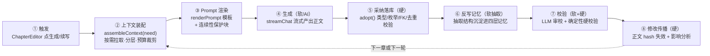

# D. 小说创作搭子｜AI Story Buddy：StoryForge 分析

> 分析对象：`/Users/sunyafu/zebra/temp/storyforge/`（GitHub: yuanbw2025/storyforge）
> 分析视角：以「小说创作流程」为主线，拆解流程、角色分工、输入输出结构、AI 的 Prompt 与上下文组装，以及与 AI 辅助创作相关的其他关键机制。
> 用途：作为「AI Story Buddy（小说创作搭子）」设计的外部同类工具参考与对照。本文只做分析记录，不改动 StoryForge 也不改动本项目代码。

---

## 0. 一句话画像

StoryForge 是一个**纯前端、本地优先、提示词全透明**的 AI 长篇小说创作工作台（React 19 + TypeScript + Vite + Zustand + Dexie/IndexedDB + TipTap）。

它的产品立场不是「一键生成完本小说的黑箱」，而是「**玻璃箱**」：

- **AI 是助手，不替作者定稿**——所有 AI 输出都要经过「预览 → 编辑 → 采纳」才落库；
- **提示词可见可改**——每个 AI 功能背后的 System Prompt / User 模板 / 参数 / few-shot 示例都能查看、克隆、改写；
- **长篇设定不散**——世界观、角色、大纲、伏笔、状态、物品、事实、故事线全部进入结构化本地数据库（约 42 张表）；
- **软硬分工**——AI 负责「生成 / 抽取 / 提建议」（软、不确定），确定性代码负责「校验 / 簿记 / 溯源 / 隔离 / 失效传播」（硬、确定），作者确认是「候选变权威」的闸门。

它的架构宪法是**三个注册表**（后文详述），把「AI 读什么 / AI 写什么 / 表的生命周期」全部收口到单一事实源，杜绝各面板各写一套管线。

---

## 1. 小说创作流程

### 1.1 宏观创作链（从灵感到正文再回流）

StoryForge 把创作组织成一条**持续回流的链路**，而不是一次性的线性生成。侧边栏 5 个一级模块正对应这条链的各段：

| 一级模块 | 在创作链中的位置 | 二级入口（节选） |
|---|---|---|
| 著作信息 | 上游输入 | 项目概况、灵感反推、项目参考 |
| 设定库 | 结构化约束 | 世界总览、真实与幻想、世界观各维度、故事设计、角色、词条、历史年表、地图 |
| 创作区 | 生成与回流 | 创作规则、大纲、角色驱动、故事线、章节正文、伏笔、文风学习、状态表、物品栏、事实库、故事年表、场景考证 |
| 提示词库 | 生成配置 | 模板、题材包、参数、示例/反例、工作流 |
| 设置区 | 运维 | 版本历史、文档解析、数据管理、消耗统计、AI 设置 |

核心闭环（官方图 7.1 的语义）：

```
著作信息/参考/灵感
   → 设定库（世界观/故事核心/力量体系/角色/词条/规则）
   → assembleContext 上下文装配
   → 创作区（卷纲/章纲/细纲/正文）
   → chapters 已写正文
   → 下游提取（状态卡/物品栏/年表/关系/事实账本）
   → 后续生成与审校证据
   ↺ 回流进下一轮上下文装配
```

**关键点：正文不是终点。** 一旦某章写完，它会被反向「抽取」成状态、物品、事实、年表、伏笔证据、章节摘要与交接（handoff），沉淀进「四层长期记忆」，供下一章的上下文装配读取——这就是它区别于「一次性生成器」的核心。

### 1.2 三种典型使用流程（官方推荐路径）

- **新书从零**：新建项目 → 故事设计（一句话/主题/核心冲突）→ 真实与幻想（声明真实/架空边界）→ 世界观各维度 → 角色生成 → 大纲（卷纲/章纲）→ 章节正文 → 用伏笔/状态表/物品栏/事实库维护一致性。
- **旧文档导入**：文档解析上传 → 选择导入当前项目或存为项目参考 → 检查导入报告 → 逐页确认 → 用灵感反推/故事设计整理成可继续写的结构。
- **历史/考证题材**：真实与幻想标出必须真实的维度 → 历史年表建史实锚点 → 项目参考存史料 → 场景考证核对关键场景 → 正文生成时同时读世界规则 + 历史年表 + 项目参考。

### 1.3 主生成管线（单章正文的 8 步）

一次「生成正文 / 续写」远不止「把 prompt 发给模型」，而是官方图 7.5 定义的 8 步：



### 1.4 分步创作工作流（链式编排）

除了单点生成，StoryForge 内置**工作流（Workflow）**——把多个 AI 步骤串成一条链，每步可暂停审核（`src/lib/ai/workflow-seeds.ts`）：

- **极速起书 · 通用**：一句话故事 → 世界起源 → 主要角色 → 卷级大纲 → 第一章正文；每步声明 `userConfirmRequired` 与 `saveTarget`（写回目标字段），并通过 `inputMapping` 把上一步产物作为下一步输入变量（如 `previousOutput → storyCore`）。
- **单章深度生成**：细纲拆场景 → 写正文 → 润色 → 去 AI 味。
- **伏笔体系搭建**：世界观摘要 → 伏笔建议。

这条「链式工作流 + 每步暂停 + 产物锚定下一步」的思路，与其未完成的《透明生成管线》设计（`GenerationNode` 节点链）是同一抽象的两种形态。

---

## 2. 流程中「用户 / AI / 工具（代码）」的角色与分工

StoryForge 最有辨识度的设计，是把三者的职责**用一条明确的软硬边界**切开（官方图 7.7）：

| 角色 | 性质 | 负责什么 | 不负责什么 |
|---|---|---|---|
| **AI（LLM）** | 软 · 不确定 | 生成正文/续写、抽取事实/状态/物品、生成摘要与交接、一致性审校（找矛盾提建议）、语义检索向量 | 不直接落库、不做最终裁决、不自造字段、不判定"是否违反 canon" |
| **代码/工具** | 硬 · 确定 | 章序解析、未来章过滤、世界隔离、当前事实投影、物品持有投影与硬校验、受控谓词守卫、写回校验（类型/枚举/FK/去重）、引文逐字回查、hash/CAS 溯源、上下文预算与分层裁剪、影响传播 | 不生成内容、不做创意判断 |
| **用户（作者）** | 闸门 | 表达意图、澄清关键分叉、预览 AI 产物、编辑、**采纳**（候选 → 权威事实）、确认修订 | —— |

一句话概括：**AI 造零件（软），代码车床 + 质检（硬），作者确认是闸门。** 这条线在产品里体现为——任何 AI 写入默认「先确认后执行」，自主/后台 agent 默认只读。

### 2.1 角色协作泳道图（单章正文生成 + 回流）

> 以下用 mermaid 的 `swimlane-beta` 泳道图（需 Mermaid v11+ 的 swimlane-beta 支持）表达「作者 / AI 模型 / 代码与工具」三条泳道在一次正文生成中的分工与交接。为规避解析问题，所有节点文字均加引号，且避免在标签内使用斜杠与含零宽连接符的 emoji。

```mermaid
swimlane-beta LR
  subgraph laneAuthor["泳道A 作者：意图与确认闸门"]
    A1["选定要写的章节，可选填写额外要求"]
    A2["点击 生成正文 或 续写"]
    A5["预览 AI 产出的正文"]
    A6{"是否采纳"}
    A7["编辑后采纳或直接采纳"]
    A9["查看审校报告，决定是否让 AI 改稿"]
    A10["确认 事实 状态 物品 候选，候选转权威"]
  end
  subgraph laneAI["泳道B AI 模型：生成 抽取 建议（软）"]
    B1["streamChat 流式产出正文"]
    B2["chapter.memory 抽取 摘要 交接 计划对账"]
    B3["抽取 事实 状态 物品 关系 候选"]
    B4["review 五维一致性审校，给建议"]
  end
  subgraph laneCode["泳道C 代码与工具：装配 校验 簿记（硬）"]
    C1["assembleContext 装配上下文，分层裁剪，世界隔离，未来章过滤"]
    C2["renderPrompt 渲染模板，注入连续性保护块"]
    C3["adopt 写回，类型 枚举 外键 去重校验"]
    C4["held-items 硬校验，引文逐字回查"]
    C5["hash 与 CAS 溯源，派生记忆失效，影响分析"]
    DB["IndexedDB 数据库，约 42 张结构化表"]
  end
  A1 --> A2
  A2 --> C1
  C1 --> C2
  C2 --> B1
  B1 --> A5
  A5 --> A6
  A6 -->|"否，重来"| A2
  A6 -->|"是"| A7
  A7 --> C3
  C3 --> DB
  C3 --> B2
  B2 --> A10
  C3 --> B3
  B3 --> A10
  A10 --> C4
  C4 --> DB
  C3 --> B4
  B4 --> A9
  A9 -->|"让 AI 改稿"| B1
  A7 --> C5
  C5 --> DB
  DB -.->|"回流进下一轮"| C1
```

---

## 3. 输入与输出，以及输出的结构

### 3.1 输入来源（AI 读什么）

所有「AI 读」都收口到 **`CONTEXT_SOURCES` 注册表**（共 34 个上下文源），由 `assembleContext({ sourceKeys })` 按需装配。每个源声明：`key / label / scope（作用域）/ layer（层级）/ budgetTokens（token 预算）/ read()（读取函数）/ 依赖前置条件`。

关键上下文源举例（含预算与层级）：

| key | 标签 | 层级 | 预算(token) |
|---|---|---|---|
| `chapterOutline` | 当前章节大纲 | L1 | 800 |
| `currentFacts` | 当前有效事实（事实账本投影） | L1 | 2000 |
| `retrievedPassages` | 相关前文召回（混合检索） | L2 | 2500 |
| `previousChapterEnding` | 直接前驱原文尾部 | L1 | 1800 |
| `chapterContinuityHandoff` | 直接前驱连续性交接 | L1 | 1600 |
| `previousPlanReconciliation` | 前章计划-正文对账 | L1 | 1400 |
| `recentChapterSummaries` | 当前世界最近已验证摘要 | L1 | 2200 |
| `worldview` | 世界观 | L2 | 8000 |
| `characters` | 角色档案 | L2 | 8000 |
| `codex` | 设定词条 | L2 | 6000 |
| `foreshadows` | 伏笔状态 | L2 | 1200 |
| `stateCards` / `itemLedger` / `heldItems` | 状态卡/物品流水/当前持有 | L1–L2 | 1000–2400 |
| `worldRules` | 真实与幻想规则 | L1 | 1200 |
| `creativeRules` | 创作规则 | L1 | 1000 |
| `userStyleProfile` | 我的文风 | L2 | 700 |
| `references` | 引用手法（参考作品方法论） | L3 | 2000 |

**预算裁剪规则**：超预算时按 `L3 → L2 → L1` 依次裁剪，`L0`（用户指定内容、连续性保护块）**永不裁剪**。输入预算 = 所选模型上下文窗口 − 输出预留 − 5% 安全边际（拿不到模型时回退 48K）。

### 3.2 输出去向（AI 写什么）

所有「AI 写」都收口到 **`FIELD_REGISTRY` + `ADOPTION_SCHEMAS`**，经 `adopt({ target, data, mode })` 结构化写回。只有登记过的字段可写（别名自动归一），写回时做：

- **类型/枚举强制**（string/number/boolean/enum/array/json/object 逐一 coerce，非法丢弃并记 `typeErrors`）；
- **别名映射**（如 AI 吐 `summary` 可自动落到 `worldOrigin`）；
- **必填校验 / 外键校验 / 数组成员回查**（引用不存在的角色/节点直接过滤）；
- **去重策略**（`skip / update / merge`，可按 name 或复合字段判定身份）；
- **自动盖章**（projectId / worldGroupId / createdAt / updatedAt）。

可写目标表（`FIELD_REGISTRY` 节选）：`chapters`（content/summary/continuityHandoff/planReconciliation/…）、`characters`（约 40 个维度字段）、`worldviews`、`storyCores`、`outlineNodes`、`detailedOutlines`、`foreshadows`、`stateCards`、`itemLedger`、`storyArcs`、`storyTimelineEvents`、`codexCategories/codexEntries`、`creativeRules`、`importantLocations`、`historicalKeywords/Events`。

### 3.3 结构化输出的两类形态

1. **正文类（自然文本）**：`chapter.content / continue / polish / expand / de-ai` 直接产出正文字符串，采纳后写 `chapters.content`；同时派生出摘要/交接/对账等**结构化记忆**（见 §5）。
2. **结构化数据类（JSON）**：大纲、角色、伏笔、事实、状态、物品、关系、细纲场景等，Prompt 里强制「严格输出 JSON 数组/对象、用 ```json 包裹、不输出多余文字」，再由解析器抽取。例如：
   - 卷纲/章纲 → `[{title, summary}]`
   - 章节记忆 → `{summary, handoff{finalScene, stateChanges, knowledgeChanges, commitments, openLoops, immediateNextIntent, evidenceQuotes[]}, planReconciliation{completedGoals, unfinishedGoals, deviations, newConstraints, nextChapterImpacts, proposedOutlineSummary}}`
   - 审校报告 → `{overallScore, issues[{dimension, severity, description, quote, suggestion}], suggestions[]}`
   - 细纲增强 → `{openingHook, endingCliffhanger, sceneLocation, emotionArc, appearingCharacterIds[], foreshadowIds[], scenes[{title, summary, location, conflict, pace, characterIds[], estimatedWords}]}`

> 值得注意：全局原则是**解析尽量不用脆弱正则**，复杂结构走 `aiRestructure`（用 AI 把自由文本重构成规整 JSON），再进 `adopt` 硬校验。

---

## 4. AI 的角色、Prompt 与上下文组装

### 4.1 AI 能力的三层结构

官方把 AI 能力分三层（与三注册表一一对应）：

1. **上下文装配**：`assembleContext()` 按当前任务读取项目概况、世界观、角色、大纲、伏笔、状态、事实、参考等；
2. **提示词渲染**：`renderPrompt()` 用模板变量、条件块、参数开关、few-shot 示例生成最终 messages；
3. **结构化采纳**：AI 输出经用户确认后由 `adopt()` 写回字段/集合/正文。

### 4.2 Prompt 模板系统（提示词库）

内置约 **61 个 moduleKey**（`PromptModuleKey` 是事实源），覆盖世界观、角色、大纲、章节、伏笔、故事核心、创作规则、导入解析、关系提取、场景考证、文风学习等。每个模板是一个 `PromptSeed`：

```
{
  scope: 'system' | 'user',
  moduleKey, name, description,
  systemPrompt,            // 系统提示词（可含 {{var}} / {{#if}} 条件块）
  userPromptTemplate,      // 用户提示词模板
  variables: [...],        // 声明用到的变量
  parameters: [...],       // 可调参数（select/slider/number/text/boolean）
  examples: { good[], bad[] },  // few-shot 好例/反例
  continuityMode,          // 是否注入连续性保护块（inherit/required/off）
  modelOverride,           // 温度/最大 token 覆盖
  isDefault, isActive
}
```

**模板语法**（`prompt-engine.ts`）：

- `{{var}}` 变量替换（缺失时置空并 `console.warn`）；
- `{{#if var}}...{{/if}}` 条件块（真值且非空字符串才保留）；
- 参数自动注入：每个 `parameter.key` 变成 `{{key}}`，并生成 `{{usesKey}}` / `{{notUsesKey}}` 标志位，配合条件块开关可选段落；
- **示例拼接**：好示例（最多 3 条）作为「作者认可的输出风格」、反例（最多 2 条）作为「要避免的输出」自动拼到 user prompt 末尾；
- **运行时覆盖**：`parameterValues`（临时调参）与 `overrides.{systemPrompt,userPromptTemplate}`（临时改文字）**不写回模板**——这正是「PromptRunPanel 调参浮窗」的语义。

**用户可控性**：系统模板可**克隆**为用户模板后自由改写；**题材包**（历史、仙侠、言情、现实主义、悬疑推理等）可热切换；运行时可标记「好/坏示例」反哺后续生成。

### 4.3 核心创作 Prompt 的写法特征（以正文生成为例）

`chapter.content` 的 System Prompt（`CHAPTER_SYSTEM`）示范了它的 prompt 风格：

- **角色设定**：「经验丰富的长篇连载作者」+ 可调基调/节奏；
- **写作原则内嵌方法论**：开篇抓人、对话推进、动作画面感、章末留钩、Show-don't-tell、行为符合动机、保持世界观/前后文一致；
- **条件化约束**：`{{#if worldRulesContext}}` 时追加「真实与幻想」世界规则铁律（📜取自真实必须准确、不得时代错乱；✨架空改造尊重作者设定）；
- **输出纪律**：直接输出正文、不输出标题、可选目标字数（上限 = 所选模型最大输出）。

大纲 System Prompt（`OUTLINE_SYSTEM`）则塞进了**网文方法论**：情绪公式（铺垫→蓄力→爆发→余韵）、爽点密度、必含结构要素（坠落时刻/选择困境/信息差/伏笔埋揭/收尾钩子）、节奏分段、升级节奏。世界观 System Prompt（`WORLDVIEW_SYSTEM`）甚至内置了一整段**历史地理学常识**（环境定生计、择水而居、山河定疆界、沧海桑田…）来防「沙漠中心建超级都市」这类反常识设定。

> 观察：StoryForge 把「创作方法论」直接**硬编码进各模块的 System Prompt**，而不是抽成独立可复用的 Skill 层。方法论是「灌进节点的水」，随模板走。

### 4.4 上下文组装的工程细节

以正文生成为例（`ChapterEditor.handleGenerate` → `buildChapterContentPrompt`）：

1. `assembleContext('write')` 拉取所需源，产出分段（segments）、已含/省略/裁剪清单、token 统计；
2. 追加题材上下文、文风上下文；
3. **连续性保护块（Continuity Envelope）** 是重点：用 `CONTINUITY_CORE_START/END` 包裹一段「本章任务 + 直接前驱 handoff + 计划冲突对账 + 前驱真实 tail + 当前续写锚点 + 最近已验证摘要」，并附带**硬约束执行协议**（"先内部逐项核对保护块中的事实/动作/禁令/人物限制，必须在正文前 40% 用可观察行动落实，不得只暗示或改反"）与**篇幅纪律**。该块按 token 预算内部再分配各部分字数，且声明「不得被未来章或其他世界资料覆盖」；
4. **正文生成上下文净化**：`sanitizeProseGenerationContext` 会剔除含「未来计划 / 尚未发生 / 异世界档案」标记的句子，避免规划信息/外世界设定当成当前 canon 泄漏进正文；
5. 末尾追加**简体中文输出约束**（`appendSimplifiedChineseOutputConstraint`）；
6. `analyzeContextSegments` 把拼好的 messages 拆成带标签的段（System Prompt / 章节大纲 / 各上游字段 / User Prompt）喂给 `ContextBudgetBar`，让作者**看见**装配结果（透明性的一半）。

### 4.5 按任务分流模型（task-routing）

AI 调用可按**任务类型**路由到不同模型/API 预设（`task-routing.ts`），四类：

- `creation`（chapter./outline./worldview./character./story./inspiration. …）
- `extraction`（state.extract/fact.extract/inventory.extract/relation.extract/chapter.memory/import. …）
- `analysis`（reference./style.learn/retrieval. …）
- `review`（review./scene.verify/chapter.deai/consistency. …）

配合《AI-COPILOT-DESIGN》的「per-role 模型」构想——世界观 agent 用擅长架构的模型、章节 agent 用擅长文风的模型——分类模型路由是这一构想的地基。未分类的 category 留在全局模型上。消耗统计按 category 分类（共 46 个调用点），token 全透明记账。

### 4.6 支持的 Provider

内置 OpenAI、Anthropic Claude、Google Gemini、Poe、NVIDIA NIM、DeepSeek、通义千问、豆包、智谱 GLM、文心一言、Kimi、MiniMax、ModelScope、LongCat 等，以及 Ollama/LM Studio 等本地 OpenAI-compatible 服务和自定义 Base URL。CORS 受限的国内服务可走本地 Vite 代理。API Key 默认存 sessionStorage，用户显式「记住本机」才写 localStorage。

---

## 5. 其他关键机制（AI 辅助 × 长篇一致性）

### 5.1 四层长期记忆闭环

长篇小说最大的敌人是「几百章后 AI 失忆/前后矛盾」。StoryForge 用**四层记忆**（官方图 7.6）应对，每层「读入口 / 写入口 / 软硬性质」分明：

| 层 | 解决的问题 | 写入口 | 读入口 | 软硬性质 |
|---|---|---|---|---|
| **A 章节交接** | 上一章刚发生什么、下一章接什么 | `chapter.memory` 抽取 `continuityHandoff` | `chapterContinuityHandoff` / `previousChapterEnding` | 抽取软、溯源硬 |
| **B 层级摘要** | 长篇几百章后还知道前面大势 | `narrativeSummaryNodes` roll-up | `recentChapterSummaries` | 半硬（确定性 roll-up） |
| **C 双层事实账本** | 已确认的事实不能被后续生成推翻 | `fact-extract → temporalFacts 候选`，作者确认 → canon | `currentFacts + heldItems` | 抽取软、投影/守卫硬 |
| **D 原文检索** | 远距离细节/伏笔需召回原文证据 | `retrievalChunks` + 可选 embedding | `retrievedPassages` 混合检索 | 召回软、过滤硬 |

**章节记忆的可靠性设计**很值得注意：`chapter.memory` 一次调用同时抽出「摘要 + handoff + 计划对账」，每个抽取条目必须带**逐字引文证据**（`evidenceQuotes`），系统**回查引文是否真在原文中**，不信任模型给的 offset；写回时用 **CAS（compare-and-set）+ hash 溯源**——只有正文 hash 与派生记忆来源 hash 一致才落库，正文一改，派生记忆立即标 stale。

### 5.2 连续性上下文的规范章序

`prepareContinuityContext` 通过 `resolveCanonicalChapterSequence` 解析**规范章序**（跨卷、跨世界都能定位真正的「直接前驱」），据此取前驱正文尾部、已验证 handoff、计划-正文对账、同世界最近已验证摘要；对尚未验证的派生记忆，记入 `memoryRebuildCandidateIds` 后台重建。跨世界转场会显式标注「世界A → 世界B 跨世界转场」。

### 5.3 稳固生成护栏栈（防 9 类失败）

官方图 7.8 列了一条沿生成链分布的护栏栈，各自防一类失败：

| 护栏 | 防的失败 |
|---|---|
| 未来章硬过滤（只召回当前章之前内容） | 剧透 |
| worldGroupId 世界隔离（只读同世界内容） | 多世界串台 |
| 当前有效事实 + 持有物注入 | 状态漂移 |
| 混合检索召回 | 远距离矛盾 |
| 引文逐字回查 | 幻觉证据 |
| 受控谓词 + adopt 校验（表外字段丢弃） | 自由造字段/谓词 |
| held-items 硬校验（判定"重复首次获得"） | 物品重复获得 |
| hash/CAS 溯源 | 旧记忆继续当真 |
| 上下文预算与保护块（L0 不删） | 超窗乱截 |

其中 **`held-items`（CONSISTENCY-1）** 是第一块落地的确定性校验器：从 `itemLedger` 按规范章序投影「截止当前章的持有物」，若审校中发现「已持有物品又被写成首次获得」即报硬矛盾——这是「用确定性代码判一致性、而非让另一个 LLM 看一遍」路线的样板。

### 5.4 灵感反推（下→上反推的入口）

`inspiration-reverse` 支持作者写一段碎片灵感（如「赛博朋克+修仙，用代码修炼的程序员，企业统治废土」），AI **反向**生成结构化的世界观草稿（worldOrigin/powerHierarchy/continentLayout/…）、故事核心（logline/theme/centralConflict/…）、初始角色卡（含九宫格阵营轴），并支持多世界版。它在架构上和「上→下生成」「下游提取」走**同一套 assembleContext + adopt 机制**，只是 reads/writes 方向不同。

### 5.5 审校与修订闭环

`review` 从五维度审校（逻辑一致性 / 人物行为 / 世界观 / 伏笔衔接 / 情节节奏），输出带 `overallScore` 与逐条 `issues{severity, quote, suggestion}` 的 JSON 报告；作者可一键让 AI **按报告改全文**（`review.revise`），改稿走和「生成正文」相同的预览→采纳流程，并强制「篇幅与原文 90%~110%、不删情节、不缩写、不注水」。审校是**软建议**，不是硬闸门——硬矛盾交给确定性校验器。

### 5.6 面向 Agent 的演进方向（设计中）

两份设计文档勾勒了未来形态，但强调**不另起炉灶、复用现有注册表**：

- **《AI 创作副驾 + 后台 Agent》(Phase 27)**：把「对话」做成总入口——前台对话副驾（用户驱动、意图识别、待确认卡片、面板双向同步）+ 后台 Agent（整理本章 / 一致性核对 / NPC 人生推演），共用一套「只读/生成/写入/提取」四类**工具层（Tool Registry）**，工具只做「薄封装 + 编排」不复制业务逻辑。安全线：写入确认只属用户驱动侧，自主 agent 默认只读。检测环坚持「确定性代码判一致性、向量只负责召回」。
- **《可介入的透明生成管线》**：把每次 AI 生成抽象成 `GenerationNode`（assembleInput → 可选发送前提示词编辑 → run → 可选 gate 硬校验 → adopt 采纳 → produces 锚定下一节点），一个抽象同时服务「分阶段生成 + 提示词可编辑 + agent 每节点可介入」。旗舰形态是「分阶段章纲工坊」（现状扫描→动机推演→碰撞预演→质检闸门→落场景卡），把一次性生成拆成窄而深的节点链。

### 5.7 数据与安全边界

纯前端、无自建后端：项目数据存浏览器 IndexedDB；AI 生成把相关上下文发到用户配置的第三方服务；Gist 云备份上传完整项目 JSON 到用户自己的私密 Gist；本地文件夹备份走 File System Access API。生产环境检测到 schema 缺表不自动删库（防误删半年手稿），启动申请持久化存储。表的生命周期（导出/导入/删除/迁移）全部由 **`PROJECT_TABLES`** 派生，不允许任何一处手写表清单。

---

## 6. 对「AI Story Buddy」设计的可借鉴点与差异提示

> 以下是从对照角度提炼的观察，供本项目（04.x 系列设计）参考，不构成结论。

**可借鉴（同类最佳实践）**：

1. **三注册表收口**（读/写/表生命周期单一事实源）——从根上防「各面板各写一套管线 → 反复出 bug」，与本项目「流程→角色→技能/工具四条落位」是同类治理思路。
2. **软硬边界 + 作者确认闸门**——AI 生成/抽取为软，确定性代码校验/簿记/溯源为硬，作者确认是候选转正的唯一闸门；「用确定性代码判一致性、而非 LLM 自评」这一原则尤其值得对齐。
3. **四层长期记忆 + 引文逐字回查 + hash/CAS 溯源**——长篇一致性的工程化答案，比「把前文一股脑塞进上下文」更省 token 也更稳。
4. **上下文源分层预算裁剪**（L0 保护块不删、L3→L1 依次裁）——把「上下文装配」当成一等公民而非临时拼接。
5. **提示词全透明 + 运行时覆盖不写回**——模板/参数/示例可见可改，临时改动不污染模板。

**差异提示（与本项目路线不同处）**：

- StoryForge 把**创作方法论硬编码进各模块 System Prompt**（方法论随模板走）；本项目 Phase 2 走的是「Skills 是核心、Agent 是执行载体」，方法论抽成可复用技能层——两者在「方法论如何组织」上是不同取向，可对照 04.3 的 Agent+Skills 设计权衡。
- StoryForge 是**纯前端、按钮驱动的单点生成 + 可选链式工作流**，Agent/对话副驾尚在设计阶段；本项目是 **deepagents/langgraph 的多 agent + HITL** 运行时——StoryForge 的「工具层薄封装、行为与手动一致、写入全确认」可作为工具/权限边界设计的外部印证。
- StoryForge 的一致性护栏（held-items/未来章过滤/世界隔离/CAS）是**确定性代码**；本项目的一致性目前更多依赖 reviewer 角色的三镜头（developmental/line/consistency）——是否补一层确定性校验器，可参考其护栏栈清单。

---

## 附录：关键文件索引（StoryForge 仓库内）

| 关注点 | 文件 |
|---|---|
| 上下文装配入口 | `src/lib/registry/assemble-context.ts` |
| 上下文源注册表 | `src/lib/registry/context-sources.ts` |
| 写回入口（adopt） | `src/lib/registry/adopt.ts` |
| 字段/采纳/表注册表 | `src/lib/registry/{field-registry,adoption-schema,project-tables}.ts` |
| 提示词渲染引擎 | `src/lib/ai/prompt-engine.ts` |
| 内置提示词种子 | `src/lib/ai/prompt-seeds-core.ts` / `prompt-seeds-novel.ts` / `prompt-seeds-genre-packs*.ts` |
| 工作流种子 | `src/lib/ai/workflow-seeds.ts` |
| 正文生成 adapter | `src/lib/ai/adapters/chapter-adapter.ts` |
| 上下文格式化 | `src/lib/ai/context-builder.ts` |
| 章节记忆/连续性 | `src/lib/ai/chapter-memory/*` |
| 确定性一致性校验 | `src/lib/consistency/{held-items,impact-analysis}.ts` |
| 灵感反推 | `src/lib/ai/inspiration-reverse.ts` |
| 审校 adapter | `src/lib/ai/adapters/review-adapter.ts` |
| 任务分流路由 | `src/lib/ai/task-routing.ts` |
| AI 客户端/流式 | `src/lib/ai/client.ts` |
| 生成正文入口 | `src/components/editor/ChapterEditor.tsx` |
| 设计文档 | `docs/AI-COPILOT-DESIGN.md`、`docs/TRANSPARENT-GENERATION-PIPELINE.md`、`docs/FEATURE-GUIDE.md`（§7 项目逻辑）、`docs/AI-FUNCTIONS-MANUAL.generated.md` |
| 架构宪法 | `CLAUDE.md`（三注册表铁律 + 四问） |

---

*分析完成日期：2026-07-22。本文基于 StoryForge 仓库快照（AI 功能清单生成基准 commit `8ef3272`）静态阅读代码与设计文档整理，未运行该应用。*
